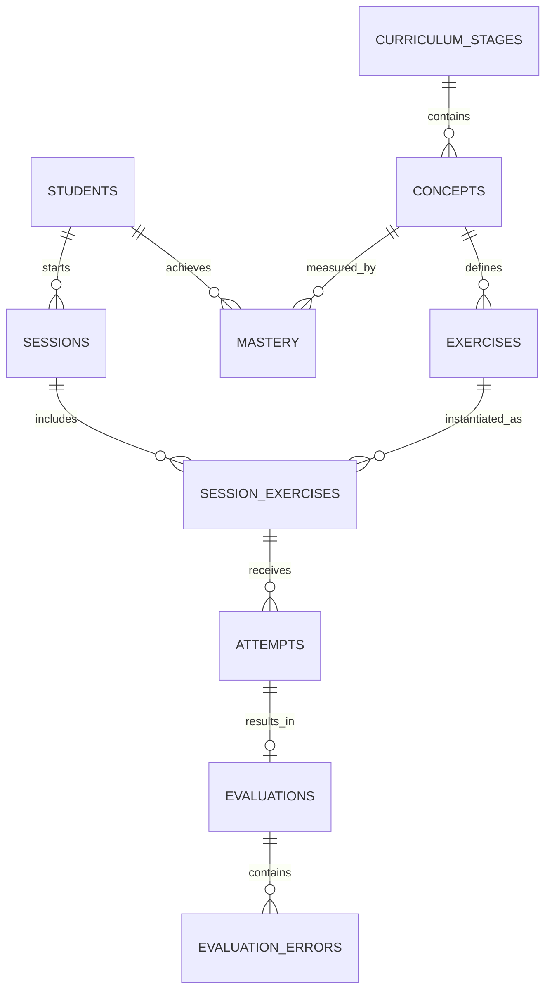

# 06 — Database Schema Specification

## 1. Document Control

* **Document ID:** DB-001
* **Document Name:** Tejaswini AI English Tutor - Database Schema Specification
* **Version:** 1.0.0
* **Status:** APPROVED FOR IMPLEMENTATION
* **Product:** Web-based AI English Learning Application
* **Primary User:** Tejaswini (Beginner)
* **Owner:** Principal Database Architect
* **Source of Truth:** Authoritative specification for database schema, relational modeling, data constraints, RLS, and data lifecycle.

## 2. Database Purpose

The database persists student profiles, curriculum content, session state, learning attempts, AI evaluations, and concept mastery. It provides a secure, relational, and highly traceable foundation to support adaptive learning and mistake-driven review for the AI English Tutor application.

## 3. Database Scope

This schema is designed for Supabase (PostgreSQL). It covers the full MVP scope for a single beginner student (Tejaswini) while utilizing scalable architectural principles (e.g., student-owned records) that allow future multi-user expansion without costly schema migrations. It strictly defines the separation between public reference data, student-owned data, and server-only mutations.

## 4. Source Documents and Authority

This schema acts as the persistence translation of:

1. `01_PRODUCT_REQUIREMENTS.md` (What must be saved)
2. `02_LEARNING_CURRICULUM.md` (Educational data model)
3. `03_UX_SPECIFICATION.md` (Interaction states needing persistence)
4. `04_UI_DESIGN_SYSTEM.md` (Visual states driven by data)
5. `05_APPLICATION_ARCHITECTURE.md` (Data boundaries and access control)

## 5. Database Architecture Goals

* **Data Integrity:** Rely on PostgreSQL constraints (Foreign Keys, CHECK, ENUMs) rather than trusting application code or AI outputs blindly.
* **Immutability of Learning History:** Student attempts and evaluations are append-only.
* **Security:** Client (browser) is granted `SELECT` access only to authorized rows via RLS. All `INSERT`/`UPDATE` operations are executed exclusively by the server using the Supabase Service Role key.
* **AI Traceability:** AI metadata (model version, prompts) is linked to evaluations for future prompt regression analysis.

## 6. Database Design Principles

* **UUIDs for Keys:** Global uniqueness and secure API exposure.
* **UTC Timestamps:** All times stored in `timestamptz`.
* **Relational Over JSONB:** Use JSONB only for unstructured AI metadata and session snapshots; use normalized tables for curriculum, errors, and mastery.
* **Soft Deletion for PII:** Support data deletion strategies without breaking relational analytics.

## 7. Domain Model

The database is divided into four major domains:

1. **Identity:** Authentication integration and student profiles.
2. **Curriculum (Reference):** Stages, concepts, and predefined exercises.
3. **Practice (Transactional):** Sessions, session exercises, attempts, and transcriptions.
4. **Evaluation & Mastery (Analytical):** AI evaluations, error categorization, and concept mastery tracking.

## 8. Canonical Entity/Table Inventory

| Entity/Table | Domain | Purpose | MVP/Future | Owner | Main Relationships |
| --- | --- | --- | --- | --- | --- |
| `students` | Identity | Stores application profile data and XP. | MVP | Student | Maps to `auth.users` |
| `curriculum_stages` | Curriculum | Defines the 0-10 learning stages. | MVP | System | Parent of `concepts` |
| `concepts` | Curriculum | Defines grammar/vocabulary targets. | MVP | System | Parent of `exercises`, `mastery` |
| `exercises` | Curriculum | Seeded Marathi translation prompts. | MVP | System | Child of `concepts` |
| `sessions` | Practice | 10-15 minute practice blocks. | MVP | Student | Child of `students` |
| `session_exercises` | Practice | Tracks sequence/state within a session. | MVP | Student | Child of `sessions`, `exercises` |
| `attempts` | Practice | Text/Voice inputs and transcriptions. | MVP | Student | Child of `session_exercises` |
| `evaluations` | Evaluation | AI semantic assessment & grades. | MVP | Student | Child of `attempts` |
| `evaluation_errors` | Evaluation | Specific grammatical mistakes made. | MVP | Student | Child of `evaluations` |
| `mastery` | Mastery | Student's proficiency per concept. | MVP | Student | Child of `students`, `concepts` |

## 9. Identity and Student Profile Schema

The `students` table decouples application-specific profile data (display name, total XP, current stage) from Supabase's internal `auth.users` table, allowing safe querying without exposing authentication credentials.

## 10. Curriculum Schema

A normalized reference schema (`curriculum_stages` $\rightarrow$ `concepts` $\rightarrow$ `exercises`). It stores the pedagogical prerequisites and learning objectives dictated by `02_LEARNING_CURRICULUM.md`.

## 11. Curriculum Versioning

For the MVP, curriculum versioning is handled implicitly by appending new records. If an exercise is fundamentally flawed, it is flagged `is_active = false` rather than deleted, preserving historical foreign keys.

## 12. Exercise Schema

Stores the base `marathi_prompt`, the intended `concept_id`, and `difficulty_level` (1-6). It does not store one single "correct" answer as the sole source of truth.

## 13. Multiple-Valid-Translation Schema

To support the UX requirement of multiple valid translations without rigid string matching:

* `exercises` contains a `reference_translations` `TEXT[]` array used for initial prompt context.
* `evaluations` contains an `alternative_valid_translations` `TEXT[]` array populated by Gemini at runtime to show the user other natural ways to express their thought.

## 14. Practice Session Schema

Tracks the lifecycle of a practice session (e.g., IN_PROGRESS, COMPLETED). It summarizes total XP earned and completion timestamps.

## 15. Session Exercise Sequencing

The `session_exercises` table maps a many-to-many relationship between `sessions` and `exercises`. It includes an `order_index` to maintain pacing (warm-up $\rightarrow$ core $\rightarrow$ voice $\rightarrow$ review) and a `status` (PENDING, SKIPPED, COMPLETED).

## 16. Attempt and Answer Schema

The `attempts` table stores the exact user interaction. A single `session_exercise` can have multiple `attempts` if the user clicks "Retry". The table records `raw_transcription` (if voice) and the final `submitted_answer`.

## 17. Voice and Transcription Schema

No raw audio files are stored. The `attempts` table captures the string returned by the browser Speech API (`raw_transcription`) and a boolean `was_edited` comparing it to the `submitted_answer`. This satisfies the UX requirement to separate technical errors from learner errors.

## 18. Answer Modality

Attempt modality is constrained to a PostgreSQL ENUM: `TEXT` or `VOICE`.

## 19. AI Evaluation Schema

Stores the 6-tier grading scale (A-F) as a controlled ENUM. It stores the `corrected_text`, `explanation_marathi`, and raw JSON metadata (`ai_metadata`) containing token usage and model versions for debugging.

## 20. Evaluation Immutability and Versioning

Evaluations are strictly immutable. If the AI hallucinates and a manual override is required (Future feature), a new evaluation record is created, and the old one is marked `is_superseded = true`.

## 21. Error Schema

`evaluation_errors` isolates discrete mistakes (e.g., Tense, Article) into separate rows. This allows the adaptive engine to run fast grouping queries (`SELECT category, count(*) FROM evaluation_errors GROUP BY category`).

## 22. Correction Schema

Corrections are embedded within the `evaluations` table (`corrected_text` and `explanation_marathi`) to maintain a 1:1 relationship with the attempt and avoid over-normalization.

## 23. Mastery Schema

The `mastery` table tracks proficiency. It increments `correct_attempts` and `incorrect_attempts` based on evaluation grades, triggering status updates (e.g., INTRODUCED $\rightarrow$ PROFICIENT).

## 24. Mastery States

Controlled ENUM: `NOT_INTRODUCED`, `INTRODUCED`, `PRACTICING`, `DEVELOPING`, `PROFICIENT`, `NEEDS_REVIEW`.

## 25. Review Schema

Mistake-driven review uses the `mastery` table. When `mastery.status = 'NEEDS_REVIEW'`, the application queries the `concepts` table to generate the next session's review exercises. No separate review queue table is needed for MVP.

## 26. Progress Schema

Long-term progress (XP) is materialized in `students.total_xp`. Historical trend data can be queried dynamically by grouping `sessions.completed_at`.

## 27. Session Summary Persistence

Stored as a `JSONB` column `summary_data` on the `sessions` table upon completion, caching the exact UI payload shown to the user (accuracy %, concepts reviewed) to avoid recalculating it on subsequent dashboard loads.

## 28. Analytics and Event Data

Extraneous UI clicks are not stored. The database only tracks domain events explicitly tied to an `attempt` or `session`.

## 29. Timestamp and Timezone Strategy

All timestamps use `TIMESTAMPTZ` (UTC). The frontend handles local timezone formatting. Standard columns: `created_at`, `updated_at`.

## 30. Primary Key Strategy

`UUID` (v4) is used for all tables via `gen_random_uuid()`. This prevents sequence guessing, allows secure URL routing, and avoids ID collisions in distributed systems.

## 31. Foreign Key Strategy

Strict referential integrity.

* System Reference Data: `ON DELETE RESTRICT`.
* Student Owned Data: `ON DELETE CASCADE` (If a session is deleted, its attempts go with it. If a student is deleted, their entire history is purged).

## 32. Normalization Strategy

The schema follows 3NF for core learning logic (Concepts $\rightarrow$ Exercises $\rightarrow$ Attempts $\rightarrow$ Errors). Denormalization is selectively applied via JSONB for `session_summaries` and `ai_metadata` where the data is read-only and structurally varied.

## 33. JSONB Strategy

`JSONB` is strictly reserved for:

1. `ai_metadata` (Token counts, prompt versions).
2. `summary_data` (Pre-calculated session metrics).
It is NEVER used for queryable business logic like evaluation grades or error categories.

## 34. Enum and Controlled-Value Strategy

PostgreSQL `ENUM` types are used for critical categorical data to ensure data integrity at the database layer without lookup joins.

* `modality_type` ('TEXT', 'VOICE')
* `grade_type` ('A', 'B', 'C', 'D', 'E', 'F')
* `session_status` ('IN_PROGRESS', 'COMPLETED', 'ABANDONED')
* `mastery_status` (Defined in Sec 24)
* `error_category` ('GRAMMAR', 'TENSE', 'ARTICLE', 'PREPOSITION', 'WORD_ORDER', 'AGREEMENT', 'VOCABULARY', 'SPELLING', 'MISSING_WORD', 'EXTRA_WORD', 'MEANING', 'NATURALNESS')

## 35. Index Strategy

| ID | Table | Columns | Index Type | Purpose | Query Supported |
| --- | --- | --- | --- | --- | --- |
| IDX-01 | `sessions` | `student_id, status` | BTREE | Fast active session lookup | Resume current session |
| IDX-02 | `session_exercises` | `session_id, order_index` | BTREE | Load session flow | Get next exercise |
| IDX-03 | `mastery` | `student_id, status` | BTREE | Weakness detection | Generate review queue |
| IDX-04 | `attempts` | `session_exercise_id` | BTREE | Foreign key optimization | Load chat history |

## 36. Uniqueness Constraints

* `mastery`: `UNIQUE(student_id, concept_id)` - A student can only have one mastery profile per concept.
* `students`: `UNIQUE(auth_user_id)` - 1:1 mapping with Supabase Auth.
* `session_exercises`: `UNIQUE(session_id, order_index)` - Prevents sequence collisions in a session.

## 37. CHECK Constraints

* `exercises.difficulty_level`: `CHECK (difficulty_level >= 1 AND difficulty_level <= 6)`
* `sessions.xp_earned`: `CHECK (xp_earned >= 0)`

## 38. Data Integrity Invariants

* An `evaluation` MUST reference exactly one `attempt`.
* An `attempt` MUST contain a `submitted_answer`.
* A `student` MUST NOT directly edit an `evaluation`. (Enforced by RLS & API).

## 39. Row Level Security Architecture

Supabase RLS is fully enabled. Policies dictate that authenticated users can `SELECT` rows where `student_id = auth.uid()`. By design, there are NO client-side `INSERT`, `UPDATE`, or `DELETE` policies for student data.

## 40. Client vs Server Database Access

* **Client (Browser):** Uses `NEXT_PUBLIC_SUPABASE_ANON_KEY`. Can read profile, session history, and evaluation results.
* **Server (Next.js Actions):** Uses `SUPABASE_SERVICE_ROLE_KEY`. Executes all writes, evaluation creation, XP updates, and mastery calculations.

## 41. Service-Role Boundaries

The `SUPABASE_SERVICE_ROLE_KEY` is completely isolated in Next.js Server Actions. It bypasses RLS, acting as the system administrator executing trusted domain logic after verifying the user's JWT.

## 42. AI Metadata Storage

The `evaluations` table stores an `ai_metadata` JSONB column:

```json
{ "model": "gemini-1.5-flash", "prompt_version": "v1.2", "latency_ms": 1250, "tokens_used": 145 }

```

This enables performance monitoring without polluting relational columns.

## 43. Prompt and Evaluation Versioning

`prompt_version` is tracked inside `ai_metadata`. If curriculum requirements change, queries can isolate old evaluations by filtering the JSONB prompt version.

## 44. Privacy and Data Minimization

* No audio blobs are stored.
* No sensitive PII beyond email (in Auth) and display name is required.

## 45. Data Deletion Strategy

If Tejaswini deletes her account, deleting her `auth.users` record triggers a CASCADE delete to `students`, which cascades down to `sessions`, `attempts`, `evaluations`, and `mastery`. Complete erasure.

## 46. Data Archival Strategy

Not required for a single-student MVP.

## 47. Seed and Reference Data

Static data (`curriculum_stages`, `concepts`, `exercises`) is deployed via Supabase migration seed scripts (`seed.sql`). It is never modified by the application at runtime.

## 48. Migration Strategy

Migrations are managed via Supabase CLI (`supabase db diff`, `supabase migration up`). All schema changes are versioned sequentially in the `supabase/migrations/` directory.

## 49. Database Environments

* **Local:** Docker-based Supabase local development (`supabase start`).
* **Production:** Supabase Cloud Project.
Seed data is identical across both.

## 50. Backup and Recovery Requirements

Supabase Cloud provides daily automated backups and Point-in-Time Recovery (PITR). This satisfies MVP recovery needs.

## 51. Performance and Query Considerations

The database is heavily read-optimized for the active session. Because the backend calculates mastery asynchronously upon session completion, UI interaction latency remains strictly tied to the Gemini API, not PostgreSQL locks.

## 52. Transaction Boundaries

Submitting an answer via a Server Action wraps the following in a single PostgreSQL transaction:

1. `INSERT attempt`
2. `INSERT evaluation`
3. `INSERT evaluation_errors`
*(Mastery updates are deferred to session completion to prevent locking).*

## 53. Asynchronous Processing

The Gemini API call occurs *before* the database transaction begins. We do not hold database connections open while waiting for external AI responses.

## 54. Concurrency Handling

Unique constraints on `session_exercises(session_id, order_index)` prevent duplicate exercises from generating if the client sends concurrent request bursts.

## 55. Idempotency

Server Actions generating attempts use an idempotency key (the `session_exercise_id`) to ensure double-clicks do not result in duplicated evaluations.

## 56. Auditability

The append-only nature of `attempts` and `evaluations` creates a natural audit log of the student's learning journey without requiring external audit tables.

## 57. Naming Conventions

* **Tables:** `snake_case`, plural (`sessions`, `attempts`).
* **Columns:** `snake_case`, singular (`student_id`, `created_at`).
* **Primary Keys:** `id` (UUID).
* **Foreign Keys:** `[entity]_id`.
* **Enums:** `snake_case_type` (e.g., `grade_type`).

## 58. Column Conventions

* Always define `NOT NULL` unless explicitly optional.
* Default `created_at` to `now()`.
* Boolean prefixes: `is_` or `has_` (e.g., `is_final`).

## 59. Sensitive-Data Classification

* `students.display_name`: PII.
* `attempts.raw_transcription`: Student IP.
* **Zero secrets** stored in the database.

## 60. Entity Relationship Diagram



## 61. Complete Table Specifications

### `students`

**Purpose:** Application profile and top-level progress mapping.
**Domain:** Identity
**Status:** MVP
**Ownership:** Student

| Column | Type | Nullable | Default | Constraints | Description |
| --- | --- | --- | --- | --- | --- |
| `id` | UUID | No | `gen_random_uuid()` | PK | Internal ID |
| `auth_user_id` | UUID | No |  | FK to `auth.users`, UNIQUE | Supabase Auth mapping |
| `display_name` | TEXT | No |  |  | User's preferred name |
| `total_xp` | INT | No | 0 | `>= 0` | Lifetime experience points |
| `current_stage_id` | UUID | No |  | FK to `curriculum_stages` | Current unlocked stage |
| `created_at` | TIMESTAMPTZ | No | `now()` |  |  |
| `updated_at` | TIMESTAMPTZ | No | `now()` |  |  |

### `curriculum_stages`

**Purpose:** Defines the 0-10 learning stages.
**Domain:** Curriculum
**Status:** MVP
**Ownership:** System

| Column | Type | Nullable | Default | Constraints | Description |
| --- | --- | --- | --- | --- | --- |
| `id` | UUID | No | `gen_random_uuid()` | PK |  |
| `level_number` | INT | No |  | UNIQUE | 0 to 10 |
| `name` | TEXT | No |  |  | e.g., "Simple Present" |
| `is_active` | BOOLEAN | No | TRUE |  | Soft toggle |

### `concepts`

**Purpose:** Specific grammar/vocab rules being targeted.
**Domain:** Curriculum
**Status:** MVP
**Ownership:** System

| Column | Type | Nullable | Default | Constraints | Description |
| --- | --- | --- | --- | --- | --- |
| `id` | UUID | No | `gen_random_uuid()` | PK |  |
| `stage_id` | UUID | No |  | FK to `curriculum_stages` |  |
| `name` | TEXT | No |  |  | e.g., "3rd Person Singular" |
| `description` | TEXT | Yes |  |  | Pedagogical intent |

### `exercises`

**Purpose:** Seeded Marathi translation prompts.
**Domain:** Curriculum
**Status:** MVP
**Ownership:** System

| Column | Type | Nullable | Default | Constraints | Description |
| --- | --- | --- | --- | --- | --- |
| `id` | UUID | No | `gen_random_uuid()` | PK |  |
| `concept_id` | UUID | No |  | FK to `concepts` |  |
| `marathi_prompt` | TEXT | No |  |  | The sentence to translate |
| `reference_translations` | TEXT[] | No |  |  | Valid ground-truth equivalents |
| `difficulty_level` | INT | No |  | `1 <= x <= 6` |  |

### `sessions`

**Purpose:** Groups exercises into a 10-15 minute block.
**Domain:** Practice
**Status:** MVP
**Ownership:** Student

| Column | Type | Nullable | Default | Constraints | Description |
| --- | --- | --- | --- | --- | --- |
| `id` | UUID | No | `gen_random_uuid()` | PK |  |
| `student_id` | UUID | No |  | FK to `students` |  |
| `status` | ENUM | No | 'IN_PROGRESS' |  | session_status |
| `xp_earned` | INT | No | 0 | `>= 0` | Calculated upon completion |
| `summary_data` | JSONB | Yes |  |  | Cached completion stats |
| `started_at` | TIMESTAMPTZ | No | `now()` |  |  |
| `completed_at` | TIMESTAMPTZ | Yes |  |  |  |

### `session_exercises`

**Purpose:** Maps exercises to a session in a specific order.
**Domain:** Practice
**Status:** MVP
**Ownership:** Student

| Column | Type | Nullable | Default | Constraints | Description |
| --- | --- | --- | --- | --- | --- |
| `id` | UUID | No | `gen_random_uuid()` | PK |  |
| `session_id` | UUID | No |  | FK to `sessions` |  |
| `exercise_id` | UUID | No |  | FK to `exercises` |  |
| `order_index` | INT | No |  |  | Sequence position |
| `status` | ENUM | No | 'PENDING' |  | PENDING, SKIPPED, COMPLETED |
| **Unique Constraints:** `UNIQUE(session_id, order_index)` |  |  |  |  |  |

### `attempts`

**Purpose:** Captures the user's input for an exercise.
**Domain:** Practice
**Status:** MVP
**Ownership:** Student

| Column | Type | Nullable | Default | Constraints | Description |
| --- | --- | --- | --- | --- | --- |
| `id` | UUID | No | `gen_random_uuid()` | PK |  |
| `session_exercise_id` | UUID | No |  | FK `session_exercises` |  |
| `modality` | ENUM | No |  |  | 'TEXT' or 'VOICE' |
| `raw_transcription` | TEXT | Yes |  |  | Browser STT raw output |
| `submitted_answer` | TEXT | No |  |  | Final text sent to AI |
| `was_edited` | BOOLEAN | No | FALSE |  | True if STT != submitted |
| `submitted_at` | TIMESTAMPTZ | No | `now()` |  |  |

### `evaluations`

**Purpose:** AI semantic assessment.
**Domain:** Evaluation
**Status:** MVP
**Ownership:** Student

| Column | Type | Nullable | Default | Constraints | Description |
| --- | --- | --- | --- | --- | --- |
| `id` | UUID | No | `gen_random_uuid()` | PK |  |
| `attempt_id` | UUID | No |  | FK to `attempts`, UNIQUE |  |
| `grade` | ENUM | No |  |  | 'A', 'B', 'C', 'D', 'E', 'F' |
| `corrected_text` | TEXT | Yes |  |  | AI's fixed version |
| `explanation_marathi` | TEXT | Yes |  |  | Tutor feedback |
| `alternative_valid_translations` | TEXT[] | Yes |  |  | Other acceptable ways |
| `ai_metadata` | JSONB | No |  |  | Tokens, model info |
| `evaluated_at` | TIMESTAMPTZ | No | `now()` |  |  |

### `evaluation_errors`

**Purpose:** Discrete error tags for weakness tracking.
**Domain:** Evaluation
**Status:** MVP
**Ownership:** Student

| Column | Type | Nullable | Default | Constraints | Description |
| --- | --- | --- | --- | --- | --- |
| `id` | UUID | No | `gen_random_uuid()` | PK |  |
| `evaluation_id` | UUID | No |  | FK to `evaluations` |  |
| `category` | ENUM | No |  |  | 'GRAMMAR', 'TENSE', etc. |

### `mastery`

**Purpose:** Tracks proficiency on specific concepts.
**Domain:** Mastery
**Status:** MVP
**Ownership:** Student

| Column | Type | Nullable | Default | Constraints | Description |
| --- | --- | --- | --- | --- | --- |
| `id` | UUID | No | `gen_random_uuid()` | PK |  |
| `student_id` | UUID | No |  | FK to `students` |  |
| `concept_id` | UUID | No |  | FK to `concepts` |  |
| `status` | ENUM | No | 'INTRODUCED' |  | 'PROFICIENT', 'NEEDS_REVIEW' |
| `correct_attempts` | INT | No | 0 |  |  |
| `incorrect_attempts` | INT | No | 0 |  |  |
| `last_practiced_at` | TIMESTAMPTZ | Yes |  |  |  |
| **Unique Constraints:** `UNIQUE(student_id, concept_id)` |  |  |  |  |  |

## 62. Relationship Specifications

| ID | Parent Table | Child Table | Cardinality | Foreign Key | Delete Behavior | Purpose |
| --- | --- | --- | --- | --- | --- | --- |
| REL-01 | `students` | `sessions` | 1:N | `student_id` | CASCADE | Erase data if user deletes account |
| REL-02 | `sessions` | `session_exercises` | 1:N | `session_id` | CASCADE | Clear session state |
| REL-03 | `session_exercises` | `attempts` | 1:N | `session_exercise_id` | CASCADE | An exercise can have multiple retries |
| REL-04 | `attempts` | `evaluations` | 1:1 | `attempt_id` | CASCADE |  |
| REL-05 | `concepts` | `exercises` | 1:N | `concept_id` | RESTRICT | Prevent deleting concepts in use |

## 63. Index Specifications

| ID | Table | Columns | Index Type | Purpose | Query Supported |
| --- | --- | --- | --- | --- | --- |
| IDX-S1 | `sessions` | `student_id, status` | BTREE | Resume logic | `SELECT * WHERE student_id = ? AND status = 'IN_PROGRESS'` |
| IDX-M1 | `mastery` | `student_id, status` | BTREE | Review queue | `SELECT concept_id WHERE status = 'NEEDS_REVIEW'` |

## 64. Constraint Specifications

| ID | Table | Constraint Type | Rule | Purpose |
| --- | --- | --- | --- | --- |
| CHK-01 | `exercises` | CHECK | `difficulty_level >= 1 AND difficulty_level <= 6` | Prevent invalid logic |
| CHK-02 | `sessions` | CHECK | `xp_earned >= 0` | No negative scores |

## 65. RLS Matrix

| Table | Student Read (Anon) | Student Insert | Student Update | Student Delete | Server Access (Service Role) | Notes |
| --- | --- | --- | --- | --- | --- | --- |
| `curriculum_*` | Yes (All) | No | No | No | ALL | Read-only for clients |
| `students` | Yes (`id = auth.uid()`) | No | No | No | ALL | Managed by Auth hooks / server |
| `sessions` | Yes (`student_id = auth.uid()`) | No | No | No | ALL |  |
| `attempts` | Yes (Via Session Join) | No | No | No | ALL |  |
| `evaluations` | Yes (Via Attempt Join) | No | No | No | ALL |  |
| `mastery` | Yes (`student_id = auth.uid()`) | No | No | No | ALL |  |

## 66. Data Lifecycle Matrix

| Entity | Creation Event | Update Events | Retention | Deletion Behavior |
| --- | --- | --- | --- | --- |
| `sessions` | User clicks "Start" | Completion / Abandonment | Indefinite | Cascade on Student deletion |
| `attempts` | User clicks "Submit" | None (Immutable) | Indefinite | Cascade |
| `evaluations` | AI returns JSON | None (Immutable) | Indefinite | Cascade |

## 67. Database-to-Application Mapping

| Database Table | Domain | Application Service | UX Feature | PRD Requirement |
| --- | --- | --- | --- | --- |
| `attempts` | Practice | `AttemptService` | Text/Voice Submission | FR-007, FR-009 |
| `evaluations` | Evaluation | `AiEvaluationService` | Feedback Cards | FR-011, FR-013 |
| `mastery` | Mastery | `ProgressService` | Mistake Review Queue | FR-020, Adaptive Learning |

## 68. Database Access Patterns

| Pattern ID | Operation | Tables | Read/Write | Transaction | Frequency |
| --- | --- | --- | --- | --- | --- |
| AP-01 | Submit Answer | `attempts`, `evaluations`, `evaluation_errors` | Write | Yes | High |
| AP-02 | Load Session | `sessions`, `session_exercises` | Read | No | Medium |
| AP-03 | Build Review | `mastery`, `concepts`, `exercises` | Read | No | Low (Start of session) |

## 69. Migration-Readiness Requirements

The schema defined herein contains exact types, enums, FK constraints, and cascade logic. It provides all requisite mapping for an engineer to write the Supabase SQL `.sql` migration files and generate the `database.types.ts` file via the Supabase CLI.

## 70. Database Risk Register

| Risk ID | Risk | Probability | Impact | Mitigation |
| --- | --- | --- | --- | --- |
| RSK-DB-01 | Client-Side Score Manipulation | Low | High | Strict RLS. Server Actions via Service Role completely lock out client `UPDATE` commands. |
| RSK-DB-02 | Session Exercise Duplication | Low | Medium | Unique constraint on `session_id` + `order_index`. |
| RSK-DB-03 | AI Overwriting History | Low | High | `attempts` and `evaluations` lack `UPDATE` functionality by application design. Append-only logic. |

## 71. Database Architecture Decision Records

| ADR ID | Decision | Alternatives | Rationale | Trade-offs | Status |
| --- | --- | --- | --- | --- | --- |
| DB-ADR-01 | UUID Primary Keys | BigInt IDENTITY | Supabase native best practice, highly secure for URL/API routes, prevents scraping. | Slight index size increase over integers. | Decided |
| DB-ADR-02 | Enums for Grading | VARCHAR Check Constraints | Strong type safety out-of-the-box. Easy to generate TypeScript types from Supabase CLI. | Requires schema migration to add new grades. | Decided |
| DB-ADR-03 | No Raw Audio Blobs | Supabase Storage | Web API dictates STT happens client-side; no audio reaches server. High privacy, low cost. | Cannot implement later audio pronunciation grading without altering architecture. | Decided |

## 72. MVP vs Future Schema

* **MVP Tables:** ALL tables defined in Section 61 are strictly required for the core translation, evaluation, and mistake-tracking loop.
* **Future Considerations (Not modeled):** `user_subscriptions`, `classrooms`, `teacher_assignments`, `pronunciation_metrics`.

## 73. Assumptions

* Supabase Auth is configured to automatically insert a corresponding `students` row via a Postgres Trigger upon user signup.
* The `NEXT_PUBLIC_SUPABASE_ANON_KEY` will be safely embedded in the Next.js client bundle.

## 74. Open Database Questions

| ID | Question | Why It Matters | Status |
| --- | --- | --- | --- |
| DB-OQ-01 | Should we implement a Soft Delete (`deleted_at`) on attempts for future auditing, or rely on strict CASCADE? | Impacts database storage growth vs compliance. For 1 student MVP, CASCADE is simpler. | Open (Recommended: Cascade) |

## 75. Final Database Specification

This document establishes a highly normalized, secure, and performant schema tailored exactly to the pedagogical and architectural needs of the application. It locks down data integrity at the lowest level, preventing client-side manipulation and ensuring the AI's evaluations are immutably logged for true educational traceability.

## 76. Database Completion Checklist

* [x] All PRD/Curriculum persistence requirements met.
* [x] Normalized architecture applied (Attempts $\rightarrow$ Evaluations $\rightarrow$ Errors).
* [x] AI evaluation categories mapped to PostgreSQL Enums.
* [x] Multiple valid translations explicitly modeled (`alternative_valid_translations`).
* [x] Voice transcription metadata captured without raw audio storage.
* [x] Server-side mutation requirement enforced conceptually via RLS rules.
* [x] Primary Key (UUID) and Foreign Key cascade behaviors defined.
* [x] Secrets excluded entirely from the specification.