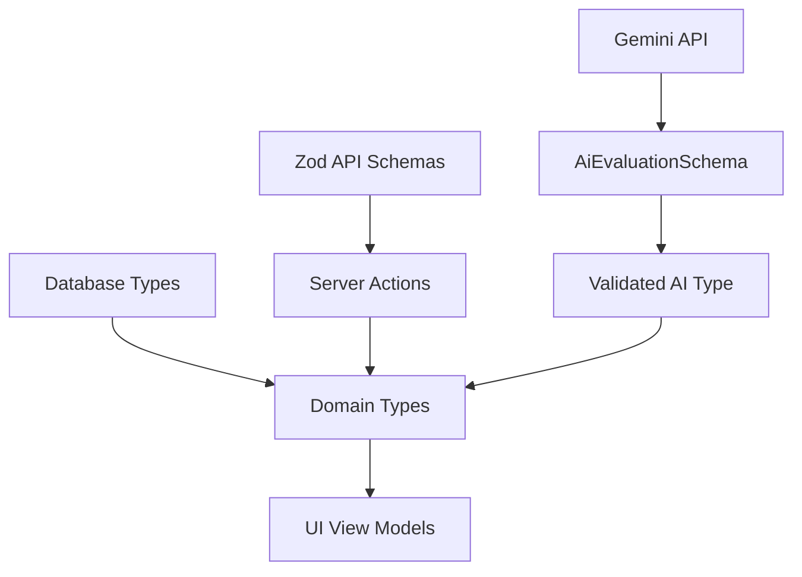

# 08 — Types and Schemas Specification

## 1. Document Control

* **Document ID:** TYPE-001
* **Document Name:** Tejaswini AI English Tutor - Types and Schemas Specification
* **Version:** 1.0.0
* **Status:** APPROVED FOR IMPLEMENTATION
* **Product:** Web-based AI English Learning Application
* **Primary User:** Tejaswini (Beginner)
* **Owner:** Principal TypeScript Architect
* **Source of Truth:** Authoritative specification for TypeScript types, runtime validation schemas, API contracts, and AI payload structures.

## 2. Purpose

This document defines the complete type-system and runtime-schema architecture for the application. It establishes how data structures are represented at compile-time (TypeScript) and validated at runtime boundaries (Zod). It provides Google Antigravity with a deterministic blueprint to prevent duplicate types, missing validations, and untrusted AI/client inputs.

## 3. Scope

The scope encompasses all domain models, database-derived types, API request/response contracts, AI input/output schemas, UI view models, and discriminated state machines for the core translation loop. It excludes specific implementation logic and frontend markup.

## 4. Source Documents and Authority

This document synthesizes and binds:

1. `01_PRODUCT_REQUIREMENTS.md` (Product rules)
2. `02_LEARNING_CURRICULUM.md` (Educational structures)
3. `03_UX_SPECIFICATION.md` (Interaction states)
4. `04_UI_DESIGN_SYSTEM.md` (Visual data needs)
5. `05_APPLICATION_ARCHITECTURE.md` (Client/Server boundaries)
6. `06_DATABASE_SCHEMA.md` (Persistence structures)
7. `07_CODEBASE_STRUCTURE.md` (Module locations)

## 5. Type-System Goals

* **Compile-Time Safety:** Catch domain errors before execution.
* **Runtime Boundary Security:** Never trust external data (Browser, API, Gemini, Supabase).
* **Single Source of Truth:** Eliminate overlapping interface definitions for the same concept.
* **AI Predictability:** Force Gemini outputs into strictly typed, parser-safe objects.
* **Clear Nullability:** Eradicate ambiguous `undefined` vs `null` usage.

## 6. Type-System Principles

* **Parse, Don't Validate:** Use Zod schemas to transform unvalidated input into typed domain objects.
* **Database Types $\neq$ Domain Types:** Supabase generates DB types. We map them into Application/Domain types to decouple business logic from storage details.
* **Discriminated Unions for State:** Impossible states (e.g., `isRecording: true` while `isEvaluating: true`) must be impossible to represent in the type system.
* **Immutable Types:** Domain objects retrieved from the DB/API are typed as `readonly`.

## 7. Type Architecture Overview

```text
[Supabase DB] -> (Supabase CLI) -> Database Types
                                        |
[Client/Browser] -> (API Call) -> API Request Schemas -> Application Actions -> Domain Types
                                        |
[Gemini AI] -> (Raw JSON) -> AI Runtime Schemas -> Validated Output -> Domain Types

```

## 8. Canonical Type Ownership

* **Database Types:** Generated by Supabase CLI (`src/types/database.types.ts`).
* **Domain Types:** Hand-authored in `src/features/[feature]/types/`.
* **API/Action Schemas:** Hand-authored Zod schemas in `src/features/[feature]/schemas/`.
* **AI Schemas:** Hand-authored Zod schemas in `src/lib/ai/schemas/`.
* **UI View Models:** Hand-authored in component files when the Domain Type is too complex for presentation.

## 9. TypeScript Conventions

* Prefer `type` for unions, state machines, and primitives.
* Prefer `type` over `interface` for consistency, except where declaration merging is strictly required (e.g., extending global browser APIs).
* Use `readonly` for domain entities representing historical data (e.g., past attempts).
* Use `Record<K, V>` over `{ [key: string]: V }`.

## 10. ID Types

* All database identifiers are represented as `string` (UUID v4).
* Branded types (e.g., `type StudentId = string & { __brand: 'StudentId' }`) are deliberately EXCLUDED for MVP simplicity. Plain strings are validated via Zod (`z.string().uuid()`) at boundaries.

## 11. Timestamp Types

* **Database:** `TIMESTAMPTZ`.
* **TypeScript / API / Domain:** `string` (ISO 8601 format: `2026-09-01T12:03:39.000Z`).
* *Rule:* Never pass raw JavaScript `Date` objects across API or Server Action boundaries; serialize to ISO strings.

## 12. Nullability and Optionality

* `field: string | null`: Explicitly absent data (originating from a nullable database column).
* `field?: string`: Optional configuration or API payload field that may be omitted entirely.
* *Rule:* Use `null` for DB entity properties. Use `?` (undefined) for function parameters or partial update schemas.

## 13. Enum and Controlled-Value Strategy

* PostgreSQL Enums are mapped to TypeScript string literal unions (e.g., `'TEXT' | 'VOICE'`).
* We DO NOT use TypeScript `enum` keywords because they compile to reverse-mapped objects and complicate standard serialization. Use string unions derived from Zod.

## 14. Domain Type Architecture

Domain types represent the core business logic, stripped of backend-specific metadata (like raw Supabase relational IDs where nested objects are preferred). They act as the `T` in `Result<T, E>`.

## 15. Student Types

### `StudentProfile`

**Purpose:** Represents Tejaswini's application identity and total progress.
**Category:** Domain
**Source of Truth:** 06_DATABASE_SCHEMA (`students` table)
**Owner:** `features/auth`
**Consumers:** Application, UI
**Client/Server:** Both
**Persisted:** Yes
**Runtime Validated:** Yes (API Boundary)

| Field | Type | Required | Nullable | Description | Constraints |
| --- | --- | --- | --- | --- | --- |
| `id` | `string` | Yes | No | Internal UUID | UUIDv4 |
| `displayName` | `string` | Yes | No | User's preferred name |  |
| `totalXp` | `number` | Yes | No | Lifetime experience | `>= 0` |
| `currentStageId` | `string` | Yes | No | ID of active curriculum stage | UUIDv4 |

## 16. Curriculum Types

### `CurriculumConcept`

**Purpose:** Defines a specific learning target (e.g., "Simple Present").
**Category:** Domain
**Source of Truth:** 02_LEARNING_CURRICULUM
**Owner:** `features/curriculum`
**Persisted:** Yes

| Field | Type | Required | Nullable | Description | Constraints |
| --- | --- | --- | --- | --- | --- |
| `id` | `string` | Yes | No |  |  |
| `stageId` | `string` | Yes | No |  |  |
| `name` | `string` | Yes | No | Name of grammar rule |  |
| `description` | `string` | No | Yes | Pedagogical intent |  |

## 17. Exercise Types

### `Exercise`

**Purpose:** A specific translation task presented to the student.
**Category:** Domain
**Source of Truth:** 02_LEARNING_CURRICULUM
**Owner:** `features/practice`

| Field | Type | Required | Nullable | Description | Constraints |
| --- | --- | --- | --- | --- | --- |
| `id` | `string` | Yes | No |  |  |
| `conceptId` | `string` | Yes | No |  |  |
| `marathiPrompt` | `string` | Yes | No | Sentence to translate |  |
| `difficultyLevel` | `number` | Yes | No |  | `1-6` |

## 18. Multiple-Valid-Translation Types

### `ValidTranslationSet`

**Purpose:** Encapsulates the reference translations to handle semantic flexibility.
**Category:** Domain

| Field | Type | Required | Nullable | Description | Constraints |
| --- | --- | --- | --- | --- | --- |
| `referenceTranslations` | `string[]` | Yes | No | Ground-truth equivalents | Min 1 |
| `alternativeValidTranslations` | `string[]` | No | Yes | Populated dynamically by AI |  |

## 19. Practice Session Types

### `PracticeSession`

**Purpose:** Represents a 10-15 minute block of exercises.
**Category:** Domain
**Owner:** `features/practice`

| Field | Type | Required | Nullable | Description | Constraints |
| --- | --- | --- | --- | --- | --- |
| `id` | `string` | Yes | No |  |  |
| `studentId` | `string` | Yes | No |  |  |
| `status` | `'IN_PROGRESS' | 'COMPLETED' | 'ABANDONED'` | Yes | No | Session lifecycle |  |
| `xpEarned` | `number` | Yes | No |  | `>= 0` |
| `startedAt` | `string` | Yes | No | ISO 8601 |  |

## 20. Session State Types

*(See Section 57 for the Discriminated Union state machine).*

## 21. Answer Types

### `Attempt`

**Purpose:** A single student submission (Text or Voice).
**Category:** Domain

| Field | Type | Required | Nullable | Description | Constraints |
| --- | --- | --- | --- | --- | --- |
| `id` | `string` | Yes | No |  |  |
| `sessionExerciseId` | `string` | Yes | No |  |  |
| `modality` | `'TEXT' | 'VOICE'` | Yes | No | Interaction method |  |
| `rawTranscription` | `string` | No | Yes | Browser STT raw output |  |
| `submittedAnswer` | `string` | Yes | No | Final text sent to AI |  |
| `wasEdited` | `boolean` | Yes | No | True if STT was manually fixed |  |

## 22. Voice Types

### `VoiceRecognitionState`

**Purpose:** Client-only state tracking browser Web Speech API.
**Category:** UI / Infrastructure
**Owner:** `lib/speech`

| Field | Type | Required | Nullable | Description | Constraints |
| --- | --- | --- | --- | --- | --- |
| `status` | `'IDLE' | 'LISTENING' | 'PROCESSING' | 'ERROR'` | Yes | No | Mic state |  |
| `transcript` | `string` | Yes | No | Live rolling transcript |  |
| `error` | `string` | No | Yes | Permission or API error |  |

## 23. Transcription Types

Mapped into `Attempt.rawTranscription` and `Attempt.wasEdited`. No standalone domain entity is needed beyond the `Attempt`.

## 24. Evaluation Types

### `Evaluation`

**Purpose:** The AI's semantic assessment of an attempt.
**Category:** Domain
**Persisted:** Yes

| Field | Type | Required | Nullable | Description | Constraints |
| --- | --- | --- | --- | --- | --- |
| `id` | `string` | Yes | No |  |  |
| `attemptId` | `string` | Yes | No |  |  |
| `grade` | `'A'|'B'|'C'|'D'|'E'|'F'` | Yes | No | Overall result |  |
| `correctedText` | `string` | No | Yes | Fixed sentence |  |
| `explanationMarathi` | `string` | No | Yes | Tutor feedback |  |
| `aiMetadata` | `AiMetadata` | Yes | No | Tokens, model info | JSONB DB |

## 25. Evaluation Category Types

Mapped directly to the `'A' | 'B' | 'C' | 'D' | 'E' | 'F'` union.

## 26. Evaluation Dimension Types

Not strictly modeled as separate columns; synthesized by Gemini into `ErrorCategory` and `grade`.

## 27. Error Types

### `EvaluationError`

**Purpose:** Categorized grammatical mistake mapped to a specific attempt.
**Category:** Domain

| Field | Type | Required | Nullable | Description | Constraints |
| --- | --- | --- | --- | --- | --- |
| `id` | `string` | Yes | No |  |  |
| `evaluationId` | `string` | Yes | No |  |  |
| `category` | `'GRAMMAR'|'TENSE'|'ARTICLE'|'PREPOSITION'|'WORD_ORDER'|'AGREEMENT'|'VOCABULARY'|'SPELLING'|'MISSING_WORD'|'EXTRA_WORD'|'MEANING'|'NATURALNESS'` | Yes | No | Specific classification |  |

## 28. Correction Types

Corrections are embedded directly in the `Evaluation` type (`correctedText`, `explanationMarathi`).

## 29. Mastery Types

### `MasteryProfile`

**Purpose:** Tracks Tejaswini's proficiency per curriculum concept.
**Category:** Domain
**Owner:** `features/progress`

| Field | Type | Required | Nullable | Description | Constraints |
| --- | --- | --- | --- | --- | --- |
| `conceptId` | `string` | Yes | No |  |  |
| `status` | `'NOT_INTRODUCED'|'INTRODUCED'|'PRACTICING'|'DEVELOPING'|'PROFICIENT'|'NEEDS_REVIEW'` | Yes | No | Proficiency level |  |
| `correctAttempts` | `number` | Yes | No |  | `>= 0` |
| `incorrectAttempts` | `number` | Yes | No |  | `>= 0` |

## 30. Review Types

Mistake-driven review uses the `MasteryProfile` type where `status === 'NEEDS_REVIEW'`.

## 31. Progress Types

Calculated dynamically from `MasteryProfile` and `PracticeSession` histories.

## 32. Session Summary Types

### `SessionSummaryData`

**Purpose:** Pre-calculated stats shown at the end of a session, saved as JSONB.
**Category:** Domain

| Field | Type | Required | Nullable | Description | Constraints |
| --- | --- | --- | --- | --- | --- |
| `accuracyPercentage` | `number` | Yes | No | e.g. 85.5 | `0 - 100` |
| `conceptsPracticed` | `string[]` | Yes | No | Array of Concept IDs |  |
| `majorErrors` | `ErrorCategory[]` | Yes | No | List of triggered errors |  |

## 33. Application Error Types

A generic structure returned by Server Actions instead of throwing HTTP 500s.

### `ActionError`

**Purpose:** Safe error object for client consumption.

| Field | Type | Required | Nullable | Description | Constraints |
| --- | --- | --- | --- | --- | --- |
| `code` | `ErrorCode` | Yes | No | Enum (e.g. `AI_TIMEOUT`) |  |
| `message` | `string` | Yes | No | User-friendly message |  |

## 34. Result/Async-State Architecture

All Server Actions return a Discriminated Union:

```typescript
type ActionResult<T> =
  | { success: true; data: T }
  | { success: false; error: ActionError };

```

## 35. API Request Types

### `SubmitAnswerRequest`

**Purpose:** Payload sent from UI to Server Action.
**Boundary:** Client $\rightarrow$ Server Action

| Field | Type | Required | Nullable | Description |
| --- | --- | --- | --- | --- |
| `sessionExerciseId` | `string` | Yes | No | Idempotency Key |
| `modality` | `'TEXT' | 'VOICE'` | Yes | No |  |
| `rawTranscription` | `string` | No | Yes | Only if VOICE |
| `submittedAnswer` | `string` | Yes | No |  |

## 36. API Response Types

Wrapped in `ActionResult<EvaluationResponse>`.

### `EvaluationResponse`

| Field | Type | Required | Nullable | Description |
| --- | --- | --- | --- | --- |
| `evaluation` | `Evaluation` | Yes | No | The persisted evaluation |
| `errors` | `EvaluationError[]` | Yes | No | The persisted errors |

## 37. Pagination Types

Not required for MVP (Session history fetched in full for 1 student).

## 38. AI Input Types

System Prompts map context dynamically. Input context variables:

* `marathiPrompt`: string
* `targetConceptName`: string
* `studentAnswer`: string
* `referenceTranslations`: string[]

## 39. AI Output Types

See Section 40.

## 40. AI Evaluation Schema

### `AiEvaluationSchema` (Zod)

**Purpose:** Guarantees structural integrity of Gemini JSON output.
**Boundary:** Gemini $\rightarrow$ Application

```typescript
const AiEvaluationSchema = z.object({
  grade: z.enum(['A', 'B', 'C', 'D', 'E', 'F']),
  correctedText: z.string().nullable(),
  explanationMarathi: z.string().nullable(),
  alternativeValidTranslations: z.array(z.string()).nullable(),
  errorCategories: z.array(z.enum([
    'GRAMMAR', 'TENSE', 'ARTICLE', 'PREPOSITION', 'WORD_ORDER',
    'AGREEMENT', 'VOCABULARY', 'SPELLING', 'MISSING_WORD',
    'EXTRA_WORD', 'MEANING', 'NATURALNESS'
  ]))
});

```

## 41. AI Output Validation Pipeline

1. Gemini returns JSON string.
2. `JSON.parse(response.text())`.
3. `AiEvaluationSchema.safeParse(data)`.
4. If `success: false`, log validation error, retry up to 1 time.
5. If `success: true`, map to `Evaluation` domain object and persist.

## 42. Database-to-Domain Mappings

| Application Type | Database Table | Mapping Direction | Transformation | Notes |
| --- | --- | --- | --- | --- |
| `StudentProfile` | `students` | DB $\rightarrow$ App | camelCase mapping | Auth ID removed |
| `PracticeSession` | `sessions` | DB $\rightarrow$ App | Parse `summary_data` JSONB |  |

## 43. API-to-Domain Mappings

| Type | API Operation | Direction | Transformation | Validation |
| --- | --- | --- | --- | --- |
| `SubmitAnswerRequest` | `evaluateAnswerAction` | Input $\rightarrow$ App | Validated to params | `z.object({...})` |

## 44. AI-to-Domain Mappings

| Type/Schema | AI Operation | Direction | Validation | Domain Mapping |
| --- | --- | --- | --- | --- |
| `AiEvaluationSchema` | Translation Evaluation | AI $\rightarrow$ DB | Zod strict parse | Maps to `evaluations` & `evaluation_errors` |

## 45. Database Type Strategy

* **Generated:** `src/types/database.types.ts` is generated by the Supabase CLI (`supabase gen types typescript`).
* **Ownership:** Server Actions use these directly. UI components use mapped Domain Types.
* **Editable:** NEVER manually edited. Always regenerated.

## 46. Runtime Schema Library

**Library:** `Zod`.
**Why:** Native integration with `@google/genai` via `zodToJsonSchema`, excellent TS inference, standard in Next.js Server Actions.

## 47. Schema Ownership and Location

* **API/Action Schemas:** `src/features/[feature]/schemas/*.schema.ts`
* **AI Schemas:** `src/lib/ai/schemas/*.schema.ts`
* **Local Recovery Schemas:** `src/features/practice/schemas/recovery.schema.ts`

## 48. Schema Naming Conventions

* `submitAnswerSchema` (The variable)
* `SubmitAnswerSchema` (The inferred type: `z.infer<typeof submitAnswerSchema>`)

## 49. Schema Inference Strategy

```typescript
export const evaluateAnswerSchema = z.object({ ... });
export type EvaluateAnswerInput = z.infer<typeof evaluateAnswerSchema>;

```

Never manually duplicate a type that a Zod schema has already defined at an API boundary.

## 50. Input Normalization

* `studentAnswer`: Zod `.trim()`. Do NOT coerce case or remove punctuation, as capitalization and punctuation may be relevant to grammatical grading.
* `rawTranscription`: Zod `.trim()`.

## 51. Output Normalization

* Gemini JSON `correctedText`: Zod `.trim().nullable()`.
* Empty arrays for `errorCategories` are normalized from `undefined/null` to `[]`.

## 52. Serialization Strategy

* Date fields from DB (PostgreSQL TIMESTAMPTZ) are passed as ISO strings over Server Actions.
* Next.js Server Actions automatically handle serialization of simple objects. Complex objects (e.g. nested Maps) are prohibited.

## 53. Deserialization Strategy

* Client reading Server Action responses relies on the `ActionResult<T>` contract.
* Local Storage parsing MUST use Zod to validate structural integrity upon hydration.

## 54. Local Recovery Schemas

### `LocalSessionStateSchema`

**Boundary:** `localStorage` $\rightarrow$ Application State
**Purpose:** Validates cached session data upon accidental page refresh.

```typescript
const localSessionStateSchema = z.object({
  sessionId: z.string().uuid(),
  currentExerciseIndex: z.number().int().min(0),
  pendingInput: z.string(),
  lastUpdated: z.string().datetime()
});

```

## 55. Form Schemas

The chat input form uses a minimal Zod schema to prevent empty submissions:

```typescript
const answerFormSchema = z.object({
  answer: z.string().min(1, "Please type an answer before submitting.")
});

```

## 56. UI View Models

* **`FeedbackCardViewModel`:** Transforms the `Evaluation` and `EvaluationError[]` into a flat UI structure for rendering. (e.g., `isSuccess: boolean`, `accentColor: 'GREEN' | 'ORANGE'`).

## 57. State-Machine Types

The core practice loop is modeled as a Discriminated Union.

| State Machine | State | Events | Required Data | Invalid States Prevented |
| --- | --- | --- | --- | --- |
| `PracticeSessionState` | `EXERCISE_READY` | `onMicTap`, `onType` | `exercise` | Cannot submit |
| `PracticeSessionState` | `RECORDING` | `onStop` | `exercise` | Cannot evaluate |
| `PracticeSessionState` | `EVALUATING` | `onResponse` | `exercise`, `answer` | Cannot type/record |
| `PracticeSessionState` | `FEEDBACK_READY` | `onNext`, `onRetry` | `exercise`, `evaluation` | Cannot submit again |

## 58. Async Operation Types

Replaced globally by Next.js Server Action `ActionResult<T>` and React's `useTransition` / `useActionState` boolean `isPending` flags.

## 59. Error Response Schemas

```typescript
const actionErrorSchema = z.object({
  code: z.string(),
  message: z.string()
});

```

## 60. Error Codes

| Error Type | Code | Retryable | User-Facing | Boundary | Logging |
| --- | --- | --- | --- | --- | --- |
| AI Failure | `AI_SERVICE_UNAVAILABLE` | Yes | "Connection slow. Please retry." | Server Action | Info |
| Validation | `INVALID_INPUT` | No | "Invalid submission." | Zod Border | Warning |
| Authorization | `UNAUTHORIZED` | No | "Please log in." | Middleware | Warning |

## 61. Schema Versioning

* **Local Storage:** `LocalSessionStateSchema` includes a `version: z.literal(1)` field to flush cache if schema changes.
* **AI Metadata:** Included in `aiMetadata: { prompt_version: "1.0" }`.

## 62. Backward Compatibility

* If `localStorage` fails Zod validation (e.g., schema was updated), the app catches the error, clears the cache, and starts fresh. No application crash.

## 63. Generated vs Handwritten Types

| Artifact | Generated/Manual | Source | Owner | Editable | Regeneration |
| --- | --- | --- | --- | --- | --- |
| Database Types | Generated | Supabase DB | `types/` | No | Via `supabase gen types` |
| Domain Types | Manual | `08_TYPES` | `features/` | Yes | N/A |
| Zod Schemas | Manual | `08_TYPES` | `schemas/` | Yes | N/A |

## 64. Type Duplication Policy

* We DO NOT create identical types like `ExerciseDTO`, `ExerciseView`, `ExerciseModel`.
* We use the Domain Type `Exercise`. If the UI needs a smaller slice, use `Pick<Exercise, 'id' 'marathiPrompt' |>` or create a specific UI View Model.

## 65. Schema Reuse Policy

* Do NOT reuse `AiEvaluationSchema` as the `EvaluationResponse` schema for the client. The AI schema is Gemini's raw contract. The API schema is the normalized application contract.

## 66. Security-Sensitive Types

* **Never included in types:** `GEMINI_API_KEY`, `SUPABASE_SERVICE_ROLE_KEY`.
* They exist only as string literals typed in `src/config/env.ts` as server-only bindings.

## 67. Sensitive AI Data Types

* `AiMetadata` (JSONB) may contain raw token usage, but must NOT contain the raw prompt text, to minimize DB bloat and data replication.

## 68. Database JSONB Types

* `ai_metadata` in `evaluations`:
```typescript
type AiMetadata = { model: string; tokensUsed: number; latencyMs: number };

```


* `summary_data` in `sessions`:
```typescript
type SummaryData = { accuracy: number; concepts: string[] };

```


## 69. API Contract Preparation

The schemas in this document (`SubmitAnswerRequest`, `EvaluationResponse`) form the definitive contract for Server Actions.

## 70. Test Schemas and Fixtures

* `tests/fixtures/ai-responses/`: JSON files adhering to `AiEvaluationSchema` (valid, invalid, missing fields) used to unit test the Zod parsing pipeline.

## 71. Property-Based Testing Considerations

* Not required for MVP. Standard boundary value tests (empty string, maximum length string, special characters) cover necessary text input normalizations.

## 72. Type-Level Testing

* Use TypeScript compiler checks (`tsc --noEmit`) in CI. Discriminated unions natively ensure exhaustive checks (e.g., switch statements on `SessionState.status` will fail to compile if a state is missing).

## 73. Schema Documentation Standards

Every Zod schema exported from `src/features/` must include a JSDoc comment detailing its Boundary, Purpose, and Owner.

## 74. Type Dependency Architecture

```text
Database Types (`src/types/database.types.ts`)
       ↓
Application Mappers (`src/features/*/services`)
       ↓
Domain Types / API Schemas (`src/features/*/types`, `schemas`)
       ↓
React Components (`src/features/*/components`)

```

## 75. Type Import Boundaries

* Domain files MUST NOT import React (`JSX.Element`).
* Client files MUST NOT import `src/lib/ai/schemas` (AI logic remains isolated on the server).

## 76. Provider Type Isolation

* Gemini SDK types (e.g., `GenerateContentResponse`) must never leave `src/lib/ai`. They are mapped to `AiEvaluationSchema` before returning to application services.

## 77. Canonical Primitive Types

Not heavily branded for MVP, but logically constrained:

* `type UUID = string;`
* `type IsoDateString = string;`
* `type Percentage = number; // 0 - 100`

## 78. Score and Rating Types

* `DifficultyLevel`: `1 | 2 | 3 | 4 | 5 | 6` (Union, not loose number).

## 79. Percentage and Score Semantics

* `accuracyPercentage` inside `SessionSummaryData` is an integer `0-100`.
* `totalXp` inside `StudentProfile` is an integer `>= 0`.

## 80. AI Confidence Semantics

* Not explicitly modeled for MVP. The AI is forced to provide a definitive A-F grade.

## 81. Evaluation Uncertainty

* If the student provides gibberish ("asdf"), the schema maps to `grade: 'F'` and `errorCategories: []`, prompting a generic "I didn't understand" UI state rather than halting the system.

## 82. Schema Strictness

* All Zod input boundaries (`.strict()`) reject unknown fields to prevent prototype pollution or payload injection.
* AI Output Zod schemas use standard `.object()` to strip unexpected fields, ensuring resilience if the model hallucinates an extra JSON key.

## 83. Database Input/Output Schema Boundaries

* Handled via Supabase generated types: `Tables<'sessions'>['Insert']` vs `Tables<'sessions'>['Row']`. We leverage Supabase's native utility types for this distinction.

## 84. Create/Update/Response Types

Derived natively from Supabase DB types:

* Create: `Database['public']['Tables']['attempts']['Insert']`
* Read: `Attempt` (Domain type mapped from `Row`)

## 85. Partial Update Semantics

* Uses standard TypeScript `Partial<T>` when updating records (e.g., finishing a session with `completedAt`).

## 86. Immutable Data Types

* `Attempt` and `Evaluation` properties are all `readonly` in Domain Types to explicitly prevent accidental mutations in service logic.

## 87. Readonly Strategy

```typescript
export type Attempt = {
  readonly id: string;
  readonly sessionExerciseId: string;
  readonly submittedAnswer: string;
  // ...
};

```

## 88. Schema Composition

Zod schemas use composition to avoid repetition:

```typescript
const UuidSchema = z.string().uuid();
const sessionActionSchema = z.object({ sessionId: UuidSchema });
const submitAnswerSchema = sessionActionSchema.extend({ answer: z.string() });

```

## 89. Circular Schema Prevention

* Domain types are strictly linear. (Session $\rightarrow$ SessionExercise $\rightarrow$ Attempt $\rightarrow$ Evaluation).

## 90. Recursive Types

* Not required for this application domain.

## 91. API Serialization Contracts

* All outputs from Server Actions are plain JavaScript objects containing primitives, arrays, or JSON-safe literals.

## 92. AI Serialization Contracts

* Gemini API receives `application/json` configured via SDK. Output is strictly bounded by the `responseSchema` property provided to the SDK.

## 93. Schema Error Representation

* Zod validation failures on Server Actions are caught, logged internally, and transformed into a generic `ActionError` with code `INVALID_INPUT` to prevent leaking internal schema details to the client.

## 94. Schema Performance Considerations

* Zod schemas are kept flat. Deeply nested object validation is avoided as AI evaluation JSONs are flat structures.

## 95. Schema Documentation Strategy

* Exported Zod schemas and Domain interfaces form the "API Contract" layer of the application.

## 96. Complete Type and Schema Inventory

| Type/Schema | Category | Source of Truth | Runtime Validated | Client | Server | Persisted | Owner |
| --- | --- | --- | --- | --- | --- | --- | --- |
| `StudentProfile` | Domain | Database | No | Yes | Yes | Yes | `features/auth` |
| `Exercise` | Domain | Database | No | Yes | Yes | Yes | `features/practice` |
| `AiEvaluationSchema` | AI | Schema | Yes | No | Yes | No | `lib/ai/schemas` |
| `SubmitAnswerReq` | API | Schema | Yes | Yes | Yes | No | `features/practice` |
| `Evaluation` | Domain | Database | No | Yes | Yes | Yes | `features/practice` |
| `MasteryProfile` | Domain | Database | No | Yes | Yes | Yes | `features/progress` |

## 97. Type-to-Database Mapping

| Application Type | Database Table | Mapping Direction | Transformation | Notes |
| --- | --- | --- | --- | --- |
| `Evaluation` | `evaluations` | DB $\rightarrow$ Domain | snake_case to camelCase |  |
| `MasteryProfile` | `mastery` | DB $\rightarrow$ Domain | snake_case to camelCase |  |

## 98. Type-to-API Mapping

| Type | API Operation | Direction | Transformation | Validation |
| --- | --- | --- | --- | --- |
| `SubmitAnswerReq` | `evaluateAnswerAction` | UI $\rightarrow$ API | None | `submitAnswerSchema` |

## 99. Type-to-AI Mapping

| Type/Schema | AI Operation | Direction | Validation | Domain Mapping |
| --- | --- | --- | --- | --- |
| `AiEvaluationSchema` | Evaluation | AI $\rightarrow$ App | Zod strict parse | `evaluations` & `evaluation_errors` |

## 100. Type-to-UI Mapping

| Domain/API Type | UI Model | Feature | Transformation |
| --- | --- | --- | --- |
| `Evaluation` + `EvaluationError[]` | `FeedbackCardProps` | Practice | Flattens errors into UI states (Green/Amber/Orange) |

## 101. Schema Dependency Matrix

| Schema | Depends On | Used By | Boundary |
| --- | --- | --- | --- |
| `SubmitAnswerSchema` | `UuidSchema` | `evaluateAnswerAction` | UI $\rightarrow$ Server |
| `AiEvaluationSchema` | Base Enums | `evaluation.service` | Gemini $\rightarrow$ Server |

## 102. Validation Boundary Matrix

| Boundary | Input | Schema | Validated Output | Failure Type |
| --- | --- | --- | --- | --- |
| Server Action | React FormData / Payload | `SubmitAnswerSchema` | `SubmitAnswerReq` | `ActionError (INVALID_INPUT)` |
| Gemini API | Raw JSON String | `AiEvaluationSchema` | `AiEvaluationOutput` | `ActionError (AI_VALIDATION)` |
| Local Storage | JSON String | `LocalSessionSchema` | `LocalSessionState` | Silent clear/reset |

## 103. State-Type Matrix

| State Machine | State | Events | Required Data | Invalid States Prevented |
| --- | --- | --- | --- | --- |
| `PracticeSessionState` | `EXERCISE_READY` | `startRecording` | `Exercise` | Cannot display evaluation |
| `PracticeSessionState` | `EVALUATING` | `receiveResponse` | `Exercise`, `Attempt` | Cannot trigger mic |
| `PracticeSessionState` | `FEEDBACK_READY` | `nextExercise` | `Exercise`, `Evaluation` | Cannot submit answer |

## 104. Error-Type Matrix

| Error Type | Code | Retryable | User-Facing | Boundary | Logging |
| --- | --- | --- | --- | --- | --- |
| `ActionError` | `INVALID_INPUT` | No | Yes ("Invalid entry") | Server Action | Warning |
| `ActionError` | `AI_SERVICE_DOWN` | Yes | Yes ("Connection issue") | AI Invocation | Error |

## 105. Generated/Manual Type Matrix

| Artifact | Generated/Manual | Source | Owner | Editable | Regeneration |
| --- | --- | --- | --- | --- | --- |
| `database.types.ts` | Generated | Supabase | `types/` | No | CLI `supabase gen types` |
| `practice.types.ts` | Manual | Requirements | `features/practice` | Yes | N/A |

## 106. Google Antigravity Implementation Rules

* Never use `any`.
* Validate all Server Action inputs with Zod.
* Validate Gemini output with `AiEvaluationSchema`.
* Keep database generated types in `src/types/database.types.ts` and use them to construct Domain Types in feature folders.
* Never export Zod schemas containing Gemini logic to client components.

## 107. Code Quality Rules

* `Record<string, unknown>` is prohibited when a Zod schema exists.
* No duplicate enums. Export the Zod enum (e.g., `z.enum([...])`) and infer the type (`z.infer<typeof ...>`).

## 108. Migration Compatibility

* If Supabase DB changes, `supabase gen types` updates `database.types.ts`. TypeScript compiler will flag any broken Domain Type mappings immediately, providing safe end-to-end type safety.

## 109. Canonical Type Examples

```typescript
// features/practice/types/practice.types.ts

// Discriminator state machine for UI
export type PracticeSessionState =
  | { status: 'EXERCISE_READY'; exercise: Exercise }
  | { status: 'RECORDING'; exercise: Exercise }
  | { status: 'EVALUATING'; exercise: Exercise; submittedAnswer: string }
  | { status: 'FEEDBACK_READY'; exercise: Exercise; attempt: Attempt; evaluation: Evaluation; errors: EvaluationError[] };

// AI Evaluation Runtime Schema (Server Only)
// lib/ai/schemas/evaluation.schema.ts
import { z } from 'zod';

export const AiEvaluationSchema = z.object({
  grade: z.enum(['A', 'B', 'C', 'D', 'E', 'F']),
  correctedText: z.string().nullable(),
  explanationMarathi: z.string().nullable(),
  alternativeValidTranslations: z.array(z.string()).nullable(),
  errorCategories: z.array(z.enum([
    'GRAMMAR', 'TENSE', 'ARTICLE', 'PREPOSITION', 'WORD_ORDER',
    'AGREEMENT', 'VOCABULARY', 'SPELLING', 'MISSING_WORD',
    'EXTRA_WORD', 'MEANING', 'NATURALNESS'
  ]))
});

export type AiEvaluationOutput = z.infer<typeof AiEvaluationSchema>;

```

## 110. Final Type/Schema Dependency Graph



## 111. Final Architecture Rules

* `src/features/*/types` owns Application Domain logic.
* `src/features/*/schemas` owns runtime API validation.
* `src/lib/ai/schemas` owns Gemini output validation.

## 112. Assumptions

* Supabase CLI generated types correctly reflect the database schema migrations.
* Gemini 1.5 Flash supports strict structured output matching the provided Zod schema.

## 113. Open Type/Schema Questions

| ID | Question | Why It Matters | Status |
| --- | --- | --- | --- |
| TYP-OQ-01 | Should we infer Database Types directly into Domain types using `Omit` / `Pick`, or manually remap them to camelCase? | CamelCase is standard TS, but mapping takes effort. | Resolved: Manual mapping to Domain Types to keep UI clean. |

## 114. Final Type and Schema Specification

This specification provides a complete, watertight boundary architecture. By enforcing Zod validation at every external ingress point (Client, AI, DB, LocalStorage) and utilizing discriminated unions for UI state, it guarantees the application remains strongly typed, resilient to AI hallucinations, and completely immune to impossible application states.

## 115. Completion Checklist

* [x] Defined all canonical domain types (Student, Exercise, Session, Attempt, Evaluation, Mastery).
* [x] Established Zod as the authoritative schema library.
* [x] Mapped DB Enums to TS string literal unions.
* [x] Outlined strict schema validation for AI (Gemini) outputs.
* [x] Specified Discriminated Union for Practice Session state management.
* [x] Explicitly defined `null` vs `undefined` usage.
* [x] Ensured no sensitive configurations or secrets are modeled in client types.
* [x] Defined Google Antigravity guardrails for type safety.