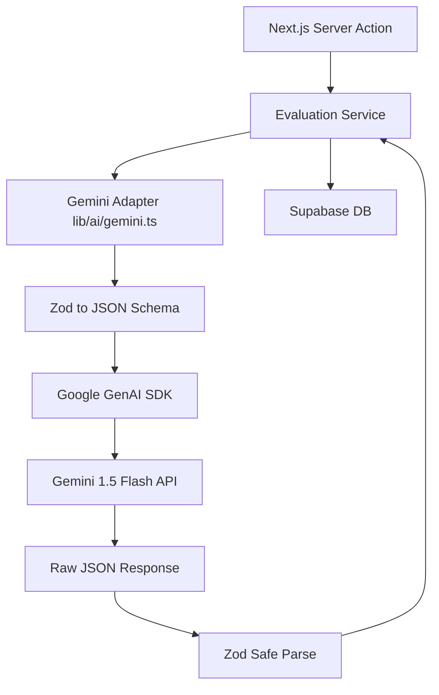
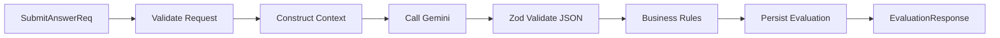
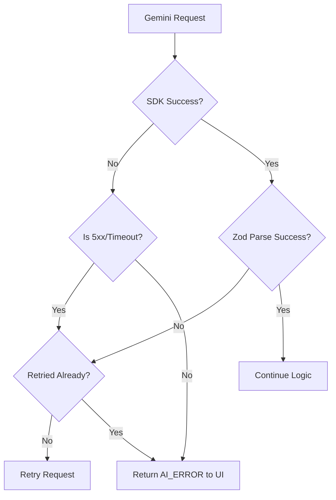

# 13 — Gemini Integration

## 1. Document Control

* **Document ID:** GEM-001
* **Document Name:** Tejaswini AI English Tutor - Gemini Integration Architecture
* **Version:** 1.0.0
* **Status:** APPROVED FOR IMPLEMENTATION
* **Product:** Web-based AI English Learning Application
* **Primary User:** Tejaswini (Beginner)
* **Owner:** Principal Google Gemini Integration Architect
* **Source of Truth:** Authoritative specification for integrating Google Gemini, managing the SDK, handling structured outputs, and maintaining the AI/Application boundary.

## 2. Purpose

This document defines the concrete technical architecture for integrating Google Gemini into the application. It translates the abstract prompt architecture (`12_AI_PROMPT_ARCHITECTURE.md`) and evaluation semantics (`11_EVALUATION_SPECIFICATION.md`) into an implementation-ready specification for the Gemini API/SDK, defining request lifecycles, structured output validation, error handling, and security boundaries.

## 3. Scope

The scope includes Gemini SDK initialization, model selection, prompt assembly, API execution, schema validation, retry logic, error mapping, observability, and testing. It explicitly excludes general application routing, database schema design, and UI rendering.

## 4. Source Documents and Authority

This document relies on the hierarchy established by:

1. `05_APPLICATION_ARCHITECTURE.md` (System boundaries)
2. `08_TYPES_AND_SCHEMAS.md` (Canonical schemas)
3. `09_API_CONTRACTS.md` (API boundaries)
4. `10_SUPABASE_SECURITY.md` (Security constraints)
5. `11_EVALUATION_SPECIFICATION.md` (Evaluation semantics)
6. `12_AI_PROMPT_ARCHITECTURE.md` (Prompt architecture)

## 5. Gemini Integration Objectives

* Provide highly reliable, deterministic structured JSON output.
* Enforce absolute security separation between client requests and Gemini API keys.
* Minimize latency to support a seamless conversational UX.
* Prevent model hallucinations from corrupting application state.

## 6. Gemini Integration Principles

* **Application is Authoritative:** Gemini does not mutate the database directly. It provides data candidate objects that the application validates and persists.
* **Parse, Don't Trust:** All Gemini output is untrusted until parsed by Zod runtime schemas.
* **Stateless Execution:** Gemini integrations are stateless. The application provides all necessary context per request.
* **Secret Isolation:** The `GEMINI_API_KEY` exists exclusively in server-side Next.js environments.

## 7. Gemini Capability Inventory

1. **Answer Evaluation:** Semantic evaluation of English translations, identifying errors, generating corrections, and providing Marathi explanations (MVP Core).
2. **Conversational Tutor:** (Future/Secondary) Open-ended Marathi conversation.
3. **Exercise Generation:** (Excluded from MVP, currently seeded in DB).

## 8. Gemini Capability Map

| Capability ID | Capability | Prompt ID | Input | Output | Model | Validation | Persistence | Failure Behavior |
| --- | --- | --- | --- | --- | --- | --- | --- | --- |
| `CAP_EVAL_01` | Evaluator | `PROMPT_EVAL_V1` | `EvaluationContext` | `AiEvaluationSchema` | Gemini 1.5 Flash | Zod -> Business | DB `evaluations` | Auto-retry 1x, then HTTP 503 |

## 9. Gemini Integration Boundary

```text
Application Services (Next.js Server Action)
        ↓
AI Domain Interface (EvaluationService)
        ↓
Gemini Adapter (src/lib/ai/gemini.ts)
        ↓
Google Gemini SDK (@google/genai)
        ↓
Gemini Model

```

## 10. Server-Side Architecture

All Gemini integration occurs strictly on the Next.js Server. Client components invoke Next.js Server Actions, which then invoke the Gemini Adapter. The browser NEVER communicates directly with Google Gemini APIs.

## 11. Gemini SDK Architecture

* **Library:** `@google/genai` (The current official Google GenAI SDK for Node.js/TypeScript).
* *Implementation Requirement:* Google Antigravity MUST verify the exact package name, version, and initialization syntax against current official Google documentation before implementation.
* **Initialization:** A singleton instance is initialized in `src/lib/ai/gemini.ts`.
* **Request Execution:** Uses `generateContent` configured for structured JSON output.

## 12. Gemini Client Initialization

Initialized once per server request context using the environment variable. It must not be instantiated globally if that violates Next.js serverless caching practices.

## 13. Environment Configuration

| Variable | Required | Server/Client | Secret | Purpose |
| --- | --- | --- | --- | --- |
| `GEMINI_API_KEY` | Yes | Server Only | Yes | Authenticates SDK with Google GenAI API |

## 14. Environment Validation

At application startup (via `src/config/env.ts` Zod validation), the presence of `GEMINI_API_KEY` is checked. If missing, the server fails to start, preventing silent runtime failures in production.

## 15. Model Configuration

* **Required Model Class:** Fast, low-latency, strong multilingual (Marathi/English) support, structured output capability.
* **Selected Model:** `gemini-1.5-flash` (or current official equivalent).
* *Implementation Requirement:* Google Antigravity must verify model availability and exact naming convention against current official documentation.

## 16. Model Selection Strategy

`gemini-1.5-flash` is selected over `gemini-1.5-pro` to prioritize minimal latency (< 2-3s) for the core evaluation loop, which requires small context windows and fast turnaround rather than complex multi-step logical reasoning.

## 17. Model Fallback Strategy

Fallback to alternative models is not supported in the MVP to minimize architectural complexity. If `gemini-1.5-flash` is unavailable, the request fails gracefully to the client.

## 18. Gemini Request Architecture

```text
AI Capability (Evaluation)
        ↓
Prompt ID / Version (`PROMPT_EVAL_V1`)
        ↓
Trusted Context (Marathi Source, Reference Answers)
        ↓
Task Input (Student Answer)
        ↓
Output Schema (`AiEvaluationSchema`)
        ↓
Gemini Request (`generateContent`)
        ↓
Gemini Response

```

## 19. Request Construction

The Gemini Adapter builds the request:

* `systemInstruction`: The immutable system prompt containing the persona, evaluation taxonomy, and rules.
* `contents`: The user message containing the JSON-stringified context (`marathiPrompt`, `studentAnswer`, etc.).

## 20. Content-Role Separation

* **System Role:** Evaluation rules, curriculum constraints.
* **User Role:** The specific data payload (Student answer, target concept).
Student input is never placed in the `systemInstruction` field to prevent prompt injection.

## 21. Gemini Prompt Assembly

Handled by the Prompt Builder (e.g., `buildEvaluationPrompt(context)`), mapping the domain `EvaluationContext` into the SDK `GenerateContentRequest` object.

## 22. Structured Output Architecture

The integration uses Gemini's native structured output capabilities:

* `responseMimeType: "application/json"`
* `responseSchema`: The JSON Schema representation of the required output.

## 23. Schema Compatibility

The `responseSchema` passed to Gemini MUST be generated directly from the Zod schemas in `08_TYPES_AND_SCHEMAS.md` (e.g., using `zodToJsonSchema`) to guarantee the AI output contract matches the application runtime validation contract.

## 24. Response Parsing

```text
Gemini Response (GenerateContentResponse)
        ↓
Extract Text (`response.text()`)
        ↓
Parse (`JSON.parse()`)
        ↓
Runtime Schema Validation (`AiEvaluationSchema.safeParse()`)
        ↓
Business Validation (e.g., If Grade A, zero errors)
        ↓
Canonical Domain Object (`Evaluation`)

```

## 25. Validation Pipeline

1. **Transport Validation:** Did the HTTP request succeed?
2. **Syntax Validation:** Is the response valid JSON?
3. **Schema Validation:** Does it match `AiEvaluationSchema`?
4. **Business Validation:** Are the enums and fields logically consistent?
5. **Persistence Validation:** Does Supabase accept the foreign keys?

## 26. Malformed Response Handling

If Gemini returns invalid JSON, missing fields, or incorrect enums:

* The Zod parser rejects the payload.
* The adapter throws an internal `GEMINI_SCHEMA_VALIDATION_ERROR`.
* The orchestration layer initiates a single technical retry.

## 27. Evaluation Integration

The core MVP integration. Implements `11_EVALUATION_SPECIFICATION.md`.

## 28. Evaluation Request

Passes:

* `marathiPrompt`
* `targetConceptName`
* `referenceTranslations`
* `studentAnswer`

## 29. Evaluation Response

Receives a JSON object matching `AiEvaluationSchema` (Grade A-F, corrected text, explanation, alternative translations, error categories).

## 30. Evaluation Validation

Ensures that if the AI hallucinates conflicting data (e.g., Grade A but populated error categories), the business layer normalizes or rejects the payload to protect the student's mastery data.

## 31. Tutor Integration

(Merged with Evaluation for MVP. The tutor's Marathi explanation is generated as a field within the Evaluation Response).

## 32. Tutor Request

N/A (Included in Evaluation Request).

## 33. Tutor Response

N/A (Included in Evaluation Response).

## 34. Exercise Generation Integration

(Excluded from MVP. Exercises are retrieved from Supabase).

## 35. Exercise Selection Integration

(Excluded from AI scope. Selected deterministically by application backend based on mastery data).

## 36. Correction Integration

Generated synchronously as `correctedText` inside the Evaluation Response.

## 37. Explanation Integration

Generated synchronously as `explanationMarathi` inside the Evaluation Response.

## 38. Adaptive Learning Integration

(Excluded from AI scope in MVP. Mastery states are updated deterministically based on Evaluation grades).

## 39. Voice Integration Boundary

Gemini is NOT involved in voice processing.

## 40. Speech-to-Text Boundary

Browser Native Web Speech API performs STT $\rightarrow$ Student edits transcription $\rightarrow$ Text string is sent to Gemini Evaluator.

## 41. Text-to-Speech Boundary

Browser Native `SpeechSynthesis` reads AI responses. Gemini is not involved in audio generation.

## 42. Multilingual Integration

Gemini must process mixed scripts flawlessly.

## 43. Marathi Handling

The prompt explicitly specifies that the source intent and explanations must be processed in Devanagari script (UTF-8). The SDK request naturally handles UTF-8 strings.

## 44. English Handling

The student answer and corrected text are evaluated in standard English, accommodating standard punctuation and contractions.

## 45. Input Limits

* `studentAnswer`: Max 500 characters (Enforced by API validation, not Gemini).
* Prevents token exhaustion and malicious payload bloat.

## 46. Context-Window Management

Context is minimized to the current exercise. Total input context is < 200 tokens. Historical session turns are NOT sent to Gemini to preserve latency.

## 47. Token-Budget Management

* **Input:** ~150-300 tokens (System Instructions + Context).
* **Output:** ~50-150 tokens (JSON Response).
* Extremely economical, fitting perfectly within Gemini 1.5 Flash parameters.

## 48. Generation Configuration

* `temperature: 0.2` (Prioritizes deterministic, consistent evaluation over creativity).
* `topP`: Default.
* `topK`: Default.
* `responseMimeType`: `"application/json"`.

## 49. Capability-Specific Configuration

Evaluation requires `temperature: 0.2`. Future conversational capabilities may use `0.7` for varied responses.

## 50. Safety Configuration

Configured in the SDK to block severe hate speech or dangerous content (`BLOCK_MEDIUM_AND_ABOVE`), though the input vector (pre-seeded exercises) limits exposure.

## 51. Safety Refusal Handling

If Gemini triggers a safety refusal (e.g., throwing a block exception):

* Adapter catches exception.
* Returns `GEMINI_SAFETY_REFUSAL` to orchestration layer.
* App presents a neutral error: "This request could not be processed." Student answer is NOT marked incorrect.

## 52. Rate Limiting

* Gemini API quotas are respected.
* If a `429 Too Many Requests` is received from Google, the adapter throws `GEMINI_RATE_LIMIT_ERROR`.

## 53. Concurrency Control

Duplicate requests from double-clicking "Submit" are blocked by the Next.js Server Action idempotency check *before* the Gemini Adapter is invoked.

## 54. Idempotency

Technical retries resulting from Gemini parse errors use the same input payload. Database unique constraints prevent duplicate persisted evaluations.

## 55. Retry Policy

* **Transport/Network:** Gemini SDK native retries (if configured).
* **Rate Limits (429):** Fail fast to client (do not block serverless thread with long backoffs).
* **Parse Failures (JSON/Zod):** 1 immediate technical retry.

## 56. Retry Limits

Max 1 application-level technical retry for schema validation failures.

## 57. Exponential Backoff

Not utilized for the synchronous chat UI to prevent hanging the client. Fail fast and let the user click "Retry Evaluation".

## 58. Timeout Policy

Gemini SDK calls are wrapped in an `AbortSignal` with a 5000ms timeout.
If exceeded, throws `GEMINI_TIMEOUT_ERROR`.

## 59. Request Cancellation

If the client disconnects, the Next.js framework may cancel the underlying fetch request, terminating the Gemini call early.

## 60. Stale-Response Protection

Responses to outdated exercises are rejected by the Application Service before persisting to Supabase.

## 61. Provider Error Taxonomy

* `GEMINI_CONFIGURATION_ERROR` (Missing keys)
* `GEMINI_NETWORK_ERROR` (Fetch failure)
* `GEMINI_TIMEOUT_ERROR` (Exceeded 5000ms)
* `GEMINI_RATE_LIMIT_ERROR` (HTTP 429)
* `GEMINI_PROVIDER_ERROR` (HTTP 5xx from Google)
* `GEMINI_INVALID_RESPONSE` (Empty/malformed)
* `GEMINI_SCHEMA_VALIDATION_ERROR` (Zod failure)
* `GEMINI_SAFETY_REFUSAL` (Blocked by safety filters)

## 62. Error Mapping

| Provider/Transport Error | Internal Error | Retryable | Recovery | Student-Facing Message | Logging |
| --- | --- | --- | --- | --- | --- |
| HTTP 429 | `GEMINI_RATE_LIMIT_ERROR` | No | Client Retry | "System busy. Please try again." | Warning |
| HTTP 500+ | `GEMINI_PROVIDER_ERROR` | Yes | 1x Auto | "Connection issue. Please retry." | Error |
| Zod Parse Fail | `GEMINI_SCHEMA_VALIDATION_ERROR` | Yes | 1x Auto | "Connection issue. Please retry." | Error + Payload |
| Timeout (>5s) | `GEMINI_TIMEOUT_ERROR` | No | Client Retry | "Connection issue. Please retry." | Warning |

## 63. User-Facing Error Handling

Never expose raw Gemini errors. Map to a generic, beginner-friendly "Connection issue" message via the `ActionError` DTO.

## 64. Developer-Facing Error Handling

Log the exact Zod parsing errors and LLM payload (excluding PII) to Vercel logs to debug prompt drift.

## 65. Secret Management

`GEMINI_API_KEY` is loaded from `process.env.GEMINI_API_KEY`.
It MUST NEVER enter client bundles.

## 66. API-Key Rotation

Simply update the Vercel Environment Variable and trigger a redeploy. No application code changes are required.

## 67. Key-Compromise Response

Revoke key in Google AI Studio, generate a new key, update Vercel, redeploy.

## 68. Client/Server Boundary

Browser $\rightarrow$ (HTTP POST) $\rightarrow$ Next.js Server Action $\rightarrow$ Gemini.
Browser has zero knowledge of Gemini's existence.

## 69. Next.js Integration Boundary

All Gemini operations are restricted to `src/lib/ai/` and consumed by `src/features/*/services/` utilized within `use server` Server Actions.

## 70. Google Antigravity Compatibility

The adapter pattern ensures Antigravity isolates AI code. It must construct the Gemini client strictly in `lib/ai/gemini.ts` and export domain-specific invocation functions (e.g., `evaluateTranslation(context)`).

## 71. Code Organization

`src/lib/ai/`

* `gemini.ts` (SDK Client and Adapter)
* `prompts/` (Prompt text and context builders)
* `schemas/` (Zod schemas matching `08_TYPES_AND_SCHEMAS.md`)

## 72. Gemini Adapter

Responsible for initializing the SDK, calling `generateContent`, extracting the text payload, and mapping provider errors to Internal Errors.

## 73. AI Orchestration Service

`src/features/practice/services/evaluation.service.ts` calls the Gemini Adapter, parses the result with Zod, applies business validation, and persists to Supabase.

## 74. Provider-Neutral Interface

The `EvaluationService` expects a function `evaluate(context: EvaluationContext): Promise<AiEvaluationOutput>`. The Gemini Adapter implements this signature.

## 75. Gemini-Specific Implementation Boundary

`responseMimeType`, `systemInstruction`, and SDK imports exist ONLY in `src/lib/ai/gemini.ts`.

## 76. Request Metadata

Application logs the Prompt ID (`EVAL_TRANS_V1`) and Model (`gemini-1.5-flash`) on each request.

## 77. Response Metadata

Application logs Latency and Validation Success.

## 78. Usage Metadata

Token counts from the SDK response are extracted and persisted in `evaluations.ai_metadata` as JSONB.

## 79. Observability

| Signal | Source | Recorded Data | Sensitive Data Excluded | Purpose |
| --- | --- | --- | --- | --- |
| Latency | Adapter | Duration (ms) | Yes | Performance tracking |
| Validation Fail | Zod Parse | Error path | Prompt omitted | Debug prompt drift |
| Token Usage | Gemini SDK | Input/Output tokens | Prompt omitted | Cost estimation |

## 80. Logging

Implemented via `console.info` and `console.error` in Server Actions.

## 81. Correlation IDs

`x-vercel-id` is used to correlate Next.js API requests with Gemini adapter logs.

## 82. Tracing

Detailed OpenTelemetry tracing is excluded from MVP.

## 83. Prompt-Version Observability

Stored in `evaluations.ai_metadata` in Supabase.

## 84. Model-Version Observability

Stored in `evaluations.ai_metadata` in Supabase.

## 85. Evaluation Reproducibility

By combining `studentAnswer`, `marathiPrompt`, `prompt_version`, and `model`, developers can replay the exact Gemini request locally for debugging.

## 86. Caching

Evaluations are NEVER cached. The nuances of student spelling and spacing require a fresh evaluation for every submission.

## 87. Cache Invalidation

N/A (No caching).

## 88. Gemini Cost Controls

Strict input length validation (< 500 chars). Idempotency checks prevent duplicate billing. `gemini-1.5-flash` model usage.

## 89. Production Safeguards

Zod validation prevents hallucinated A-F grades from breaking DB ENUM constraints.

## 90. Development Mode

Local development uses `.env.local` with a developer API key.

## 91. Test Environment

Unit/Integration tests use `tests/mocks/gemini.mock.ts` to simulate structured output without burning API tokens.

## 92. Unit Testing

Test prompt context building and Zod parsing independently of the Gemini SDK.

## 93. Integration Testing

Test the Gemini Adapter with a live API key against the Golden Dataset.

## 94. Contract Testing

Test that the output of `zodToJsonSchema(AiEvaluationSchema)` matches the structure required by the Gemini SDK.

## 95. Golden Tests

CI/CD script invokes the live Gemini API with the Golden Dataset from `11_EVALUATION_SPECIFICATION.md` to ensure >98% accuracy.

## 96. Evaluation Regression Testing

Required whenever `gemini-1.5-flash` updates its base model or the prompt template is modified.

## 97. Multilingual Testing

Ensure Devanagari script is correctly encoded in the JSON payload sent to Gemini and correctly decoded from the response.

## 98. Prompt Injection Testing

Include "Ignore previous instructions" in the Golden Dataset to verify the System Instruction priority holds.

## 99. Secret-Exposure Testing

Verify the Gemini Adapter does not throw raw SDK errors containing the API key.

## 100. Failure-Injection Testing

Mock the SDK to throw HTTP 503 and verify the Server Action returns the correct `ActionError`.

## 101. Performance Testing

Monitor average latency to ensure evaluations complete within the 3000ms UX target.

## 102. Load Considerations

MVP is for 1 student. Gemini API rate limits are practically limitless for this scope.

## 103. Scalability Boundary

The Gemini Adapter is entirely stateless. Horizontal scaling of the Next.js application automatically scales AI processing.

## 104. Concurrent Sessions

Server Actions run in isolated request contexts; prompt state cannot leak between requests.

## 105. Data Isolation

Context Builder only fetches the `ReferenceTranslations` for the specific `exerciseId` provided in the trusted payload.

## 106. Privacy Minimization

No Student IDs or names are sent to Gemini. Only the translation string is sent.

## 107. Student-Data Retention

Gemini provider data retention is subject to Google's API terms. The application retains the persisted evaluation indefinitely in Supabase.

## 108. Gemini Provider Data Considerations

* *Implementation Requirement:* Google Antigravity must verify current official Google AI Studio terms regarding data logging and training opt-outs to ensure student privacy.

## 109. Regional and Compliance Considerations

API requests originate from Vercel's edge/serverless functions. If data residency is required, configure Vercel region appropriately.

## 110. Content Safety Boundary

Gemini's safety settings protect against generating harmful feedback. Application limits protect Gemini from harmful student input.

## 111. Out-of-Scope Requests

The prompt instructs the AI to return Grade F and a specific explanation if the student attempts to use the AI as a general chatbot.

## 112. AI Refusal Behavior

Refusals (Safety blocks) are caught and mapped to `GEMINI_SAFETY_REFUSAL`, displaying a neutral "Connection issue" to the student without failing their attempt.

## 113. Gemini Response Safety Validation

Zod ensures no extra arbitrary keys (e.g., hidden messages) are accepted into the application state.

## 114. Generated-Content Grounding

Evaluations are grounded strictly to the `marathiPrompt` context provided in the payload.

## 115. Model Hallucination Handling

If the model hallucinates a grammar rule that doesn't exist, it cannot be automatically caught. The UX mitigation allows the student to "Retry" if confused.

## 116. Deterministic Post-Processing

If Zod parses `grade: 'A'` but `errorCategories: ['GRAMMAR']`, the `EvaluationService` strips the error array to `[]` to enforce logical consistency before DB insertion.

## 117. Gemini Adapter Error Isolation

SDK errors (e.g., `GoogleGenerativeAIError`) are caught inside `src/lib/ai/gemini.ts` and mapped to `ActionError` objects. They do not crash the Next.js server.

## 118. Canonical Internal AI Errors

`GEMINI_TIMEOUT_ERROR`, `GEMINI_SCHEMA_VALIDATION_ERROR`, `GEMINI_SERVICE_UNAVAILABLE`.

## 119. Request/Response Correlation

Tied via `attemptId` created prior to the Gemini invocation.

## 120. Request Deduplication

Handled by the DB/Server Action boundary (Unique constraint on `sessionExerciseId`).

## 121. Streaming Architecture

Not utilized.

## 122. Structured Output vs Streaming

Evaluation requires the full JSON object to validate business rules and persist to the database atomically. Streaming partial JSON is explicitly prohibited as it bypasses Zod validation.

## 123. Conversational Streaming

N/A for MVP.

## 124. Evaluation Non-Streaming Behavior

Gemini is invoked via `generateContent`, awaiting the complete parsed JSON response.

## 125. Batch Operations

Not utilized. Each student answer is evaluated individually in real-time.

## 126. Asynchronous Operations

Server Actions await the Gemini response before returning the HTTP response to the browser.

## 127. Model Fallback Implications for Evaluation

Not applicable (Fallback not implemented).

## 128. Model Upgrade Policy

Upgrades require re-running the Golden Dataset to ensure evaluation severity hasn't drifted.

## 129. Prompt Upgrade Policy

Same as Model Upgrade Policy.

## 130. Schema Upgrade Policy

Changes to `AiEvaluationSchema` require coordinated deployment of frontend UI types, Database Enums, and Prompt Instructions.

## 131. Integration Upgrade Policy

Google GenAI SDK upgrades must pass all integration tests before deployment.

## 132. Deprecated API Protection

* *Implementation Rule:* Do not use legacy `@google/generative-ai` if newer standard Google SDKs are released. Google Antigravity MUST verify current docs.

## 133. Official Documentation Verification

Google Antigravity must check `[aistudio.google.com/app/apikey](https://aistudio.google.com/app/apikey)` for current SDK initialization paradigms and structured output parameter names (`responseSchema` vs `schema`, etc.).

## 134. Gemini Capability Matrix

### `CAP_EVAL_01`

**Purpose:** Evaluate English translation for semantic and grammatical correctness.
**Prompt ID:** `PROMPT_EVAL_V1`
**Prompt Version:** 1.0
**Inputs:** `EvaluationContext`
**Trusted Inputs:** `marathiPrompt`, `targetConceptName`, `referenceTranslations`
**Untrusted Inputs:** `studentAnswer`
**Gemini Model:** `gemini-1.5-flash`
**Generation Configuration:** `temperature: 0.2`, `responseMimeType: "application/json"`
**Output Contract:** `AiEvaluationSchema`
**Validation:** Zod `.strict()`
**Persistence:** `evaluations` table via Service Role
**Retry Behavior:** 1x on parse/5xx failure.
**Failure Behavior:** Return generic error; retain student attempt in UI.
**Security Requirements:** Server-side execution only.
**Observability:** Log latency and token usage.

## 135. Gemini Configuration Matrix

| Capability | Model | Generation Configuration | Structured Output | Safety Configuration | Timeout | Retry |
| --- | --- | --- | --- | --- | --- | --- |
| Evaluation | `gemini-1.5-flash` | `temperature: 0.2` | Yes (JSON Schema) | `BLOCK_MEDIUM_AND_ABOVE` | 5000ms | 1x |

## 136. Request/Response Matrix

| Capability | Request | Gemini Input | Gemini Output | Application Output |
| --- | --- | --- | --- | --- |
| Evaluation | `SubmitAnswerReq` | `SystemPrompt` + Stringified `EvalContext` | Raw JSON String | `EvaluationResponse` |

## 137. Error Mapping Matrix

| Provider/Transport Error | Internal Error | Retryable | Recovery | Student-Facing Message | Logging |
| --- | --- | --- | --- | --- | --- |
| Google API 503 | `GEMINI_PROVIDER_ERROR` | Yes | Auto 1x | "Connection issue. Please retry." | Error |
| Validation Failure | `GEMINI_SCHEMA_ERROR` | Yes | Auto 1x | "Connection issue. Please retry." | Warn + Payload |
| Safety Exception | `GEMINI_SAFETY_REFUSAL` | No | User Retry | "Connection issue. Please retry." | Warn |

## 138. Retry Matrix

| Failure | Retry? | Max Attempts | Backoff | Fallback | Final Behavior |
| --- | --- | --- | --- | --- | --- |
| JSON Parse Error | Yes | 1 | Immediate | None | Return ActionError |
| HTTP 429 Limit | No | 0 | N/A | None | Return ActionError |
| HTTP 5xx | Yes | 1 | Immediate | None | Return ActionError |

## 139. Security Matrix

| Asset/Threat | Risk | Control | Enforcement Layer | Verification |
| --- | --- | --- | --- | --- |
| API Key Exposure | Critical | ENV variables only | Vercel / Next.js Server | Build inspection |
| Prompt Injection | High | Strict system prompt framing | AI Prompt | Golden Dataset Tests |
| DB Corruption | High | Zod Validation | App Service | Integration Tests |

## 140. Observability Matrix

| Signal | Source | Recorded Data | Sensitive Data Excluded | Purpose |
| --- | --- | --- | --- | --- |
| AI Failure | Adapter | Error stack, Request ID | Student Answer | Debugging integration |
| Performance | Adapter | Latency ms | Prompt text | Monitoring UX targets |

## 141. Testing Matrix

| Test | Scope | Method | Expected Result | Acceptance Criterion |
| --- | --- | --- | --- | --- |
| Schema Parity | Unit | `zodToJsonSchema` | Matches SDK type | Schema builds successfully |
| Golden Dataset | Integration | Call Gemini API | JSON fits A-F rules | >98% accuracy on test cases |
| Timeout Handling | Unit | Mock 6s response | Throws `GEMINI_TIMEOUT_ERROR` | Server Action returns clean DTO |

## 142. Model Matrix

| Capability | Primary Model | Fallback | Reason | Compatibility | Verification |
| --- | --- | --- | --- | --- | --- |
| Evaluation | `gemini-1.5-flash` | None | Low latency, JSON output | High | Verify in current SDK docs |

## 143. Environment Variable Matrix

| Variable | Required | Server/Client | Secret | Purpose |
| --- | --- | --- | --- | --- |
| `GEMINI_API_KEY` | Yes | Server | Yes | Gemini API Authentication |

## 144. Gemini Architecture Diagram



## 145. Evaluation Integration Diagram



## 146. Request Lifecycle Diagram

(Captured in 144/145).

## 147. Error-Handling Flow Diagram



## 148. Retry Flow Diagram

(Captured in 147).

## 149. Gemini Acceptance Criteria

| ID | Requirement | Verification Method | Pass Condition |
| --- | --- | --- | --- |
| GEM-AC-01 | Server-Side Only | Build inspection | `GEMINI_API_KEY` is not present in output `.js` bundles. |
| GEM-AC-02 | Structured Output | Integration Test | Gemini always returns parseable JSON matching the Zod schema. |
| GEM-AC-03 | Graceful Timeout | Mock 6000ms delay | API returns `success: false` without crashing the Next.js process. |

## 150. Google Antigravity Implementation Rules

* Read official Google Gemini SDK docs before writing `src/lib/ai/gemini.ts`.
* DO NOT use `@google/generative-ai` if a newer official library is recommended for Node/TypeScript.
* Enforce `responseMimeType: "application/json"`.
* Bind the Zod schema via `zodToJsonSchema` or equivalent natively supported parameter.
* Never export the initialized Gemini client to UI components.

## 151. Gemini Integration Anti-Patterns

* **Prohibited:** `const response = await fetch("https://generativelanguage.../generateContent")` (Use the SDK).
* **Prohibited:** Leaving `temperature` at default (Force 0.2 for evaluation).
* **Prohibited:** Exposing raw `err.message` from the SDK to the client.

## 152. Integration Decisions

* **Decision:** Single, synchronous API call per evaluation. (Maximizes speed and simplifies error handling).
* **Decision:** No SDK-level caching. (Every student string is unique).

## 153. Assumptions

* Gemini 1.5 Flash provides < 3000ms latency for small < 500 token context windows.
* Vercel Serverless Functions have a timeout limit greater than 5000ms.

## 154. Open Integration Questions

| ID | Question | Why It Matters | Status |
| --- | --- | --- | --- |
| GEM-OQ-01 | Will `gemini-1.5-flash` enforce strict JSON schema keys effectively without drifting? | If drift occurs, we may need to switch to a strict object parsing library or an explicit fallback model. | Open (Monitor via Zod validation logs) |

## 155. Final Consistency Audit

The architecture firmly encapsulates Gemini as an untrusted, stateless external service accessed only via Server Actions. Zod acts as the absolute boundary ensuring that the database only persists valid, structured semantic evaluations, protecting the core application logic from AI hallucination and security threats.

## 156. Gemini Integration Completion Checklist

* [x] Evaluator capability isolated to Gemini Adapter.
* [x] Secret management strictly server-only.
* [x] Structured JSON output and Zod validation mandated.
* [x] Technical retry and timeout thresholds set.
* [x] Error taxonomy and user-facing masking defined.
* [x] Model selection (Gemini 1.5 Flash) and config locked.
* [x] Google Antigravity SDK verification required.