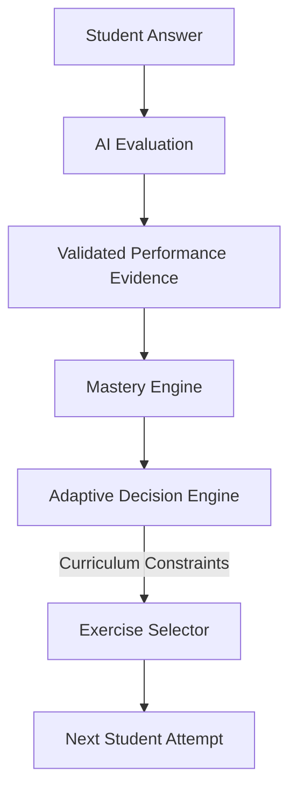
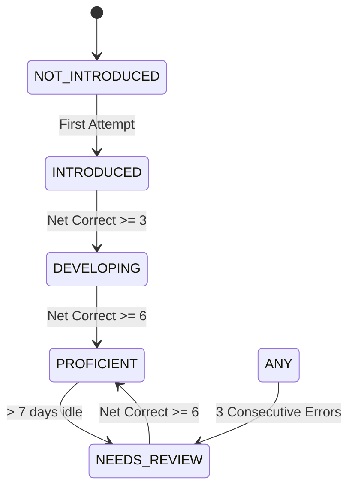
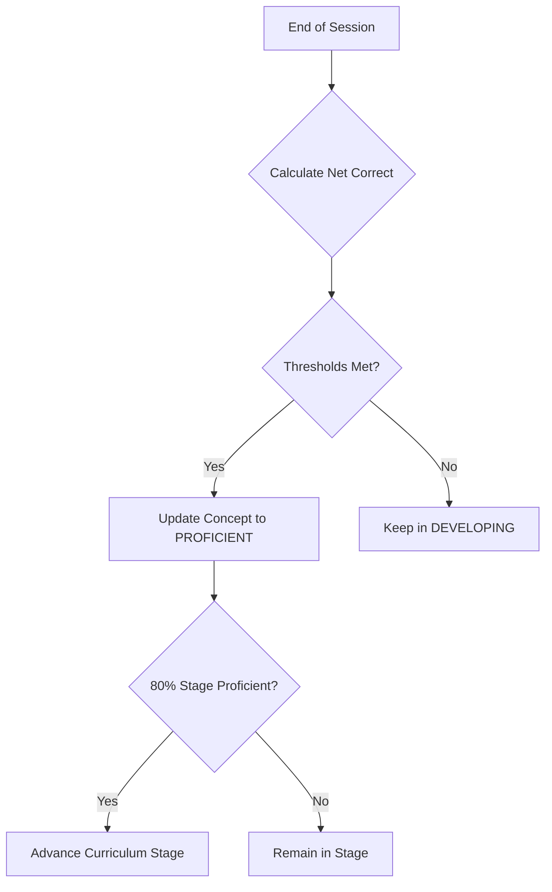
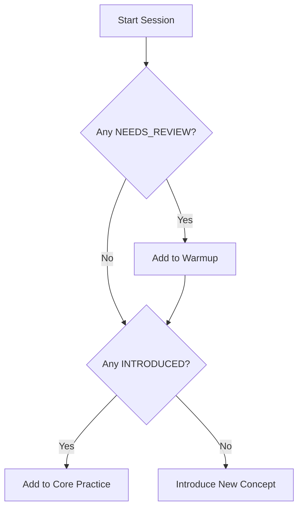

# 14 — Adaptive Learning

## 1. Document Control

* **Document ID:** ADAPT-001
* **Document Name:** Tejaswini AI English Tutor - Adaptive Learning Specification
* **Version:** 1.0.0
* **Status:** APPROVED FOR IMPLEMENTATION
* **Product:** Web-based AI English Learning Application
* **Primary User:** Tejaswini (Beginner)
* **Owner:** Principal Adaptive-Learning Architect
* **Source of Truth:** Authoritative specification for mastery calculation, error tracking, exercise selection, review scheduling, and adaptive curriculum progression.

## 2. Purpose

This document defines precisely how the application utilizes student attempts, AI evaluations, and error patterns to adapt the learning experience. It ensures Tejaswini receives a personalized progression path that remediates weaknesses and reinforces strengths without relying on unpredictable "black box" AI decisions.

## 3. Scope

The scope encompasses the deterministic rules for updating mastery, scheduling reviews, triggering mini-lesson remediations, adjusting exercise difficulty, and selecting the next exercise within a practice session. It defines the boundary between authoritative application logic and AI-assisted recommendations.

## 4. Source Documents and Authority

This specification synthesizes and respects:

1. `01_PRODUCT_REQUIREMENTS.md` (Product goals)
2. `02_LEARNING_CURRICULUM.md` (Curriculum structure & session limits)
3. `05_APPLICATION_ARCHITECTURE.md` (System boundaries)
4. `06_DATABASE_SCHEMA.md` (Persistence of mastery)
5. `11_EVALUATION_SPECIFICATION.md` (Evaluation categories A-F)

## 5. Adaptive Learning Objectives

* **Targeted Remediation:** Detect recurring grammatical errors and intervene immediately.
* **Spaced Reinforcement:** Systematically reintroduce previously mastered concepts.
* **Optimal Challenge:** Maintain difficulty appropriate to Tejaswini's current state to prevent boredom or frustration.
* **Transparent Progression:** Ensure advancement through curriculum stages is grounded in verifiable evidence.

## 6. Adaptive Learning Principles

* **Evidence-Based:** Mastery requires repeated success across varied contexts, not a single lucky answer.
* **Application is Authoritative:** Gemini evaluates text; the application decides the next step.
* **Fail-Safe Adaptation:** A technical failure (e.g., speech recognition error) must never degrade the student's mastery score.
* **MVP Simplicity:** Rely on deterministic, rules-based adaptation rather than complex machine learning algorithms for a single-student deployment.

## 7. Adaptive Learning Architecture Overview



## 8. Adaptive Learning Responsibility Model

* **AI (Gemini):** Categorizes errors and assigns a semantic grade (A-F).
* **Mastery Engine (App Service):** Updates the student's database profile based on grades.
* **Decision Engine (App Service):** Determines if the next action is to continue, review, or remediate.
* **Exercise Selector (App Service):** Queries the database for a specific exercise matching the decision criteria.

## 9. Learning Objective Inventory

| Objective ID | Objective | Stage | Difficulty | Prerequisites | Mastery Evidence | Review Requirement |
| --- | --- | --- | --- | --- | --- | --- |
| LO-01 | Pronouns + Be | 1 | 1-2 | None | 5 correct uses | Medium frequency |
| LO-02 | Simple Present | 2 | 2-3 | LO-01 | 5 correct 3rd person uses | High frequency |
| LO-03 | Present Cont. | 3 | 2-3 | LO-01, LO-02 | 5 correct be+ing uses | Medium frequency |
| LO-04 | Simple Past | 4 | 3-4 | LO-02 | 5 correct irregular uses | High frequency |

## 10. Concept Model

A `Concept` represents a granular, testable grammar or vocabulary rule (e.g., "3rd Person Singular 's'").

* **Fields:** `concept_id`, `stage_id`, `prerequisites`, `difficulty_baseline`.

## 11. Skill Dimensions

The MVP tracks three primary dimensions based on AI output:

1. **Semantic/Translation:** Preserving meaning.
2. **Grammar:** Structural accuracy (e.g., tense, agreement).
3. **Vocabulary:** Correct word choice.
*(Note: Pronunciation is explicitly excluded from MVP).*

## 12. Mastery Definition

Mastery is the demonstrated ability to accurately and independently translate sentences requiring a specific concept, across multiple sessions, without major grammatical errors.

## 13. Mastery Evidence

* **Positive Evidence:** Evaluations graded **A** (Fully correct) or **B** (Correct but unnatural).
* **Negative Evidence:** Evaluations graded **C** (Minor error), **D** (Partially correct), or **E** (Incorrect).
* **Neutral Evidence:** Evaluations graded **F** (Off-topic/Gibberish/Technical failure) do not affect mastery.

## 14. Evidence Weighting

MVP uses a simple unweighted counter model:

* Grade A/B = +1 Correct Attempt.
* Grade C/D/E = +1 Incorrect Attempt.
*(Future: Grade E could weigh -2, but MVP retains simplicity).*

## 15. Mastery States

| State | Definition | Entry Condition | Exit Condition | Allowed Actions |
| --- | --- | --- | --- | --- |
| `NOT_INTRODUCED` | Never seen | Default state | Attempt > 0 | Intro, Core Practice |
| `INTRODUCED` | Seen but unproven | Attempt > 0 | Net Correct >= 3 | Core Practice |
| `DEVELOPING` | Progressing | Net Correct >= 3 | Net Correct >= 6 | Core, Voice |
| `PROFICIENT` | Mastered | Net Correct >= 6 | Decay > 7 days | Advance, Review |
| `NEEDS_REVIEW` | Decayed or forgotten | Decay > 7 days OR Net < 4 | Net Correct >= 6 | Review, Remediation |

## 16. Mastery State Transitions

| Current State | Evidence | Next State | Reason |
| --- | --- | --- | --- |
| `INTRODUCED` | 3 Consecutive Correct | `DEVELOPING` | Consistency shown |
| `DEVELOPING` | 3 Consecutive Correct | `PROFICIENT` | Threshold met |
| `PROFICIENT` | 7 Days Elapsed | `NEEDS_REVIEW` | Spaced repetition |
| `ANY` | 3 Consecutive Errors | `NEEDS_REVIEW` | Performance regression |

## 17. Mastery Decay

Mastery naturally decays over time. If a concept marked `PROFICIENT` has not been tested in 7 days, its state transitions to `NEEDS_REVIEW`.

## 18. Review Model

Review is the systematic re-testing of `PROFICIENT` or `NEEDS_REVIEW` concepts using *different* exercise sentences. It reinforces long-term retention.

## 19. Remediation Model

Remediation occurs when a student repeatedly fails a specific concept (3 consecutive errors). The system halts standard progression, lowers difficulty to Level 1, and provides a targeted mini-lesson explicitly contrasting the error.

## 20. Reinforcement Model

For `DEVELOPING` concepts, the system interleaves these with easier `PROFICIENT` concepts to build confidence without overwhelming the student.

## 21. Progression Model

The student unlocks a new Curriculum Stage only when **80% of concepts in the current stage are marked `PROFICIENT**`.

## 22. Regression Model

If a student drops below 50% proficiency in their current stage, the system temporarily restricts new concept introduction and focuses heavily on Review and Remediation.

## 23. Difficulty Model

Difficulty scales from 1 to 6 based on sentence length, grammatical overlap, and contextual ambiguity.

## 24. Difficulty Levels

* **Level 1:** < 4 words, single concept, known vocabulary.
* **Level 2:** < 6 words, single concept.
* **Level 3:** Two overlapping concepts (e.g., Negative + Present).
* **Level 4:** Past/Future tenses with time markers.
* **Level 5:** Context-dependent translations.
* **Level 6:** Multi-turn conversational scenarios.

## 25. Difficulty Transitions

* **Increase:** 3 consecutive Grade A/B answers at current difficulty.
* **Maintain:** Mixed performance (Grades A/C).
* **Decrease:** 2 consecutive Grade D/E answers at current difficulty.

## 26. Adaptive Difficulty Guardrails

* Difficulty cannot increase more than 1 level per session for a specific concept.
* Difficulty cannot drop below the concept's baseline prerequisite level.

## 27. Recent Performance

The system evaluates the last 5 attempts for a specific concept to make immediate adaptive decisions (e.g., trigger remediation).

## 28. Long-Term Performance

Stored as `total_correct` and `total_incorrect` in the `mastery` table. Used for stage progression and global XP.

## 29. Recency vs Historical Evidence

Recent performance (last 5 attempts) overrides historical performance. A student who historically answered 100 correctly but fails 3 times today requires immediate remediation.

## 30. Performance Trends

* **Improving:** Recent accuracy > Historical accuracy.
* **Declining:** Recent accuracy < 50%. (Triggers Review).

## 31. Minimum Evidence Requirements

A concept requires at least 3 attempts before its state can transition from `INTRODUCED` to `DEVELOPING`.

## 32. Cold-Start Behavior

New students start at Stage 1, Difficulty 1. No assumptions of prior knowledge are made.

## 33. New-Concept Behavior

New concepts are introduced at Difficulty 1. They are heavily weighted toward direct translation exercises before moving to contextual exercises.

## 34. Prerequisite Logic

If Concept B (Present Continuous) requires Concept A (Be Verb), Concept B cannot enter `INTRODUCED` state until Concept A is `PROFICIENT`.

## 35. Prerequisite Recovery

If a student in Stage 3 fails Subject-Verb agreement (a Stage 2 concept) repeatedly, the system schedules a Stage 2 remediation exercise in the next session.

## 36. Error-to-Concept Mapping

| Error Type | Curriculum Concept | Evidence Strength | Adaptive Response |
| --- | --- | --- | --- |
| `TENSE` | Current Stage Tense | Strong Negative | Queue Tense Remediation |
| `AGREEMENT` | Subject-Verb | Strong Negative | Queue Agreement Remediation |
| `ARTICLE` | Articles / Nouns | Weak Negative | Slight difficulty drop |

## 37. Repeated-Error Detection

The system queries the `evaluation_errors` table for the current session. If `category == X` occurs 3 times, a `REMEDIATE` decision is generated.

## 38. Error Severity Influence

* `MEANING` and `TENSE` errors drive immediate difficulty reduction.
* `SPELLING` and `NATURALNESS` errors do not reduce difficulty.

## 39. Error Frequency

Tracked continuously during a session. Resets at the start of a new session.

## 40. Error Recency

Errors made > 30 days ago hold minimal weight compared to errors made in the current session.

## 41. Error Persistence

If an error persists across 3 separate sessions despite remediation, the concept is flagged internally for "Hard Review," capping its difficulty at 2.

## 42. Context Diversity

To reach `PROFICIENT`, a student must correctly translate a concept using at least 3 different vocabulary themes (e.g., Food, Travel, Work).

## 43. Exercise Diversity

The Exercise Selector ensures no single exercise format (e.g., pure text translation) dominates if voice exercises are available for the concept.

## 44. Mastery Generalization

Mastery is tied to the grammatical concept, not the specific Marathi string.

## 45. Memorization Detection

If the student answers an exercise correctly but fails a structurally identical exercise with different vocabulary, true mastery is not yet achieved.

## 46. Duplicate-Exercise Handling

The Exercise Selector maintains a `recently_used` array in memory. An exact `exercise_id` cannot be repeated within 48 hours.

## 47. Exercise Selection

Selection is deterministic, governed by the session pacing rules defined in `02_LEARNING_CURRICULUM.md`.

## 48. Next-Exercise Selection

Determined at the start of the session and adjusted dynamically only if a `REMEDIATE` trigger fires mid-session.

## 49. Deterministic Selection

MVP entirely relies on deterministic SQL queries filtering by `concept_id`, `difficulty_level`, and excluding `recently_used`.

## 50. AI-Assisted Selection

**Status: Excluded from MVP.** (Future enhancement: Gemini analyzes error nuances to dynamically generate bespoke sentences).

## 51. AI Authority Boundary

Gemini evaluates the string. Gemini NEVER updates the `mastery` table or decides the next `concept_id`.

## 52. Adaptive Recommendation Contract

N/A for MVP. Deterministic rules apply.

## 53. Adaptive Decision Authority

The Next.js Application Service (`ProgressService`) is the absolute authority on adaptive state.

## 54. Adaptive Decision Types

### `CONTINUE`

**Definition:** Standard progression within current concept.
**Trigger:** Grade A/B/C.
**Action:** Present next planned exercise.

### `REMEDIATE`

**Definition:** Interrupt flow for a mini-lesson.
**Trigger:** 3 consecutive errors on same concept.
**Action:** Drop difficulty, show contrastive exercise.

### `REVIEW`

**Definition:** Revisit older material.
**Trigger:** Session warmup slot OR 7-day decay.
**Action:** Select exercise from `PROFICIENT` concept.

### `ADVANCE`

**Definition:** Unlock new curriculum stage.
**Trigger:** 80% Stage concepts `PROFICIENT`.
**Action:** Update student profile `current_stage_id`.

## 55. Adaptive Decision Schema

```typescript
type AdaptiveDecision = {
  type: 'CONTINUE' | 'REMEDIATE' | 'REVIEW' | 'ADVANCE';
  targetConceptId: string;
  targetDifficulty: number;
  reason: string;
};

```

## 56. Adaptive API Behavior

The `/actions/session/complete` endpoint aggregates session data, recalculates mastery, and stores the updated state. The next call to `/actions/session/start` reads this state to build the queue.

## 57. Adaptive Persistence

Decisions update the `mastery` table (`status`, `correct_attempts`) and `students` table (`current_stage_id`).

## 58. Adaptive Security

Client-provided mastery scores are ignored. Only evaluations generated by the server-side AI orchestration can alter adaptive state.

## 59. Adaptive Code Organization

Housed in `src/features/progress/services/adaptive.service.ts`.

## 60. Adaptive Prompt Integration

If Remediation is triggered, the AI Context is updated with a `targetConceptName` to force the AI to provide a highly specific explanation for that concept.

## 61. Gemini Integration

Gemini acts as the sensor (detecting errors). The Adaptive Engine acts as the brain (updating state).

## 62. Adaptive Data Flow

| Stage | Input | Processing | Output | Owner |
| --- | --- | --- | --- | --- |
| Evaluation | Attempt | Zod / Gemini | Grades & Errors | `EvalService` |
| Calculation | Grades & Errors | SQL Aggregation | Mastery Deltas | `ProgressService` |
| Decision | Mastery Deltas | Threshold Check | `AdaptiveDecision` | `AdaptiveEngine` |
| Selection | `AdaptiveDecision` | DB Query | `Exercise[]` | `SessionService` |

## 63. Mastery-Update Timing

Mastery is updated at the END of a session during `/actions/session/complete`. Mid-session updates are kept in memory to prevent DB locking.

## 64. Transaction Boundaries

Updating the `mastery` table and `students` table during session completion is wrapped in a single database transaction.

## 65. Idempotency

If the client submits `/actions/session/complete` twice due to network lag, the server checks `sessions.status`. If already `COMPLETED`, mastery updates are skipped.

## 66. Adaptive-State Versioning

Not required for MVP. If the algorithm changes in v2, previous `mastery` states remain valid starting points.

## 67. Adaptive Algorithm Version

Hardcoded in `adaptive.service.ts` as `ALGO_VERSION = '1.0'`.

## 68. Historical Reproducibility

The `evaluations` and `attempts` tables provide an immutable, append-only log of every interaction. A data scientist can reconstruct the exact mastery state at any point in time.

## 69. Adaptive Decision Auditability

Decisions are implicit based on the database state; formal audit logging of every internal decision tree branch is excluded from MVP to maintain simplicity.

## 70. Adaptive Decision Explanation

"Why am I seeing this exercise?" $\rightarrow$ The UI maps `REMEDIATE` to "Let's review this again."

## 71. Student-Facing Adaptive Behavior

The UI does not expose raw algorithms. Progression feels natural, like a tutor slowing down when the student struggles.

## 72. Student-Facing Messaging

* `REVIEW`: "Let's do a quick warm-up!"
* `REMEDIATE`: "You seem to be having trouble with this. Let's practice it."
* `ADVANCE`: "Great job! You've unlocked a new stage!"

## 73. Adaptation Transparency

No hidden penalties. If difficulty drops, the student is informed it's to help them practice a specific rule.

## 74. Adaptive Fairness

A single typo (Grade C) does not drop difficulty. Voice STT errors (if unedited) are treated as minor spelling errors, preventing unfair difficulty drops.

## 75. Uncertainty Handling

If Gemini outputs Grade F (Unintelligible) due to a parsing error or gibberish, it is ignored by the mastery engine completely.

## 76. Invalid-Evaluation Handling

If the AI times out or returns invalid JSON, the attempt is not evaluated, and no adaptive state changes occur.

## 77. Infrastructure-Failure Isolation

A 503 from Google Gemini results in a UI retry prompt, completely isolated from the student's mastery profile.

## 78. Adaptation Stability

Difficulty changes require multiple data points (2 failures or 3 successes) to prevent oscillation.

## 79. Hysteresis

It is harder to increase difficulty (requires 3 successes) than to decrease it (requires 2 failures), favoring a strong foundation over rapid, fragile advancement.

## 80. Smoothing

Mastery status transitions (`DEVELOPING` $\rightarrow$ `PROFICIENT`) require a net positive balance of correct vs incorrect attempts.

## 81. Confidence

AI Confidence is not utilized. Gemini outputs deterministic grades.

## 82. Mastery vs Confidence

Mastery = Proven database history of student success. Confidence = (Not used).

## 83. Scoring

Total XP is a gamification layer. Mastery is the true educational state. XP only goes up; Mastery can go up or down.

## 84. Category-to-Evidence Mapping

* A, B $\rightarrow$ +1 Correct.
* C, D, E $\rightarrow$ +1 Incorrect.
* F $\rightarrow$ 0 (Ignored).

## 85. Evaluation-to-Mastery Mapping

Same as 84.

## 86. Mastery-to-Adaptation Mapping

| Mastery State | Recent Performance | Recommended Action | Difficulty |
| --- | --- | --- | --- |
| `INTRODUCED` | N/A | `CONTINUE` | 1 |
| `DEVELOPING` | Improving | `CONTINUE` | +1 |
| `PROFICIENT` | Decayed > 7d | `REVIEW` | Current |
| `ANY` | 3 Errors | `REMEDIATE` | 1 |

## 87. Error-to-Adaptation Mapping

| Error Pattern | Frequency/Severity | Adaptive Response |
| --- | --- | --- |
| Same Error Cat. | 3 in one session | Trigger `REMEDIATE` |
| Grade E | 2 consecutive | Drop Difficulty -1 |

## 88. Difficulty-to-Exercise Mapping

| Difficulty | Exercise Characteristics | Selection Conditions |
| --- | --- | --- |
| 1 | Short, direct | New concept or Remediation |
| 3 | Tense variations | `DEVELOPING` state |
| 5 | Contextual | `PROFICIENT` review |

## 89. Review Scheduling

Triggered deterministically:

1. `PROFICIENT` concept unpracticed for 7 days.
2. Allocated to the first 2 "Warm-up" slots of the next session.

## 90. Review Priority

1. Recently degraded concepts (`NEEDS_REVIEW`).
2. Oldest `PROFICIENT` concepts.
3. Random `PROFICIENT` concepts.

## 91. Review Failure

If a student fails a Review exercise (Grade D/E), the concept's state drops from `PROFICIENT` to `NEEDS_REVIEW`.

## 92. Review Success

If successful (Grade A/B), the `last_practiced_at` timestamp is updated, pushing the next review 7 days out.

## 93. Retention Evidence

Review success counts as strong retention evidence, keeping the concept in `PROFICIENT` status.

## 94. Interleaving

The 5 "Core Practice" slots in a session intentionally mix the primary target concept with a secondary, previously learned concept to promote contextual recall.

## 95. Blocking vs Interleaving

* **Blocking:** Used during Remediation (drilling the exact same concept 3 times).
* **Interleaving:** Used during standard Core Practice.

## 96. Adaptive Exercise Composition

Exercises are pre-authored in the DB. The system queries an exercise matching `concept_id` and `difficulty`.

## 97. Multi-Error Attribution

If an answer yields `[TENSE, ARTICLE]`, the primary failure is attributed to `TENSE` (highest severity), and mastery for the Tense concept is penalized. `ARTICLE` is treated as informational.

## 98. Semantic-Error Attribution

Attributed to the primary learning objective of the exercise.

## 99. Vocabulary Weakness

Tracked via `VOCABULARY` error categories, but MVP does not adapt specific vocabulary lists, only grammatical concepts.

## 100. Grammar Weakness

Drives standard Remediation loops.

## 101. Translation Weakness

Drives reduction in overall sentence length/difficulty.

## 102. Conversational Weakness

N/A (Open conversation is outside MVP).

## 103. Cross-Skill Transfer

MVP assumes concepts are independent. Mastering "Simple Present" does not automatically grant mastery points to "Present Continuous".

## 104. Evidence Independence

Only distinct attempts count. Retries of the *exact same* exercise within the same session do not award additional mastery points.

## 105. Attempt Independence

A "Retry" after a failure allows the student to progress the session, but the initial failure is what counts toward the long-term mastery calculation.

## 106. Session-Level Adaptation

Occurs via the `REMEDIATE` trigger if the student fails rapidly.

## 107. Session Boundaries

10-15 questions. Mastery writes to DB happen at the end.

## 108. Cross-Session Adaptation

Determines the composition of the *next* session's warmup and core queues based on historical database state.

## 109. New-Session Behavior

1. Check `current_stage_id`.
2. Query `NEEDS_REVIEW` concepts (assign to Warmup).
3. Query `INTRODUCED`/`DEVELOPING` concepts (assign to Core).

## 110. Daily Planning Interaction

Not applicable. The system relies on Session-by-Session pacing.

## 111. Daily Plan vs Adaptive Engine

N/A

## 112. Session Goal vs Adaptive Engine

The Session Goal (e.g., "Complete 10 exercises") is a hard UX constraint. The Adaptive Engine determines *which* 10 exercises fill those slots.

## 113. Curriculum Progression vs Adaptive Engine

Curriculum mandates the sequence (Stage 1 $\rightarrow$ 2). The Adaptive engine mandates the pace (How long we stay in Stage 1).

## 114. Adaptive Constraints

* Cannot select an exercise > 1 difficulty level higher than the student's current proficiency.
* Cannot select concepts from locked stages.

## 115. Hard vs Soft Constraints

| Constraint | Type | Enforcement Layer | Can AI Override? |
| --- | --- | --- | --- |
| Stage Prerequisites | Hard | DB / App Service | No |
| Session Length (10) | Hard | App Service | No |
| Interleaving Ratio | Soft | App Service | No |

## 116. Adaptive Decision Priority

1. Safety/System constraints (Stage limits).
2. Required Remediation (Mid-session failures).
3. Scheduled Review (7-day decay).
4. Current target concept advancement.

## 117. Starvation Prevention

The Exercise Selector orders `NEEDS_REVIEW` by `last_practiced_at ASC` to ensure all weak concepts are eventually tested.

## 118. Over-Practice Prevention

`PROFICIENT` concepts are excluded from the Core Practice queue unless explicitly pulled into the Warmup/Review slots.

## 119. Under-Practice Prevention

Concepts remain in `DEVELOPING` until 6 net correct attempts are recorded, ensuring sufficient practice before moving on.

## 120. Exploration vs Exploitation

* **Exploration:** Introducing a new concept at Level 1.
* **Exploitation:** Drilling a `NEEDS_REVIEW` concept.
* *Ratio:* Core practice is 80% Exploitation, 20% Exploration.

## 121. Adaptive Balance

The rules-based MVP provides a highly predictable, balanced learning curve without the unpredictability of black-box ML models.

## 122. MVP Adaptive Architecture

Strictly deterministic based on PostgreSQL `mastery` table aggregations.

## 123. Future Extensibility

The `AdaptiveEngine` service interface allows swapping the deterministic SQL logic for an AI-recommendation engine later without touching the UX or API layers.

## 124. Deterministic Baseline

Implemented as described in Sections 15-26.

## 125. AI Augmentation

Excluded from MVP decision-making. AI is used solely for evaluation.

## 126. Adaptive AI Prompt Inputs

N/A

## 127. Adaptive AI Prompt Outputs

N/A

## 128. Adaptive AI Output Validation

N/A

## 129. Adaptive AI Rejection

N/A

## 130. Deterministic Fallback

Serves as the primary and only engine for MVP.

## 131. AI Non-Availability

If Gemini fails, evaluation fails, and the session halts or allows retries. Adaptive progression pauses safely.

## 132. AI Recommendation vs Decision

N/A

## 133. Recommendation Provenance

All decisions map to `source: 'DETERMINISTIC_RULES'`.

## 134. Adaptive Decision Metadata

Not persisted directly. Master state serves as the source of truth.

## 135. Adaptive Logs

Standard server logs trace when a student advances a stage or triggers remediation.

## 136. Privacy

No student PII is required to calculate adaptive vectors.

## 137. Security

Mastery updates require the `SUPABASE_SERVICE_ROLE_KEY`.

## 138. Client Limitations

The browser cannot send `{"action": "ADVANCE_STAGE"}`. It can only submit answers and request the next exercise.

## 139. Server Authority

`ProgressService` is the absolute authority.

## 140. Database Authority

Foreign keys and constraints protect stage validity.

## 141. Adaptive API Authority

API ensures session requests belong to the authenticated user.

## 142. Race Conditions

Double-submitting a session completion is caught by checking `sessions.status = 'COMPLETED'`, ensuring mastery isn't incremented twice.

## 143. Stale-State Handling

Mastery calculations occur server-side based on the latest DB state, not on stale client-side tokens.

## 144. Transactionality

All mastery row updates for a session occur inside a single PostgreSQL transaction.

## 145. Recovery

If a transaction fails, the session remains `IN_PROGRESS`. The student can click "Complete" again safely.

## 146. Adaptive State Machine



## 147. Adaptive Event Model

* `ATTEMPT_EVALUATED`: Triggers session-level tracking.
* `SESSION_COMPLETED`: Triggers DB mastery updates and stage progression checks.

## 148. Event Ordering

Evaluation $\rightarrow$ Session Complete $\rightarrow$ Mastery Update $\rightarrow$ Next Session Start $\rightarrow$ Exercise Selection.

## 149. Event Idempotency

`session_exercise_id` ensures an attempt is processed once.

## 150. Event Sourcing Boundary

Not utilized. Current state is updated in place in the `mastery` table.

## 151. Adaptive State Persistence

`mastery` table tracks the granular state. `students` table tracks global `current_stage_id`.

## 152. Adaptive History

Derivable from the `attempts` and `evaluations` logs.

## 153. Algorithm Migration

If transition thresholds change (e.g., from 6 to 10 for Proficient), a server-side migration script will recalculate the `status` column for all rows in `mastery`.

## 154. Adaptive Experiment Support

Excluded from MVP.

## 155. Adaptive Metrics

* Time-to-Proficiency per concept.
* Remediation trigger frequency.

## 156. Adaptive-Quality Metrics

* **Oscillation Rate:** How often a concept bounces between `PROFICIENT` and `NEEDS_REVIEW`. (High rate indicates threshold is too low).

## 157. Adaptive Acceptance Criteria

| ID | Requirement | Verification Method | Pass Condition |
| --- | --- | --- | --- |
| ADAPT-AC-01 | Stage Locking | Request exercise from locked stage. | Denied by selector. |
| ADAPT-AC-02 | Decay Trigger | Mock `last_practiced_at` to -8 days. | Status changes to `NEEDS_REVIEW`. |
| ADAPT-AC-03 | Remediation | Log 3 `TENSE` errors in a session. | Next exercise drops to difficulty 1. |

## 158. Adaptive Test Dataset

| Test ID | Scenario | Input State | Expected Decision | Verification |
| --- | --- | --- | --- | --- |
| T-AD-01 | New Student | Stage 1, 0 XP | Select Stage 1, Diff 1 | DB Query matches |
| T-AD-02 | Ready to Advance | 80% Stage 1 Proficient | Update profile to Stage 2 | Profile check |

## 159. Adaptive Regression Tests

Mocking 10 completed sessions to verify the final mastery state matches the calculated expected state.

## 160. Adversarial Adaptive Tests

* Client attempts to `POST` to a fake `/api/advance_stage` endpoint $\rightarrow$ HTTP 404 (Endpoint doesn't exist).

## 161. Adaptive Safety

The system will never drop a student below Stage 1, Difficulty 1.

## 162. Learner Experience Safeguards

Remediation exercises are framed positively ("Let's review"). No punitive demotions are displayed.

## 163. Adaptive Transparency

The Dashboard UI reflects active learning stages, making progression obvious and predictable to Tejaswini.

## 164. Adaptive Architecture Diagram

*(See Section 7)*

## 165. Mastery State Diagram

*(See Section 146)*

## 166. Adaptive Decision Tree



## 167. Exercise-Selection Decision Tree



## 168. AI Recommendation Flow

N/A (Deterministic selection used).

## 169. Adaptive Priority Matrix

| Condition | Priority | Action | Reason |
| --- | --- | --- | --- |
| 3 Errors in Session | 1 (Immediate) | `REMEDIATE` | Stop frustration |
| Decay > 7 Days | 2 (Next Session) | `REVIEW` | Spaced repetition |
| 80% Stage Proficient | 3 (End Session) | `ADVANCE` | Curriculum pacing |

## 170. Mastery Matrix

| Mastery State | Evidence | Interpretation | Next Action |
| --- | --- | --- | --- |
| `INTRODUCED` | Net Correct < 3 | Learning | `CONTINUE` |
| `PROFICIENT` | Net Correct >= 6 | Mastered | Hold for Review |

## 171. Difficulty Matrix

| Current Difficulty | Evidence | Action | New Difficulty |
| --- | --- | --- | --- |
| 2 | 3 consecutive A/B | Increase | 3 |
| 3 | 2 consecutive D/E | Decrease | 2 |

## 172. Error-Adaptation Matrix

| Error Pattern | Frequency/Severity | Adaptive Response |
| --- | --- | --- |
| `AGREEMENT` | 3x in session | Level 1 Remediation Drill |

## 173. Review Matrix

| Review Status | Performance | Action |
| --- | --- | --- |
| Due | Grade A/B | Reset timer, Keep `PROFICIENT` |
| Due | Grade D/E | Drop to `NEEDS_REVIEW` |

## 174. AI Recommendation Matrix

N/A

## 175. Adaptive Event Matrix

| Event | Trigger | Input | Output | Persistence | Idempotency |
| --- | --- | --- | --- | --- | --- |
| Complete Session | User Action | Session ID | Summary | `mastery` table | Status Check |

## 176. Adaptive Data-Flow Matrix

| Stage | Input | Processing | Output | Owner |
| --- | --- | --- | --- | --- |
| Mastery Update | Grades | Summation | DB Updates | `ProgressService` |

## 177. Adaptive Responsibility Matrix

| Responsibility | Application | Gemini | Database | Client |
| --- | --- | --- | --- | --- |
| Assign Grades | No | Yes | No | No |
| Update Mastery | Yes | No | Yes | No |

## 178. Hard/Soft Constraint Matrix

*(See Section 115)*

## 179. Adaptive Failure Matrix

| Failure | Detection | Student Impact | Recovery | State Change |
| --- | --- | --- | --- | --- |
| DB Transaction Fails | HTTP 500 | Retry Complete | Client resubmits | None |

## 180. Adaptive Testing Matrix

*(See Section 158)*

## 181. Adaptive Observability Matrix

| Metric | Source | Purpose | Recommended Monitoring |
| --- | --- | --- | --- |
| Stage Progressions | DB | Validate pacing | Monthly review |

## 182. Algorithm Versioning

Handled via standard application code versioning (Git).

## 183. Adaptive Configuration

Thresholds (e.g., `PROFICIENT_THRESHOLD = 6`) are hardcoded constants in `src/features/progress/constants.ts`.

## 184. Configuration Ownership

Application codebase. Not driven by AI or DB.

## 185. Adaptive Calibration

If Tejaswini advances too quickly without true retention, `PROFICIENT_THRESHOLD` will be patched to a higher integer.

## 186. Anti-Overfitting Safeguards

Constants are based on standard spaced-repetition logic, avoiding the trap of tuning a machine learning model to a single student's quirks.

## 187. One-Student MVP Behavior

Provides a highly tailored, predictable experience without requiring large cohorts of user data to train models.

## 188. Future Multi-Student Extensibility

The `student_id` parameter on every `mastery` row ensures the logic scales to *N* students instantly.

## 189. Adaptive Algorithm Boundary

Contained within `src/features/progress/services/adaptive.service.ts`.

## 190. Adaptive Service Responsibilities

Calculate net correct attempts, compare to thresholds, and execute DB updates.

## 191. Adaptive Service Non-Responsibilities

Authentication, UI rendering, LLM invocation.

## 192. AI Adaptive Service Responsibilities

N/A

## 193. Exercise Selector Responsibilities

Queries the `exercises` table mapping against the `mastery` requirements to build the session array.

## 194. Feedback Responsibilities

UI translates `AdaptiveDecision` states into encouraging messages.

## 195. Daily Planning Integration

N/A

## 196. Session Planning Integration

The Adaptive Engine dictates the 10-15 exercises selected at the start of `/actions/session/start`.

## 197. Review Scheduling Integration

Governed by the 7-day decay rule mapped to the warmup slots.

## 198. Mastery Source of Truth

The `mastery` table in PostgreSQL.

## 199. Performance Source of Truth

The `evaluations` table in PostgreSQL.

## 200. Adaptive Decision Source of Truth

The Application Service logic.

## 201. AI Recommendation Source of Truth

N/A

## 202. Final Decision Authority

The Next.js Application Server.

## 203. Adaptive Invariants

* ADAPT-INV-001: A single minor error must not cause a major difficulty reduction.
* ADAPT-INV-002: Invalid AI output must never change mastery.
* ADAPT-INV-003: Technical failure must not become negative learner evidence.
* ADAPT-INV-004: Repeated identical attempts must not artificially inflate mastery.

## 204. Adaptive Anti-Patterns

* **Prohibited:** Allowing Gemini to pick the next exercise freely.
* **Prohibited:** Updating mastery on every single question mid-session (causes DB lock issues and breaks session rollback).
* **Prohibited:** Moving a student backward in Curriculum Stages (Difficulty can drop, but stages only move forward).

## 205. Final Consistency Audit

This specification ensures that Tejaswini's progress is managed reliably, safely, and transparently, utilizing the AI purely as a sensory input (evaluator) while the application rules maintain absolute authority over the educational journey.

## 206. Adaptive Learning Decisions

* **Decision:** Mastery calculations are deferred to session completion to ensure atomic, lock-free session progression.
* **Decision:** AI adaptive recommendations are excluded from MVP in favor of deterministic SQL thresholds to guarantee stability for a single-student deployment.

## 207. Assumptions

* A 7-day decay timer is an appropriate baseline for beginner language spaced repetition.

## 208. Open Adaptive Learning Questions

| ID | Question | Why It Matters | Status |
| --- | --- | --- | --- |
| AD-OQ-01 | Should we implement a decay timer shorter than 7 days for extremely fundamental concepts (e.g., Be verb)? | May help solidify basics faster. | Open (Monitor via metrics) |

## 209. Final Adaptive Learning Specification

By leveraging a strict deterministic state machine (`NOT_INTRODUCED` $\rightarrow$ `PROFICIENT`) driven by validated AI evaluations, the application provides a highly personalized, mistake-driven learning path without the unpredictability of generative curriculum control.

## 210. Adaptive Learning Completion Checklist

* [x] Defined mastery states and transition thresholds.
* [x] Established deterministic decision boundaries (AI evaluates, App decides).
* [x] Defined remediation, review, and progression rules.
* [x] Secured mastery writes behind server-side authority.
* [x] Separated technical errors from learning evidence.