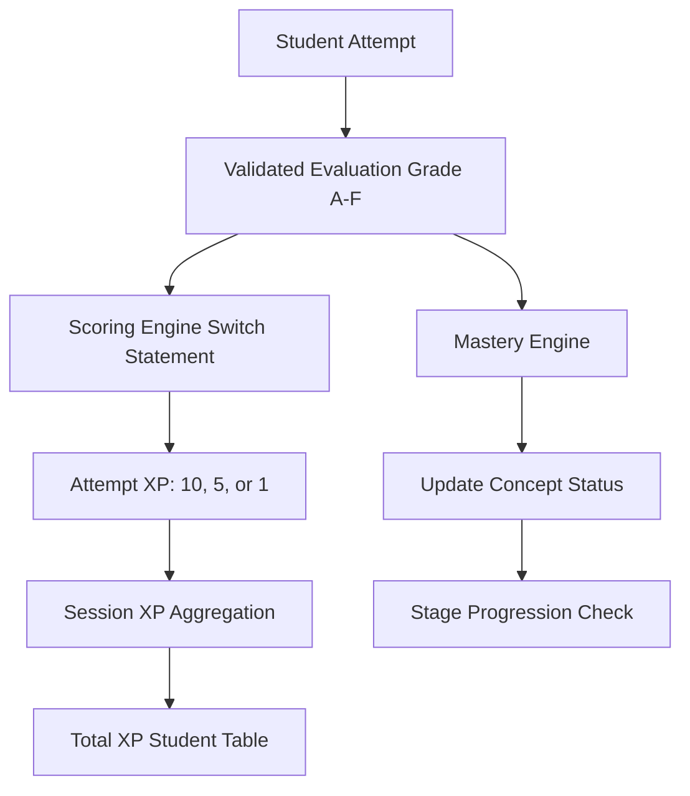
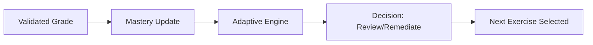
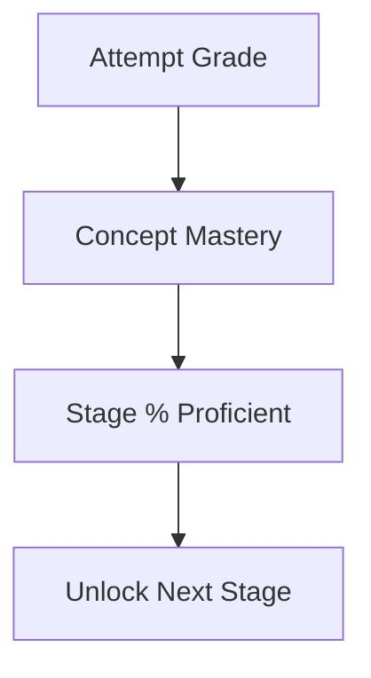
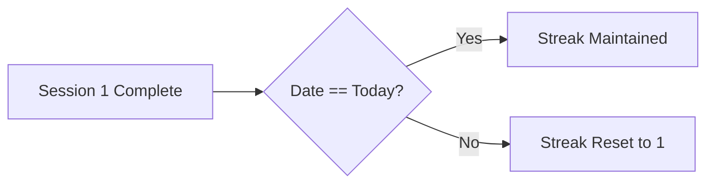

# 15 — Scoring and Progress

## 1. Document Control

* **Document ID:** SCORE-001
* **Document Name:** Tejaswini AI English Tutor - Scoring and Progress Specification
* **Version:** 1.0.0
* **Status:** APPROVED FOR IMPLEMENTATION
* **Product:** Web-based AI English Learning Application
* **Primary User:** Tejaswini (Beginner)
* **Owner:** Principal Learning-Assessment Architect
* **Source of Truth:** Authoritative specification for translating evaluations into scores, measuring learning progress, tracking effort, and persisting historical performance metrics.

## 2. Purpose

This document defines the complete lifecycle of how a validated AI evaluation becomes a quantified score, and how accumulated scores and mastery evidence translate into measurable learning progress. It ensures that effort is recognized, mastery is strictly evidence-based, and progress is never conflated with mere activity volume.

## 3. Scope

The scope encompasses attempt scoring (XP allocation), session aggregation, daily consistency metrics (streaks), curriculum progress calculation, historical reproducibility of scores, and the separation of client/server responsibilities for performance tracking.

## 4. Source Documents and Authority

This document relies on the hierarchy established by:

1. `01_PRODUCT_REQUIREMENTS.md` (Product goals and XP constraints)
2. `02_LEARNING_CURRICULUM.md` (Curriculum progression objectives)
3. `06_DATABASE_SCHEMA.md` (Persistence model for `total_xp` and `mastery`)
4. `11_EVALUATION_SPECIFICATION.md` (Canonical A-F evaluation categories)
5. `14_ADAPTIVE_LEARNING.md` (Mastery thresholds and state transitions)

## 5. Scoring and Progress Principles

* **Reward Effort, Require Evidence:** Scoring (XP) rewards effort and participation to maintain beginner motivation. Mastery requires consistent, accurate performance.
* **Server Authority:** Progress and scores are calculated exclusively on the server. Client-side state is purely presentational.
* **Fail-Safe:** Technical failures (e.g., Speech-to-Text artifacts, Gemini timeouts) yield 0 XP and 0 mastery impact. They must never decrease a student's standing.
* **Reproducibility:** A historical score must be fully explainable by tracing its source evaluation and the algorithm version active at the time.

## 6. Core Terminology

* **Attempt:** A single submitted student answer.
* **Evaluation:** The AI's semantic and grammatical assessment of an attempt (Grades A-F).
* **Score (XP):** A numerical value awarded for an attempt, driving gamification and effort tracking.
* **Mastery:** The demonstrated, stable ability to correctly apply a specific curriculum concept.

## 7. Evaluation vs Score vs Performance vs Mastery vs Progress vs Completion vs Effort

* **Evaluation:** Interpretation of the student's answer (e.g., "Grade C: Minor Article Error").
* **Score:** Quantified performance under a defined scoring model (e.g., "+5 XP").
* **Performance:** Observed ability on a task or set of tasks (e.g., "80% accuracy in Session 4").
* **Mastery:** Sufficient evidence of demonstrated competence in a learning objective (e.g., `PROFICIENT` state).
* **Completion:** Completion of a defined activity (e.g., "Session 4 Finished").
* **Progress:** Change and advancement in the learner's state over time (e.g., "Unlocked Stage 2").
* **Effort:** Activity/time indicators that do not automatically imply learning (e.g., "Practiced for 15 minutes").

## 8. Scoring Architecture Overview

The Scoring Engine resides in the Application Service layer. It intercepts the validated `Evaluation`, assigns an XP value based on the semantic grade, and persists this score to the `sessions` and `students` tables. The Progress Service concurrently translates this evaluation into `Mastery` evidence.

## 9. Canonical Scoring Pipeline

Raw Student Attempt $\rightarrow$ Validated Evaluation $\rightarrow$ Performance Evidence $\rightarrow$ Attempt Score (XP) $\rightarrow$ Concept/Skill Performance $\rightarrow$ Session Performance $\rightarrow$ Daily Performance $\rightarrow$ Long-Term Progress $\rightarrow$ Curriculum Progress $\rightarrow$ Student-Facing Progress.

## 10. Scoring Inputs

* **Semantic Correctness (Grade A-F):** The primary input from `11_EVALUATION_SPECIFICATION.md`.
* **Exercise Type:** (Future use: potentially weighting voice higher than text).
* **Attempt Modality:** Text or Voice.

## 11. Scoring Outputs

* **Attempt Score:** XP gained for a single answer.
* **Session Score:** Aggregate XP earned during a 10-15 minute block.
* **Total Score:** `students.total_xp` (Lifetime XP).

## 12. Score Scale

The application utilizes an **Experience Points (XP)** scale to measure effort and performance.

* **A/B (Fully Correct / Correct but unnatural):** 10 XP
* **C/D (Minor Errors / Partially Correct):** 5 XP
* **E/F (Incorrect / Off-topic / Gibberish):** 1 XP
*(Note: 1 XP is awarded for failed attempts to validate effort without inflating mastery).*

## 13. Score Semantics

XP represents a blend of effort and correctness. It is fundamentally additive. XP can never decrease. It is a motivational metric, not a clinical assessment of fluency.

## 14. Score Normalization

Normalization across different difficulty levels is NOT applied to XP in the MVP. A Grade A on a Level 1 exercise yields the same 10 XP as a Grade A on a Level 6 exercise to keep beginner scoring transparent and predictable.

## 15. Weighted Scoring

Weights are not applied to individual attempt scores in the MVP. Every prompt carries equal potential XP.

## 16. Scoring Precedence

Semantic correctness dictates the score. If an answer is grammatically perfect but completely alters the semantic meaning of the Marathi prompt (Grade E), it receives 1 XP.

## 17. Major and Minor Errors

As defined in `11_EVALUATION_SPECIFICATION.md`, minor errors (Grade C) yield 5 XP. Major errors (Grade D/E) yield 5 XP and 1 XP respectively.

## 18. Error Impact on Scores

Errors reduce the XP yield of an attempt from the maximum (10) to a partial reward (5) or base effort reward (1). They do not result in negative scores.

## 19. Valid Alternative Answers

A valid alternative translation recognized by the AI receives Grade A and awards the maximum 10 XP. The student is never penalized for deviating from the reference translation if the semantics are correct.

## 20. Natural Language Variation

Stylistically awkward but grammatically and semantically correct answers (Grade B) award the maximum 10 XP.

## 21. Minor Mistakes

Spelling typos, minor punctuation errors, or missing articles (Grade C) reduce the score to 5 XP.

## 22. Meaning-Changing Errors

Wrong tenses, reversed subjects, or dropped negations (Grade E) reduce the score to 1 XP.

## 23. Incomplete Answers

Fragments that capture partial meaning (Grade D) award 5 XP.

## 24. Non-Attempts

Empty submissions are blocked by the UI and API. Skipped exercises (if permitted by UX) award 0 XP.

## 25. Technical Failures

If Gemini times out or returns unparseable JSON, the attempt is marked as a technical failure. Score = 0 XP. Mastery is unaffected. The student may retry without penalty.

## 26. Voice and Transcription Effects

Unedited STT artifacts are evaluated as standard text input. To prevent unfair penalization, the UX mandates transcription review. If a transcription error slips through and causes a Grade C, it awards 5 XP.

## 27. Attempt Score Calculation

```typescript
function calculateAttemptXp(grade: EvaluationGrade): number {
  switch (grade) {
    case 'A':
    case 'B': return 10;
    case 'C':
    case 'D': return 5;
    case 'E':
    case 'F': return 1;
    default: return 0;
  }
}

```

## 28. Score Confidence

Gemini output does not supply a confidence interval. The structured output grade is treated as 100% confident for scoring purposes.

## 29. Score Uncertainty

If an answer is wildly ambiguous, the AI defaults to Grade F (Off-topic). This awards 1 XP for effort but does not negatively impact mastery aggregates.

## 30. Score Validity

An attempt score is valid and persisted only if it successfully passes the Zod `AiEvaluationSchema` and business validation rules.

## 31. Score Invalidation

Scores are not recorded for duplicate submissions (idempotency key matches an existing attempt).

## 32. Score Correction

Historical scores are immutable. If an evaluation algorithm changes in the future, past XP is not retroactively deducted or inflated.

## 33. Score Versioning

The `scoring_algorithm_version` (e.g., `v1.0`) is conceptually tied to the application deployment. MVP relies on a static mapping, so explicit database versioning of the XP formula is omitted.

## 34. Historical Reproducibility

The `evaluations` table stores the `grade`. The XP can always be re-derived by mapping the historical grade against the `v1.0` XP scale.

## 35. Score Immutability

Once persisted to `sessions.xp_earned` and `students.total_xp`, the XP granted for a specific attempt cannot be revoked by the client or standard API flows.

## 36. Attempt-Level Metrics

* **Total Attempts:** Count of submitted answers per session.
* **Correct Attempts:** Count of Grade A/B.
* **Incorrect Attempts:** Count of Grade C/D/E.

## 37. Accuracy

Calculated per session: `(Count of A + B) / (Total Valid Attempts) * 100`.

## 38. Correctness Rate

Denominator: Total valid evaluated attempts (excluding Grade F / technical failures). Numerator: Grade A + Grade B.

## 39. Average Score

Not heavily utilized in MVP. Progress relies on Accuracy and Mastery rather than "Average XP per question".

## 40. Median Score

Not utilized.

## 41. Score Distribution

Not utilized for the single-student MVP.

## 42. Consistency

Measured via the "Daily Streak" (Days with > 0 XP earned).

## 43. Improvement

Improvement is measured by a concept transitioning from `NEEDS_REVIEW` back to `PROFICIENT`, or a reduction in specific `ErrorCategory` frequencies over a 7-day window.

## 44. Improvement Metrics

* **Error Reduction Rate:** E.g., `TENSE` errors dropped from 4 per session to 1 per session.

## 45. Improvement Windows

Calculated over a rolling 7-day period.

## 46. Trend Calculation

* **Stable:** Accuracy remains within +/- 10% over 3 sessions.
* **Improving:** Accuracy increases > 10% over 3 sessions.
* **Declining:** Accuracy decreases > 10% over 3 sessions.

## 47. Trend Evidence Requirements

Trends require a minimum of 3 completed sessions to display.

## 48. Volatility

Extreme swings (e.g., 90% accuracy $\rightarrow$ 20% accuracy) flag a session anomaly, typically suggesting distraction or fatigue. Adaptive remediation handles the immediate fallout; long-term progress metrics smooth this over a 7-day average.

## 49. Session Score

The sum of XP earned across all attempts within a specific `session_id`.

## 50. Session Progress

Tracked out of the predefined session length. E.g., 8/10 exercises completed (80%).

## 51. Daily Score

The sum of all Session Scores with a `completed_at` timestamp matching the current calendar day (IST).

## 52. Daily Progress

If a daily plan exists (e.g., "Complete 2 sessions"), daily progress is `Sessions Completed / Daily Target`. MVP defaults to an implicit goal of 1 session per day to maintain a streak.

## 53. Daily Planning Interaction

The system encourages daily practice but does not rigidly enforce a curriculum cap per day.

## 54. Unfinished Daily Plans

If a student misses a day, the Streak resets to 0. No negative XP or mastery degradation occurs (beyond the standard 7-day mastery decay).

## 55. Session Completion

A session is marked `COMPLETED` when the user finishes the predefined number of exercises (e.g., 10) and the client invokes `/actions/session/complete`.

## 56. Curriculum Completion

Defined as advancing past Stage 10.

## 57. Curriculum Progress

Calculated as: `(Number of PROFICIENT Concepts in Stage) / (Total Concepts in Stage) * 100`.

## 58. Objective Progress

Mapped directly to the Concept Progress.

## 59. Concept Progress

Represented by the `mastery` state: `NOT_INTRODUCED` $\rightarrow$ `INTRODUCED` $\rightarrow$ `DEVELOPING` $\rightarrow$ `PROFICIENT`.

## 60. Skill Progress

Aggregations of Concepts (e.g., "Tenses" vs "Vocabulary"). Excluded from MVP UI to avoid dashboard clutter.

## 61. Overall Progress

Overall Progress is explicitly tied to Curriculum Stage advancement. It is NOT `total_exercises_completed / total_exercises_in_db`.

## 62. Progress Dimensions

1. **XP:** Cumulative effort.
2. **Streak:** Consistency.
3. **Stage:** Curriculum advancement.

## 63. Progress Aggregation

Session completion triggers an aggregation function that reads recent evaluations, updates `mastery` records, and updates `current_stage_id` if 80% of concepts in the stage are `PROFICIENT`.

## 64. Composite Progress Score

Not used. XP and Stage are kept strictly separate.

## 65. Progress vs Mastery

* **Progress:** "You earned 150 XP today and maintained a 5-day streak."
* **Mastery:** "You are PROFICIENT in Simple Present tense."

## 66. Progress vs Completion

* **Completion:** Finishing 10 exercises.
* **Progress:** Answering enough of those 10 exercises correctly to trigger a stage advancement.

## 67. Progress vs Performance

* **Performance:** Scoring 100% on Level 1 exercises.
* **Progress:** Moving to Level 2 exercises based on that performance.

## 68. Progress vs Effort

A student may earn 500 XP (high effort) but remain in Stage 1 if their accuracy prevents mastery transitions (low progress).

## 69. Progress vs Activity Volume

100 repeated identical exercises yield high volume but zero progress, as the Exercise Selector (`14_ADAPTIVE_LEARNING.md`) prevents identical drilling.

## 70. Student-Facing Progress

* **Top Bar:** Current XP, Current Streak.
* **Dashboard:** Current Stage (e.g., "Stage 2: Daily Routines"), Recent Mistakes.

## 71. Progress Dashboard Metrics

* Total XP.
* Current Streak.
* Stage Name / Level.

## 72. Progress Cards

* "Mistake Review" card highlights recent concepts that dropped to `NEEDS_REVIEW`.

## 73. Progress Visualization Semantics

* **XP:** A growing numerical counter.
* **Streak:** A flame icon with a day count.
* **Stage:** A stepped path or discrete level indicator.

## 74. Progress Percentages

Whenever a percentage is shown (e.g., "Stage 1: 80% Complete"), the denominator MUST be the total number of concepts defined for that stage in the curriculum.

## 75. Score Status Semantics

* **Green/Success:** 10 XP (Grade A/B).
* **Amber/Warning:** 5 XP (Grade C/D).
* **Orange/Alert:** 1 XP (Grade E/F).

## 76. Streaks

A Streak increments by 1 for every consecutive calendar day (IST) the student completes at least 1 Session. Missing a calendar day resets it to 0.

## 77. Consistency Metrics

Streaks are the sole consistency metric for the MVP.

## 78. Time-Based Metrics

Time-spent-learning is not explicitly tracked or displayed to the student, avoiding anxiety.

## 79. Exercise Completion Metrics

Tracked internally via `sessions` and `session_exercises` (count of rows with `status = 'COMPLETED'`).

## 80. Review Metrics

Internal metrics tracking the success rate of concepts flagged as `NEEDS_REVIEW` when re-tested.

## 81. Retention Metrics

If a `PROFICIENT` concept is tested after 7 days and receives Grade A/B, it is logged as a successful retention event.

## 82. Error Metrics

Frequencies of specific `error_categories` (e.g., 15 `TENSE` errors this week).

## 83. Error Reduction

If a specific error category drops in frequency by 50% week-over-week, it provides internal evidence of effective remediation.

## 84. Concept Mastery Progression

Defined in `14_ADAPTIVE_LEARNING.md`. Evaluated grades determine the transition from `INTRODUCED` to `PROFICIENT`.

## 85. Adaptive-Learning Integration

The Scoring Engine validates evaluations and guarantees that only schema-valid, non-duplicate evaluations are fed into the Mastery Engine.

## 86. Adaptive Input Contract

The Adaptive Engine consumes the canonical `Evaluation` domain object (Grade A-F) and the associated `ConceptId`. It does NOT consume raw XP or AI JSON strings.

## 87. Adaptive Output Interaction

Mastery updates dictate the next exercise selection, but they never reach back to alter historical XP.

## 88. Curriculum Integration

Scoring and Mastery calculations respect the stage prerequisites defined in `02_LEARNING_CURRICULUM.md`.

## 89. Evaluation Integration

Scoring relies entirely on the output of `11_EVALUATION_SPECIFICATION.md`.

## 90. Gemini Integration

Gemini provides the Grade (A-F). Gemini DOES NOT provide the XP (+10) or calculate the Mastery state.

## 91. Deterministic Scoring Authority

The Next.js Application Server maps the AI's semantic grade to XP using a hardcoded, deterministic switch statement.

## 92. AI Scoring Boundary

Gemini evaluates language. The Server calculates scores.

## 93. AI Recommendation vs Scoring

If Gemini recommends a retry, the Application may offer it, but the Application determines if the retry overwrites the session score or counts as a new attempt. (Rule: New attempt).

## 94. Score Validation

The server verifies that XP granted for a session does not exceed theoretical maximums (e.g., 15 questions * 10 XP = max 150 XP per session).

## 95. Score Invariants

* SCORE-INV-001: Invalid evaluations cannot produce valid student scores.
* SCORE-INV-002: Technical failures cannot reduce student performance or mastery.
* SCORE-INV-003: A score must always have a defined scale (XP).
* SCORE-INV-004: Progress percentages must have a defined denominator (Concepts).
* SCORE-INV-005: Mastery and score remain distinctly separate entities.

## 96. Score Idempotency

`session_exercise_id` ensures a network retry does not award XP twice for the same interaction.

## 97. Concurrency

Server Actions execute database updates atomically. Double clicks on "Complete Session" return the already-calculated summary without incrementing global XP twice.

## 98. Correction and Re-Evaluation

If an attempt is somehow manually re-evaluated (Admin action, outside MVP scope), the original attempt is marked superseded, and a new attempt generates new XP.

## 99. Historical Aggregate Recalculation

If the XP scale changes in v2, historical `total_xp` is retained. We do not retroactively alter the student's visible score.

## 100. Score Snapshots

Session summaries act as permanent snapshots of performance at that moment in time.

## 101. Derived Metrics

`Accuracy` and `Stage %` are derived on-the-fly or cached in `summary_data`. They are not canonical tables.

## 102. Database Persistence

`students.total_xp`, `sessions.xp_earned`, `mastery.correct_attempts` persist the outcomes.

## 103. API Contracts

`/actions/session/complete` returns the calculated score and progress summary.

## 104. Type and Schema Integration

Adheres to `08_TYPES_AND_SCHEMAS.md`.

## 105. Security Integration

Only the Service Role key can update `total_xp` or `mastery`. The client cannot execute `UPDATE students SET total_xp = 9000`.

## 106. Code Organization

`src/features/progress/services/progress.service.ts`

## 107. Scoring Service

Consumes evaluations, assigns XP, and updates the session tally.

## 108. Progress Service

Aggregates session XP into global XP and triggers Mastery transitions.

## 109. Progress Service Non-Responsibilities

It does not invoke Gemini, and it does not define the curriculum.

## 110. Scoring Data Flow

Attempt $\rightarrow$ Grade $\rightarrow$ `calculateXP()` $\rightarrow$ Update Session Cache $\rightarrow$ Display +10 UI.

## 111. Progress Data Flow

Session Complete $\rightarrow$ Sum Session XP $\rightarrow$ Add to `total_xp` $\rightarrow$ Calculate Concept Accuracies $\rightarrow$ Update Mastery $\rightarrow$ Check Stage 80% Threshold $\rightarrow$ Update Stage (if met).

## 112. Daily Progress Data Flow

Calculate streaks based on `sessions.completed_at` timestamps matching the current date.

## 113. Session Progress Data Flow

`completed_exercises / total_session_exercises * 100`.

## 114. Aggregation Hierarchy

Attempt $\rightarrow$ Session $\rightarrow$ Concept $\rightarrow$ Stage $\rightarrow$ Overall.

## 115. Aggregation Rules

* **XP:** Additive globally.
* **Mastery:** Based on net correct balance over rolling history.
* **Stage:** Percentage of PROFICIENT concepts.

## 116. Missing Data

If a concept has 0 attempts, its mastery is `NOT_INTRODUCED`. It does not contribute negatively to accuracy.

## 117. Insufficient Data

If a stage has 10 concepts and only 2 are introduced, Stage Progress is 0% (or specifically "20% Introduced, 0% Proficient").

## 118. Denominator Integrity

Calculations always use total *available* concepts for a stage, not just concepts the student has attempted.

## 119. Weighting Integrity

All concepts carry equal weight toward stage completion.

## 120. Concept Weighting

Equal weighting.

## 121. Objective Weighting

Equal weighting.

## 122. Stage Weighting

Stages are sequential, not weighted against each other.

## 123. Overall Progress Weighting

Not heavily utilized. Progress is framed around the *current* stage.

## 124. Progress Normalization

N/A

## 125. Historical Trend Storage

Captured via querying the timeline of `sessions` and `evaluations`.

## 126. Progress Snapshots

`sessions.summary_data` (JSONB) stores the accuracy and XP for that exact session.

## 127. Progress Timeline

A list view on the dashboard showing recent session dates, XP earned, and accuracy.

## 128. Progress Milestones

Advancing a Stage triggers a celebratory UI notification.

## 129. Achievement and Badge Boundary

Excluded from MVP to maintain a focused educational environment. XP and Stage advancement are sufficient motivators.

## 130. Progress Notifications

Inline toasts: "You've reached a 3-day streak!"

## 131. Progress Explanations

"You are in Stage 2 because you mastered 80% of Stage 1 concepts."

## 132. Progress Messaging

Factual and encouraging.

## 133. Beginner-Friendly Progress Language

Avoid: "You are 12% fluent."
Use: "You've mastered 5 new sentence types!"

## 134. Comparative Progress

Explicitly forbidden. The student is never compared to global averages.

## 135. Personal-Baseline Comparison

"Your accuracy on Present Tense improved by 20% this week!" (Future enhancement, basic foundational tracking supported in MVP).

## 136. Improvement Detection

Requires minimum 3 sessions of baseline data before displaying improvement toasts.

## 137. Difficulty-Adjusted Performance

XP is flat. Difficulty adjusts under the hood (Adaptive Learning) to keep the student in the zone of proximal development.

## 138. Difficulty-Aware Scoring

Not utilized in MVP. (A Level 6 prompt yields 10 XP, same as a Level 1 prompt).

## 139. Challenge-Adjusted Progress

Mastery requires success at the concept's baseline difficulty.

## 140. Adaptive Feedback Loop

Score $\rightarrow$ Mastery $\rightarrow$ Adaptive Engine $\rightarrow$ Next Exercise.

## 141. Progress Stability

Stage progression requires 80% proficiency. A single mistake will not demote a student to a previous stage.

## 142. Score Smoothing

N/A (XP is additive).

## 143. Raw vs Derived Data

Raw = `evaluations.grade`. Derived = `mastery.status`.

## 144. Immutable Evidence

`evaluations` are insert-only.

## 145. Derived Metric Recalculation

If `mastery` data is corrupted, it can be entirely rebuilt by replaying the `evaluations` log.

## 146. Auditability

Every XP point is traceable to a specific `session_id` and `attempt_id`.

## 147. Progress Provenance

XP $\rightarrow$ Attempt $\rightarrow$ Session $\rightarrow$ Student.

## 148. Progress Reproducibility

Guaranteed by relational integrity and immutable attempt logs.

## 149. Algorithm Versioning

Stored conceptually in codebase.

## 150. Migration Strategy

If XP scales change (e.g., from 10 to 100 per question), a DB migration multiplies all historical `xp_earned` by 10 to maintain scale parity.

## 151. Backward Compatibility

Always preserve legacy attempt data.

## 152. Recalculation Strategy

Handled via server-side admin scripts if required.

## 153. Performance Optimization

`total_xp` is materialized on the `students` table to avoid `SUM()` aggregations on every dashboard load.

## 154. MVP Performance

Extremely lightweight. Derived metrics are calculated async at the end of a session.

## 155. Future Scalability

Materialized views can handle cohort analytics when moving beyond 1 student.

## 156. Multi-Student Isolation

`student_id` enforces strict boundaries for all aggregations.

## 157. Authorization

Only the Server Action running as Service Role can execute the Progress Aggregation logic.

## 158. Client Trust Boundary

The client receives read-only progress summaries.

## 159. Server Authority

Server code defines XP mapping.

## 160. Database Authority

DB RLS ensures progress cannot be written via public APIs.

## 161. API Authority

The `/complete` endpoint orchestrates the transaction.

## 162. Score Manipulation Protection

Zod validation and RLS.

## 163. Privacy Minimization

The dashboard queries only the aggregated numbers, not the full history of mistakes, unless specifically navigating to the Mistake Review view.

## 164. Logging

XP updates are logged at the `info` level.

## 165. Observability

Track API 500s on the `/complete` endpoint, as a failure here loses the student's session progress update.

## 166. Scoring Alerts

Alert if `xp_earned` in a single session exceeds mathematical maximums (>200).

## 167. Aggregate Consistency Checks

Nightly cron job (if desired) can assert `SUM(sessions.xp_earned) == students.total_xp`.

## 168. Reconciliation

If consistency checks fail, auto-heal `total_xp` from the `sessions` ledger.

## 169. Test Architecture

Unit tests for `calculateAttemptXp()`. Integration tests for `ProgressService`.

## 170. Scoring Unit Tests

Mock grades A-F and assert expected XP output.

## 171. Progress Unit Tests

Mock an array of evaluations and assert `mastery` state transitions.

## 172. Aggregation Tests

Verify session completion accurately sums XP and counts distinct concepts.

## 173. Idempotency Tests

Call `/complete` twice with the same session ID. Assert `total_xp` increments only once.

## 174. Correction Tests

N/A (Historical edits excluded from MVP).

## 175. Security Tests

Attempt to POST `{ "xp": 1000 }` to `/complete` using the Anon key. Assert rejection.

## 176. Scoring Regression Dataset

Ensure changes to AI prompts don't skew the distribution of A-F grades.

## 177. Golden Scoring Dataset

Maps specifically defined student strings to expected XP yields based on golden grades.

## 178. Progress Regression Dataset

Test suite asserting that 6 correct attempts explicitly trigger `PROFICIENT` status.

## 179. Numerical Calibration

XP values (+10, +5, +1) are fixed for MVP but isolated as constants for easy tuning.

## 180. Calibration Process

Update `src/config/constants.ts` and deploy.

## 181. Score Distribution Monitoring

Monitor to ensure students aren't stuck receiving exclusively 1 XP (Grade E/F).

## 182. Progress Inflation Safeguards

Duplicate identical exercise retries in a single session yield 0 additional mastery points.

## 183. Progress Deflation Safeguards

Technical errors yield 0 XP but do not decrement mastery or count as an incorrect attempt.

## 184. Meaningful Progress

Stage advancement is the ultimate indicator of learning.

## 185. Student Motivation Safeguards

Even an incorrect answer (Grade E) grants 1 XP to validate the effort of translating.

## 186. Score Visibility

XP is visible globally. Grade letters (A-F) are internal and translated to UI colors (Green, Amber, Orange).

## 187. Internal-Only Metrics

Raw error counts, decay timers, AI metadata.

## 188. Student-Facing Metrics

XP, Streak, Stage, Accuracy %.

## 189. Progress Privacy

Dashboard is heavily authenticated.

## 190. Teacher/Admin Scope

Excluded from MVP.

## 191. Daily Planning Relationship

Implicit goal: maintain the daily streak.

## 192. Review Relationship

Review exercises contribute to Session XP like any other exercise.

## 193. Remediation Relationship

Remediation exercises grant XP but do not increment mastery until standard exercises are passed.

## 194. Repeated Exercise Relationship

See 182.

## 195. Exercise Difficulty Relationship

Flat XP across difficulties.

## 196. Curriculum Coverage

Calculated as % of Stage introduced.

## 197. Mastery Coverage

Calculated as % of Stage `PROFICIENT`.

## 198. Progress Coverage

Same as 197.

## 199. Overall Learner State

Represented by `StudentProfile` type.

## 200. Score Object

Numeric value derived from `EvaluationGrade`.

## 201. Progress Object

Derived `MasteryProfile`.

## 202. Daily Progress Object

Implicit via `Streak` calculation.

## 203. Session Progress Object

`SessionSummaryData` (XP, Accuracy).

## 204. API Response Contracts

Conform to `09_API_CONTRACTS.md`.

## 205. Database Mapping

Conform to `06_DATABASE_SCHEMA.md`.

## 206. Adaptive Mapping

Conform to `14_ADAPTIVE_LEARNING.md`.

## 207. Evaluation Mapping

Conform to `11_EVALUATION_SPECIFICATION.md`.

## 208. Scoring Architecture Diagram



## 209. Adaptive Feedback Diagram



## 210. Progress Hierarchy Diagram



## 211. Daily Progress Diagram



## 212. Score Calculation Matrix

| Input | Source | Used for Score? | Weight/Influence | Validation |
| --- | --- | --- | --- | --- |
| Semantic Grade (A-F) | AI Evaluation | Yes | Absolute (Determines 10/5/1) | Zod Schema |
| STT Error Flag | UI | No | N/A | None |
| Time to Answer | UI | No | N/A | None |

## 213. Score-Scale Matrix

| Score Range | Interpretation | Student-Facing Meaning | Internal Meaning |
| --- | --- | --- | --- |
| 10 XP | Correct / Minor flaw | Green/Success | Grade A, B |
| 5 XP | Partial / Grammar flaw | Amber/Warning | Grade C, D |
| 1 XP | Incorrect / Effort | Orange/Alert | Grade E, F |
| 0 XP | Tech Failure / Skipped | None | Ignored |

## 214. Progress Metric Matrix

| Metric | Definition | Formula/Rule | Source Data | Student-Facing? | Limitations |
| --- | --- | --- | --- | --- | --- |
| Accuracy | Session correct % | `(A+B)/ValidAttempts * 100` | `evaluations` | Yes (Summary) | Can fluctuate wildly on hard sessions |
| Streak | Consecutive days | Count of sequential days with 1+ session | `sessions` | Yes (Dashboard) | Fails if timezone sync breaks |
| Stage % | Curriculum completion | `Proficient Concepts / Total Concepts` | `mastery`, `concepts` | Yes | N/A |

## 215. Aggregation Matrix

| Level | Input | Aggregation | Time Window | Missing Data | Output |
| --- | --- | --- | --- | --- | --- |
| Session | Attempt XP | SUM | Session start-to-end | 0 | `Session XP` |
| Global | Session XP | SUM | Lifetime | 0 | `Total XP` |

## 216. Completion Matrix

| Completion Type | Definition | Evidence | Does it imply Mastery? |
| --- | --- | --- | --- |
| Session | 10 exercises answered | `/complete` API call | No. |
| Stage | 80% concepts proficient | `mastery` state checks | Yes, implicitly. |

## 217. Mastery and Progress Matrix

| State | Score | Mastery | Progress | Completion | Interpretation |
| --- | --- | --- | --- | --- | --- |
| Grade A | +10 XP | +1 Correct Attempt | Micro-step | 1 Exercise | Strong retention |
| Grade C | +5 XP | +1 Incorrect Attempt | None | 1 Exercise | Needs structural work |

## 218. Trend Matrix

| Trend | Evidence Required | Calculation | Meaning |
| --- | --- | --- | --- |
| Improving | 3 sessions | Current Acc > Avg Acc | Student is adapting well |

## 219. Error-Impact Matrix

| Error Type | Severity | Score Impact | Progress Impact | Mastery Impact |
| --- | --- | --- | --- | --- |
| `MEANING` | Major | Caps at 1 XP | None | +1 Incorrect |
| `ARTICLE` | Minor | Caps at 5 XP | None | +1 Incorrect |

## 220. Review Matrix

| Review Outcome | Score Impact | Progress Impact | Mastery Impact |
| --- | --- | --- | --- |
| Success (A/B) | +10 XP | None | Extends decay timer |
| Failure (D/E) | +1/5 XP | None | Drops to `NEEDS_REVIEW` |

## 221. Difficulty Matrix

| Difficulty Change | Evidence | Score Impact | Progress Impact |
| --- | --- | --- | --- |
| Drop to Lvl 1 | 3 Consecutive Fails | None | Triggers Remediation |

## 222. Failure Matrix

| Failure | Score Impact | Progress Impact | Recovery |
| --- | --- | --- | --- |
| Gemini Timeout | 0 XP | None | UI allows manual retry |

## 223. Correction Matrix

| Correction Type | Historical Score | Aggregate Score | Progress | Audit |
| --- | --- | --- | --- | --- |
| Re-evaluation | Remains immutable | Immutable | Reverts state based on new eval | Creates new Attempt row |

## 224. Versioning Matrix

| Versioned Component | Version | Stored With | Purpose |
| --- | --- | --- | --- |
| XP Algorithm | `v1.0` | Codebase Constant | Ensures consistent math |

## 225. Security Matrix

| Threat | Control | Enforcement Layer | Test |
| --- | --- | --- | --- |
| Client fakes XP | Server calculates XP from grades | API/Server Action | Inject `{xp: 1000}` payload |

## 226. Observability Matrix

| Metric | Source | Purpose | Sensitive Data Excluded |
| --- | --- | --- | --- |
| 500s on `/complete` | Vercel | Detect failed aggregates | Yes (No PII logged) |

## 227. Testing Matrix

| Test ID | Scenario | Expected Result | Verification |
| --- | --- | --- | --- |
| SC-01 | Submit Grade A | XP increments by 10 | Unit Test |
| PR-01 | Complete Session | Total XP = Old XP + Session XP | Integration Test |

## 228. Scoring Acceptance Criteria

* SCORE-AC-001: Evaluation grades explicitly map to 10, 5, 1, or 0 XP according to rules.
* SCORE-AC-002: Client-side tampering with XP values is ignored by the server.

## 229. Progress Acceptance Criteria

* PROG-AC-001: Stage advances strictly when 80% of concepts reach `PROFICIENT`.
* PROG-AC-002: Streaks reset exactly at midnight IST if no session is logged.

## 230. Scoring Invariants

* SCORE-INV-001: Invalid evaluations cannot produce valid student scores.
* SCORE-INV-002: Technical failures cannot reduce student performance.
* SCORE-INV-003: A score must always have a defined scale.
* SCORE-INV-004: Mastery and score must remain distinct.

## 231. Progress Invariants

* PROGRESS-INV-001: Progress must never exceed its defined maximum (100%).
* PROGRESS-INV-002: Technical failures must not decrease learning progress.
* PROGRESS-INV-003: Duplicate processing must not inflate progress.

## 232. Scoring Anti-Patterns

* **Prohibited:** Treating XP as a measure of fluency.
* **Prohibited:** Deducting XP for wrong answers.

## 233. Progress Anti-Patterns

* **Prohibited:** Allowing Gemini to declare a student has completed a Stage.
* **Prohibited:** Presenting time spent logged in as "Progress".

## 234. One-Student MVP Strategy

The system relies on absolute, deterministic counters (e.g., 6 correct attempts = Mastery) rather than complex Bayesian knowledge tracing. It is highly interpretable.

## 235. Future Scalability

The `student_id` segmentation ensures the aggregation logic works for 1 or 1,000 students.

## 236. Final Consistency Audit

Scoring derives directly from `11_EVALUATION`, feeds into `14_ADAPTIVE_LEARNING`, is persisted per `06_DATABASE_SCHEMA`, and secured by `10_SUPABASE_SECURITY`.

## 237. Scoring Decisions

* **Decision:** Implement a flat 10/5/1 XP scale. Rationale: It maintains beginner motivation without creating complex, hard-to-explain weighted curves.

## 238. Progress Decisions

* **Decision:** Streak is defined by completing a session, not just logging in.

## 239. Assumptions

* The student's timezone for Streak calculation is fixed to IST.

## 240. Open Questions

| ID | Question | Why It Matters | Status |
| --- | --- | --- | --- |
| SC-OQ-01 | Should Voice attempts yield a 1.5x XP multiplier to encourage speaking practice? | Voice is harder, rewarding it might align with goals. | Open (MVP: Flat 1x multiplier). |

## 241. Final Scoring and Progress Specification

This specification provides a mathematically rigorous, server-authoritative engine that protects the integrity of the student's learning data. It ensures gamification (XP) encourages effort without polluting the pure pedagogical data (Mastery) required to adapt the curriculum.

## 242. Scoring and Progress Completion Checklist

* [x] XP scoring scale (10/5/1) defined and mapped to A-F grades.
* [x] Clear separation established between Score, Progress, and Mastery.
* [x] Server-side authority and idempotency rules mandated.
* [x] Streaks and Session completion requirements explicitly stated.
* [x] Fallback mechanisms for technical failures defined to prevent penalization.