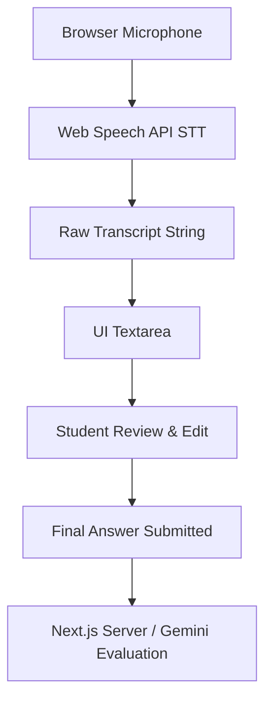
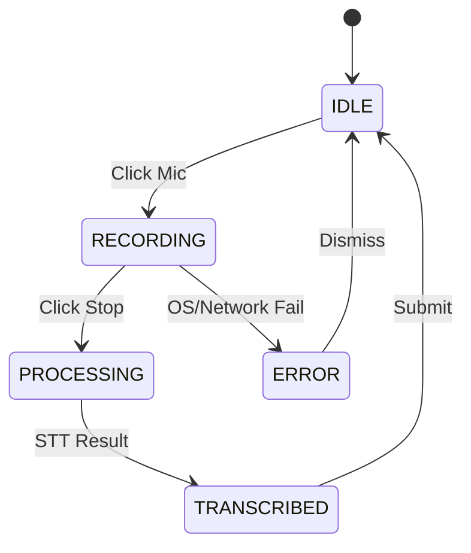
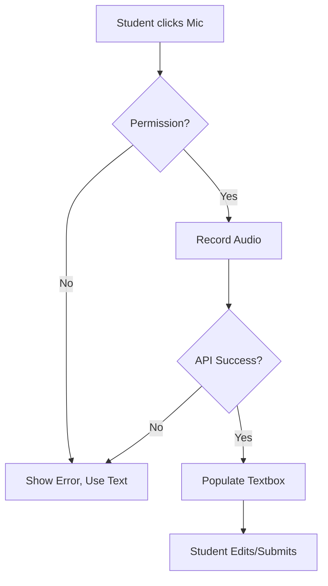

# 16 — Voice & Speech Specification

## 1. Document Control

* **Document ID:** VOICE-001
* **Document Name:** Tejaswini AI English Tutor - Voice & Speech Specification
* **Version:** 1.0.0
* **Status:** APPROVED FOR IMPLEMENTATION
* **Product:** Web-based AI English Learning Application
* **Primary User:** Tejaswini (Beginner)
* **Owner:** Principal Speech-AI Architect
* **Source of Truth:** Authoritative implementation specification for all voice, speech, audio capture, transcription, and text-to-speech functionality.

## 2. Purpose

This document specifies how the application handles voice interactions. It establishes the technical and UX boundaries for microphone capture, Speech-to-Text (STT), and Text-to-Speech (TTS). Crucially, it defines the separation between technical speech recognition and educational language evaluation, ensuring the student is never penalized for infrastructure artifacts.

## 3. Scope

The scope includes browser-based audio capture, native browser STT transcription, transcription editing workflows, TTS playback for Marathi/English, and the graceful degradation of voice features. It explicitly excludes raw audio storage, pronunciation scoring, and real-time conversational streaming for the MVP.

## 4. Source Documents and Authority

This specification derives authority from:

1. `01_PRODUCT_REQUIREMENTS.md` (Mandates voice input and editable transcripts).
2. `03_UX_SPECIFICATION.md` (Defines the mic interaction and review flow).
3. `05_APPLICATION_ARCHITECTURE.md` (Mandates browser-native Web Speech API to avoid server audio processing).
4. `11_EVALUATION_SPECIFICATION.md` (Evaluates final text, not audio).

## 5. Voice Requirements Inventory

| Requirement ID | Requirement | Source Document | Priority | MVP/Future | Technical Implication |
| --- | --- | --- | --- | --- | --- |
| VR-01 | Voice Input | `01_PRODUCT_REQUIREMENTS.md` | High | MVP | Requires browser microphone access. |
| VR-02 | Editable STT | `01_PRODUCT_REQUIREMENTS.md` | Critical | MVP | STT populates a text input, requires explicit user submit. |
| VR-03 | No Pronunciation Eval | `01_PRODUCT_REQUIREMENTS.md` | High | MVP | Avoid complex audio analysis APIs. |
| VR-04 | Marathi TTS | `03_UX_SPECIFICATION.md` | Medium | MVP | Requires `SpeechSynthesis` API with Marathi language support. |
| VR-05 | No Audio Storage | `05_APPLICATION_ARCHITECTURE.md` | High | MVP | Do not upload or persist `Blob` or `ArrayBuffer` data. |

## 6. Voice Capability Classification

| Capability | Required | Recommended | Future | Out of Scope | Source |
| --- | --- | --- | --- | --- | --- |
| Native STT (Browser) | Yes |  |  |  | `05_ARCHITECTURE` |
| Editable Transcripts | Yes |  |  |  | `01_PRD` |
| Native TTS (Browser) | Yes |  |  |  | `03_UX` |
| Audio File Storage |  |  |  | Yes | `05_ARCHITECTURE` |
| Pronunciation Scoring |  |  | Yes |  | `01_PRD` |
| Real-Time Streaming |  |  |  | Yes | `01_PRD` |

## 7. Core Voice Principles

1. **Voice is an interaction modality, not automatically an assessment dimension.**
2. **Speech-to-text transcription is not the same as pronunciation assessment.**
3. **A transcription error is not automatically a student language error.**
4. **Microphone, network, or provider failures are not student failures.**
5. **The final student-submitted text is the absolute, authoritative answer for language evaluation.**

## 8. Voice Architecture Overview

## 9. Voice Interaction Modes

* **Supported:** Tap-to-record (Tap mic to start, tap to stop).
* **Out of Scope:** Push-to-talk (Hold to record), Continuous conversation (always listening), Automatic Voice Activity Detection (VAD) stops.

## 10. MVP Voice Mode

**Tap-to-record.** The user explicitly initiates and terminates the recording session to maximize control and reduce accidental submissions.

## 11. Browser Compatibility

| Browser | Microphone Capture | Recording | Playback | Known Limitations |
| --- | --- | --- | --- | --- |
| Google Chrome | Yes | Yes (Web Speech API) | Yes | Best STT support. |
| Microsoft Edge | Yes | Yes (Web Speech API) | Yes | Uses Windows native speech engine. |
| Safari (macOS/iOS) | Yes | Yes (Web Speech API) | Yes | STT may require Apple server processing; can be slower. |
| Firefox | Yes | Limited / Experimental | Yes | Web Speech API is hidden behind flags; UI must degrade to text fallback gracefully. |

## 12. Microphone Permissions

* Requested only upon the first interaction with the Microphone button.
* Managed entirely by the browser's `navigator.mediaDevices.getUserMedia` sandbox.

## 13. Microphone Permission UX

* **Prompt:** Triggered by user intent (clicking the Mic button).
* **Denied:** The Mic button visually grays out with a tooltip: "Microphone access denied. Please type your answer."
* **Revoked:** Handled identically to Denied.

## 14. Recording States

| State | Definition | Entry Conditions | Exit Conditions | User Feedback |
| --- | --- | --- | --- | --- |
| `IDLE` | Ready to record | Default, or post-submission | User clicks Mic | Mic icon default state |
| `PERMISSION_REQ` | Browser asking for access | First Mic click | Allowed or Denied | "Please allow microphone" |
| `RECORDING` | Capturing audio | Permission granted & click | User clicks Stop | Pulsing red mic icon |
| `PROCESSING` | Finalizing transcript | User clicked Stop | API returns final string | "Listening/Processing..." |
| `TRANSCRIBED` | Text ready for review | STT string returned | User submits or edits | Text populates input box |
| `ERROR` | Tech failure | Denied, Offline, No mic | User dismisses error | "Voice unavailable. Type instead." |

## 15. Recording State Transitions

| Current State | Event | Next State | Validation | User Feedback |
| --- | --- | --- | --- | --- |
| `IDLE` | Click Mic | `RECORDING` | Has Permission? | Mic pulses |
| `RECORDING` | Click Mic (Stop) | `PROCESSING` | Audio > 0 bytes? | Spinner |
| `PROCESSING` | STT Returns Text | `TRANSCRIBED` | Text length > 0? | Text appears in box |
| `RECORDING` | Network Drops | `ERROR` | API exception | "Connection lost." |

## 16. Recording Start Behavior

Initializes `webkitSpeechRecognition` (or standard `SpeechRecognition`). Sets `continuous = true` (to prevent premature cutoff) and `interimResults = true` (for live UI feedback).

## 17. Recording Stop Behavior

User clicks the Stop button. The application calls `recognition.stop()`. The application waits for the final `onresult` event before transitioning to `TRANSCRIBED`.

## 18. Recording Duration

* **Maximum:** 60 seconds (Enforced by application timer; calls `stop()` automatically).
* **Minimum:** 1 second (Prevents accidental double-taps).

## 19. Audio Format

**Out of Scope for MVP.** Because the application relies on the Browser Native Web Speech API, audio capture, encoding (e.g., Opus/WebM), and format handoff are managed internally by the browser OS. The web app only receives the text string.

## 20. Audio Quality Requirements

Managed by the browser and device hardware. No application-level bitrate validation is performed.

## 21. Silence Handling

If the STT engine detects prolonged silence (e.g., 5 seconds) and auto-stops, the UI transitions to `TRANSCRIBED`. Empty results revert the UI to `IDLE`.

## 22. Background Noise

Web Speech API applies native OS noise cancellation. If noise overwhelms speech, the API returns an empty string or low-confidence gibberish, which the student can edit.

## 23. Audio Clipping and Distortion

Handled by the browser. Results in poor transcription. Student edits the result.

## 24. Audio Validation

| Validation | Rule | Failure | Student Impact | Recovery |
| --- | --- | --- | --- | --- |
| Hardware | Mic exists | `NotAllowedError` | Cannot use voice | Fallback to text |
| Output | Result > 0 chars | Empty string | None | Try again or type |

## 25. Audio Upload

**Out of Scope for MVP.** Audio is not uploaded to the Next.js server or Supabase.

## 26. Upload Progress

N/A.

## 27. Upload Cancellation

N/A.

## 28. Speech-to-Text Architecture

Client Browser (`SpeechRecognition` Interface) $\rightarrow$ Browser OS / Cloud Engine $\rightarrow$ `onresult` JavaScript Event $\rightarrow$ React State $\rightarrow$ Text Input Field.

## 29. Speech-to-Text Responsibility

Performed exclusively by the Browser API. Gemini is NOT used for STT in the MVP.

## 30. Transcription Language

`recognition.lang = 'en-IN'` (Indian English) or `'en-US'` based on optimal performance for the learner's beginner accent.

## 31. Marathi Speech Handling

Marathi STT is NOT supported for student answers, as the learning objective is English production.

## 32. English Speech Handling

The application expects English speech. The API is configured to optimize for English transcription.

## 33. Language Mismatch

If the student speaks Marathi, the English STT engine will likely produce phonetic gibberish.

* **Impact:** Student sees gibberish.
* **Action:** Student clears the text box, types, or re-records in English.

## 34. Code-Switching

If the student says "I am eating poli", the STT engine may transcribe "I am eating poly". The final text is passed to Gemini, which handles code-switching evaluation per `11_EVALUATION_SPECIFICATION.md`.

## 35. Transcription Output

* `transcript`: The string text.
* `isFinal`: Boolean indicating the STT engine has finalized the segment.

## 36. Transcription Confidence

The Web Speech API provides a `confidence` float (0.0 to 1.0).

## 37. Confidence Handling

**Ignored for MVP.** The application relies on the student's manual review of the text. A low-confidence transcript is not automatically rejected or penalized.

## 38. Transcription Uncertainty

Reflected entirely in the student's ability to edit the text box. The UI does not display "Low Confidence" warnings to the beginner.

## 39. Transcript Normalization

Basic `.trim()` is applied. Punctuation is left exactly as provided by the STT engine.

## 40. Transcript Editing

The core safeguard of the voice architecture. Once `TRANSCRIBED`, the string sits in a standard HTML `<textarea>`. The user can use their keyboard to correct artifacts before clicking "Submit".

## 41. Transcript vs Final Answer

* `rawTranscription`: The exact string returned by the STT API.
* `submittedAnswer`: The string after the student clicks "Submit" (may be identical or edited).
* `wasEdited`: Boolean.

## 42. Language Evaluation Source of Truth

The `submittedAnswer` is the ONLY payload evaluated by Gemini.

## 43. Raw Transcript Preservation

Passed to the Server Action for analytics (`wasEdited` comparison) but is NOT used for educational grading.

## 44. Transcript Versioning

N/A. Only the final `rawTranscription` and `submittedAnswer` are sent.

## 45. Audio Retention

**Not Stored.** Audio is ephemeral and destroyed by the browser immediately after transcription.

## 46. Audio Retention Period

0 seconds post-transcription.

## 47. Audio Deletion

Automatic OS-level garbage collection.

## 48. Audio Privacy

| Data | Sensitivity | Stored? | Retention | Access Control |
| --- | --- | --- | --- | --- |
| Raw Voice Audio | High (Biometric) | No | 0 | N/A (Client Sandbox) |
| Raw Transcript | Low | Yes | Indefinite | RLS (Student Only) |

## 49. Sensitive Data Handling

Because audio never leaves the client device (except via the browser's native OS-level STT processing agreements, e.g., Apple/Google terms), the application maintains a near-zero audio risk profile.

## 50. Audio Storage Architecture

N/A for MVP.

## 51. Object Storage

N/A for MVP.

## 52. Audio Access

N/A for MVP.

## 53. Signed URL Behavior

N/A for MVP.

## 54. Transcript Access

Stored in the `attempts` table. Accessible only by the authenticated student via Supabase RLS.

## 55. Voice API Security

No application-level API keys are required for Web Speech API.

## 56. Server Authority

The Server controls scoring and progress based on the text. It does not control voice capture.

## 57. Client Trust Boundary

The client provides `rawTranscription` and `submittedAnswer`. The server trusts this text as the payload to evaluate but DOES NOT trust the client to evaluate its own correctness.

## 58. Replay Protection

The `sessionExerciseId` prevents the same transcribed text payload from generating multiple evaluations.

## 59. Duplicate Submission Handling

Double-clicking "Submit" after recording is caught by the Next.js Server Action idempotency check.

## 60. Idempotency

Transcriptions submitted to the API are idempotent based on `sessionExerciseId`.

## 61. Concurrent Processing

If the user starts recording while a previous text attempt is submitting, UI state locks prevent corruption.

## 62. Stale Recording Sessions

If recording > 60 seconds, it is automatically terminated and transcribed to prevent memory leaks.

## 63. Abandoned Recordings

If the user navigates away mid-recording, the `useEffect` cleanup function calls `recognition.abort()`.

## 64. Interrupted Recordings

OS-level interruptions (phone call) trigger `onerror` or `onend`. UI reverts to text input mode.

## 65. Microphone Device Changes

Handled by the browser OS. If the active mic is disconnected, STT throws an error; UI degrades to text.

## 66. Microphone Unavailable

UI degrades gracefully. Mic button is hidden or disabled. Text input remains active.

## 67. Permission Revocation

Caught by standard error handler; UI reverts to text mode.

## 68. Network Failure

Web Speech API often requires an internet connection (Chrome). If offline, it throws a network error. UI toasts: "Voice unavailable offline. Please type."

## 69. Provider Outage

If Google/Apple STT engines are down, the browser API fails. Dealt with as a Network Failure.

## 70. Transcription Timeout

If no result is returned within 10 seconds of stopping speech, abort and instruct the user to type.

## 71. Provider Rate Limits

Browser native STT rate limits are opaque but rarely hit in single-user applications.

## 72. Provider Error Mapping

`SpeechRecognitionErrorEvent` codes (e.g., `not-allowed`, `network`) are mapped to internal UI states.

## 73. User-Facing Voice Errors

"We couldn't hear you clearly. Please try again or type your answer." (Generic, friendly).

## 74. Retry Policy

User manually taps the mic again to retry. No infinite automated loops.

## 75. Fallback Behavior

The primary fallback for ANY voice failure is the Text Input Field.

## 76. Graceful Degradation

If `window.SpeechRecognition` and `window.webkitSpeechRecognition` are undefined (e.g., Firefox), the Mic button is completely removed from the DOM on load. The app remains 100% functional via text.

## 77. Text Fallback

Text is fundamentally the core input. Voice is a convenience wrapper over text.

## 78. Voice-Required vs Voice-Optional Exercises

In the MVP, specific slots in a session (e.g., Question 6 & 7) *prompt* the user to use voice by hiding the keyboard text input initially. However, if voice fails or permissions are denied, the text input unlocks automatically as a fail-safe.

## 79. Speech Assessment Boundary

The application evaluates the resulting TEXT. It DOES NOT evaluate speech acoustics.

## 80. Pronunciation Assessment

**Explicitly Out of Scope for MVP.**

## 81. Fluency Assessment

**Explicitly Out of Scope for MVP.**

## 82. Accent Handling

The browser STT engine handles accents. If it struggles with the learner's accent, the editable transcript rule mitigates the issue. Accent is never scored.

## 83. Pronunciation vs Accent

N/A (Both unassessed).

## 84. Intelligibility

Assessed implicitly: if the STT engine produces completely wrong words, intelligibility was likely low. The student fixes the text, avoiding an educational penalty.

## 85. Speech Rate

Not measured.

## 86. Pauses

Not measured.

## 87. Filler Words

If STT transcribes "um", Gemini evaluation (via `11_EVALUATION_SPECIFICATION.md`) will likely ignore it or flag it as an EXTRA_WORD minor error.

## 88. Stuttering and Disfluency

Not penalized unless it corrupts the STT text and the user fails to edit it.

## 89. Pronunciation Error Handling

N/A.

## 90. Speech-to-Text Artifacts

Homophones ("I want two go" instead of "too/to"). Treated as spelling/grammar errors by Gemini if submitted unedited.

## 91. Artifact Detection

The application does not run a deterministic artifact detector. It relies on the student and Gemini.

## 92. Artifact Correction

The student's responsibility during the "Review" phase.

## 93. Speech Evidence Eligibility

Once submitted, the text is treated identically to typed text for Mastery and Progression updates.

## 94. Voice Evidence Provenance

| Representation | Source | Editable? | Used for Evaluation? | Stored? |
| --- | --- | --- | --- | --- |
| `rawTranscription` | Web Speech API | No | No | Yes (Analytics) |
| `submittedAnswer` | Student UI | Yes | **Yes** | Yes (DB `attempts`) |

## 95. Voice Evaluation Pipeline

Browser Mic $\rightarrow$ STT $\rightarrow$ Raw Text $\rightarrow$ Student Edit $\rightarrow$ Final Answer $\rightarrow$ Gemini API.

## 96. Speech-Specific Evaluation Pipeline

N/A.

## 97. Text-Only Fallback Pipeline

Standard pipeline.

## 98. Voice/Text Consistency

The AI Evaluator has no knowledge of whether the text was typed or spoken. Evaluation is 100% consistent.

## 99. Voice Modality Metadata

Stored in `attempts.modality` as an ENUM (`'TEXT'` | `'VOICE'`).

## 100. Modality Effects

Modality does NOT affect the score multiplier. 10 XP for Grade A, regardless of input method.

## 101. Voice-Specific Scoring

None.

## 102. Voice-Specific Progress

None.

## 103. Voice-Specific Mastery

None.

## 104. Voice-Specific Adaptive Behavior

None.

## 105. Text-to-Speech Architecture

Client Browser (`SpeechSynthesis` Interface) $\rightarrow$ Browser OS Engine $\rightarrow$ Device Speakers.

## 106. Marathi TTS

Used to read AI prompts and explanations.
`const utterance = new SpeechSynthesisUtterance(text); utterance.lang = 'mr-IN';`

## 107. English TTS

Used to read the Corrected English answers.
`utterance.lang = 'en-IN';`

## 108. Voice Selection

The application selects the default OS voice for the specified language tag. Custom cloud voices (e.g., Google Cloud TTS) are deferred to Post-MVP to avoid costs and API complexity.

## 109. TTS Pronunciation Model

Relies on OS defaults.

## 110. Speech Speed

Set to `rate = 0.9` to aid beginner comprehension.

## 111. Replay

A persistent "Play Audio" button next to chat bubbles allows unlimited replays.

## 112. Autoplay

Due to browser policies, autoplay is NOT used. Audio requires a manual click.

## 113. Playback States

* `IDLE`
* `PLAYING`
* `ERROR`

## 114. Playback Controls

Play/Stop button. No scrubbing/seeking required for short sentences.

## 115. TTS Caching

N/A. Rendered locally on demand by the browser.

## 116. TTS Storage

N/A. No audio files exist.

## 117. TTS Privacy

Processed locally on device.

## 118. TTS Provider Failures

If TTS fails or no Marathi voice is installed on the OS, the UI simply behaves as a text-only chat application.

## 119. TTS Cost Controls

Zero cost (Browser native).

## 120. TTS Cache Keys

N/A.

## 121. Audio Processing Pipeline

(See Section 95. Handled by OS).

## 122. Audio Size Limits

N/A.

## 123. Duration Limits

60 seconds hard limit on recording.

## 124. Processing Timeouts

N/A. STT is real-time.

## 125. Retry Limits

Student can retry recording indefinitely.

## 126. Network Resilience

If STT requires network and drops, UI degrades to text.

## 127. Offline Behavior

The app requires a connection for the Next.js API / Gemini evaluation anyway, so offline STT failure is acceptable.

## 128. Browser Audio APIs

`window.SpeechRecognition` || `window.webkitSpeechRecognition`
`window.speechSynthesis`

## 129. Browser Permission UX

Standard OS prompt. No custom UI overlays required beyond the "Denied" toast.

## 130. Accessibility

| Requirement | Implementation Requirement | Fallback |
| --- | --- | --- |
| Non-Voice Nav | Keyboard access to Mic button | Type answer |
| Screen Readers | ARIA labels on Mic/Play buttons | Read text natively |

## 131. Keyboard Accessibility

Mic button focusable via `Tab`, triggered via `Space` or `Enter`.

## 132. Visual Recording Feedback

Pulsing red microphone icon.

## 133. Recording Timer

Not required. Visual pulse is sufficient.

## 134. Recording Waveform

**Out of Scope.** A simple pulse animation is used instead of complex Canvas API waveforms.

## 135. Recording Indicator

Prominent CSS animation.

## 136. Privacy Indicator

Relies on the browser's native red dot in the OS status bar/tab.

## 137. Recording Cancellation

Clicking the "Clear" button (`X`) next to the input wipes the STT transcript and resets state.

## 138. Re-Recording

Clicking the mic again while text is present overwrites the text box.

## 139. Transcript Review UX

Text appears standard size in the input box, looking exactly like typed text.

## 140. Transcript Editing UX

User taps the text box, bringing up the standard OS keyboard to edit.

## 141. Submission UX

Explicit "Submit" button click required. Auto-submit after silence is strictly forbidden.

## 142. Feedback Timing

Evaluation begins immediately upon explicit submission.

## 143. Loading States

"Listening..." during STT. "Checking..." during AI evaluation.

## 144. Error Recovery UX

| Failure | Detection | Student Impact | Recovery | Affects Score? | Affects Progress? | Affects Mastery? |
| --- | --- | --- | --- | --- | --- | --- |
| Mic Denied | API Error | Must type | Use keyboard | No | No | No |
| STT Gibberish | Visual | Must edit | Edit text | No | No | No |

## 145. Voice Analytics

Not implemented beyond standard DB tracking of `modality` (`TEXT` vs `VOICE`).

## 146. Voice Telemetry

None.

## 147. Voice Observability

| Metric | Source | Purpose | Privacy Consideration |
| --- | --- | --- | --- |
| Modality Usage | DB `attempts` | Determine if voice is used | Highly private (No audio stored) |
| Edit Rate | App (if `rawTranscription != submittedAnswer`) | Measure STT quality | Transcript is stored safely in RLS |

## 148. Voice Health Metrics

Edit rate serves as a proxy for STT accuracy.

## 149. Student-Impact Metrics

None.

## 150. Voice Quality Monitoring

N/A.

## 151. Privacy-Preserving Logs

No raw text or audio is piped to external observability tools (like Datadog/Sentry).

## 152. Voice Data Retention

Audio: 0 seconds. Text: Indefinite.

## 153. Voice Data Deletion

Cascade on student account deletion.

## 154. Cascade Behavior

Deleting a session deletes the attempts and the associated transcript strings.

## 155. Voice Audit Trail

The `wasEdited` boolean and `rawTranscription` strings provide the complete audit trail.

## 156. Voice Data Versioning

N/A.

## 157. Historical Reproducibility

The `submittedAnswer` string guarantees the semantic evaluation can be historically reproduced.

## 158. Provider Abstraction

| Capability | Application Interface | Provider Adapter | Provider-Specific Data |
| --- | --- | --- | --- |
| STT | `useSpeech()` React Hook | `webkitSpeechRecognition` | `onresult` events |
| TTS | `playAudio(text)` | `speechSynthesis` | `SpeechSynthesisUtterance` |

## 159. Gemini Boundary

Gemini does not interact with the voice APIs.

## 160. Provider Substitution

The `useSpeech()` hook allows dropping in a cloud provider (e.g., Deepgram/Azure) later by swapping the internal fetch call, without touching the UI components.

## 161. Provider-Independent Types

`TranscriptionState`, `VoiceInput` (See `08_TYPES_AND_SCHEMAS.md`).

## 162. Provider-Specific Adapters

Located in `src/lib/speech/`.

## 163. Transcription Adapter

`src/lib/speech/recognition.ts`.

## 164. TTS Adapter

`src/lib/speech/synthesis.ts`.

## 165. Speech Assessment Adapter

N/A.

## 166. API Contract Integration

Modality and Transcripts are sent via the standard `SubmitAnswerReq` payload.

## 167. Type and Schema Integration

Adheres to `08_TYPES_AND_SCHEMAS.md`.

## 168. Database Integration

Adheres to `06_DATABASE_SCHEMA.md`.

## 169. Security Integration

Adheres to `10_SUPABASE_SECURITY.md`.

## 170. Codebase Integration

Adheres to `07_CODEBASE_STRUCTURE.md`.

## 171. Evaluation Integration

Adheres to `11_EVALUATION_SPECIFICATION.md`. Evaluates text only.

## 172. Scoring Integration

Adheres to `15_SCORING_AND_PROGRESS.md`. Flat XP regardless of modality.

## 173. Adaptive Learning Integration

Adheres to `14_ADAPTIVE_LEARNING.md`.

## 174. Voice Domain Service

### `Client Voice Service`

**Purpose:**
Manage browser STT/TTS state and permissions.

**Responsibilities:**
Requesting mic, managing recording state machine, updating React state with transcript.

**Non-Responsibilities:**
Persisting data, evaluating English, scoring.

**Inputs:**
User clicks.

**Outputs:**
String transcript.

**Dependencies:**
Browser APIs.

**Failure Handling:**
Gracefully returns error states to update UI.

**Security Boundary:**
Executes entirely in the untrusted client sandbox.

## 175. Transcription Service

(Handled by Client Voice Service).

## 176. TTS Service

(Handled by Client Voice Service).

## 177. Audio Service

N/A.

## 178. Speech Assessment Service

N/A.

## 179. Client Voice Service

(See 174).

## 180. State Ownership

| Responsibility | Browser | Client App | Server | Gemini/Provider | Database |
| --- | --- | --- | --- | --- | --- |
| Audio Capture | X |  |  |  |  |
| STT Processing |  |  |  | X (OS Engine) |  |
| UI Recording State |  | X |  |  |  |
| Final Text Eval |  |  | X | X |  |

## 181. Voice Event Model

| Event | Trigger | Input | Output | Owner | Idempotent? |
| --- | --- | --- | --- | --- | --- |
| `START_REC` | Click | None | Stream | Client | Yes |
| `STOP_REC` | Click | Stream | Text | Client | Yes |

## 182. Event Ordering

`START_REC` $\rightarrow$ `ON_RESULT` (interim) $\rightarrow$ `STOP_REC` $\rightarrow$ `ON_RESULT` (final).

## 183. Event Idempotency

Double clicks on the mic toggle state safely.

## 184. Voice State Machine

## 185. Recording State Machine

(See 184).

## 186. Transcription State Machine

(Internal to Browser API).

## 187. Playback State Machine

`IDLE` $\rightarrow$ `PLAYING` $\rightarrow$ `IDLE`.

## 188. Voice Error State Machine

Falls back to `IDLE` ready for text input.

## 189. Voice Decision Tree

## 190. Complete Voice Architecture Diagram

(Covered in Section 8).

## 191. Voice Answer Flow Diagram

(Covered in Section 189).

## 192. AI Speech Flow Diagram

`AI Returns Text` $\rightarrow$ `UI renders Bubble` $\rightarrow$ `Student clicks Play` $\rightarrow$ `Browser Synthesis speaks text`.

## 193. Voice Failure Flow Diagram

(Covered in Section 189).

## 194. Voice Responsibility Matrix

(See Section 180).

## 195. Voice State Matrix

(See Section 14).

## 196. Audio Validation Matrix

(See Section 24).

## 197. Transcription Matrix

| Input | Provider | Output | Validation | Failure |
| --- | --- | --- | --- | --- |
| Audio stream | Web Speech API | String | Length > 0 | Revert to text UI |

## 198. Transcript Provenance Matrix

(See Section 94).

## 199. Voice Failure Matrix

(See Section 144).

## 200. Voice Privacy Matrix

(See Section 48).

## 201. Voice Security Matrix

| Threat | Attack | Control | Enforcement Layer | Test |
| --- | --- | --- | --- | --- |
| Progress Inflation | Submit same STT text 100x | `sessionExerciseId` | Server API | Idempotency test |

## 202. Voice Observability Matrix

(See Section 147).

## 203. Browser Compatibility Matrix

(See Section 11).

## 204. Accessibility Matrix

(See Section 130).

## 205. Provider Abstraction Matrix

(See Section 158).

## 206. Voice Testing Strategy

| Test ID | Scenario | Expected State | Expected Result | Verification |
| --- | --- | --- | --- | --- |
| V-01 | Web Speech API unavailable | `IDLE` | Mic button hidden | Visual check |
| V-02 | STT succeeds | `TRANSCRIBED` | Text in input box | DOM check |
| V-03 | STT edited before submit | Submitted | `wasEdited` is true | API payload check |

## 207. Microphone Tests

Mock `getUserMedia` responses (Allowed/Denied) in unit tests.

## 208. Recording Tests

Simulate `onresult` events from the mocked recognition object.

## 209. Audio Tests

N/A (No audio blobs handled).

## 210. Transcription Tests

N/A (Relies on OS engine).

## 211. Transcript Tests

Verify that editing the input box correctly updates the React state and `wasEdited` flag.

## 212. Evaluation Integration Tests

Verify Server Action correctly processes payload regardless of `modality`.

## 213. Scoring Integration Tests

Verify `modality: 'VOICE'` yields standard XP.

## 214. Progress Integration Tests

Verify voice attempts trigger mastery correctly.

## 215. Adaptive Integration Tests

Verify voice usage does not alter difficulty logic.

## 216. TTS Tests

Mock `window.speechSynthesis.speak()`.

## 217. Security Tests

Verify no audio buffers can be accessed via `window` object arbitrarily.

## 218. Privacy Tests

Code review ensuring no `fetch()` sends audio data.

## 219. Performance Tests

N/A (Browser-bound latency).

## 220. Resilience Tests

Disable network in Playwright to verify graceful text fallback.

## 221. Voice Regression Dataset

N/A (Text dataset used for evaluation).

## 222. Golden Voice Test Cases

N/A.

## 223. Voice Invariants

* VOICE-INV-001: Microphone failure must never be interpreted as language failure.
* VOICE-INV-002: Transcription failure must never automatically decrease mastery.
* VOICE-INV-003: Duplicate voice submissions must not create duplicate learning evidence.
* VOICE-INV-004: Final edited transcript must be distinguishable from raw transcript.
* VOICE-INV-005: Voice modality must not change language scoring when the same final answer is evaluated.

## 224. Voice Anti-Patterns

* **Prohibited:** Auto-submitting the answer the moment the user stops speaking.
* **Prohibited:** Using Gemini for raw audio transcription.
* **Prohibited:** Storing audio Blobs in Supabase for a simple translation app.

## 225. MVP Voice Scope

* **Required:** STT via Browser, Editable Transcripts, Modality metadata tracking, TTS via Browser.
* **Deferred/Out of Scope:** Audio storage, Pronunciation scoring, Cloud STT APIs.

## 226. Future Voice Enhancements

Cloud-based Azure Speech evaluation for pronunciation grading.

## 227. Streaming Boundary

MVP uses non-streaming interaction (Turn-based chat).

## 228. Real-Time Conversation Boundary

Excluded from MVP.

## 229. Voice Cost Controls

Zero cost achieved by relying natively on the user's Browser/OS APIs.

## 230. Voice Latency Expectations

Near-instant STT rendering via `interimResults = true`.

## 231. Voice UX Latency Safeguards

"Processing..." visual state prevents user confusion while waiting for final STT string.

## 232. Voice Feature Flags

N/A.

## 233. Emergency Voice Fallback

The standard Text Input field serves as the permanent, unbreakable fallback.

## 234. Voice Acceptance Criteria

* Voice flows gracefully degrade to text.
* STT populates the text field and awaits manual submission.

## 235. Voice Security Requirements

No server-side credentials are used.

## 236. Voice Privacy Requirements

Audio is completely ephemeral and device-local.

## 237. Voice Accessibility Requirements

Keyboard navigation supported for all voice UI controls.

## 238. Voice Performance Requirements

Native API ensures 0ms network latency for audio upload.

## 239. Voice Reliability Requirements

Graceful fallback on Firefox or unsupported browsers.

## 240. Voice Observability Requirements

Track `wasEdited` metric to monitor OS STT efficacy over time.

## 241. Voice Configuration

`lang: 'en-IN'` or `'en-US'`.

## 242. Voice Configuration Ownership

Defined in `src/features/practice/hooks/use-speech.ts`.

## 243. Voice Algorithm/Provider Versioning

Tied to Browser OS updates.

## 244. Voice Migration Strategy

If a Cloud provider is added in v2, the `use-speech.ts` hook interface remains identical.

## 245. Voice Backward Compatibility

N/A.

## 246. Voice Data Lifecycle

Audio $\rightarrow$ Text $\rightarrow$ DB (Audio Destroyed).

## 247. Voice Data Provenance

`attempts` table logs `rawTranscription` and `submittedAnswer`.

## 248. Voice Source of Truth

Browser API for string generation; Student for final submission.

## 249. Voice Responsibility Boundaries

Client owns capture. Server owns evaluation.

## 250. Voice Failure Classification

All voice failures classify as Technical Failures, causing zero learning impact.

## 251. Voice Failure Recovery

User switches to typing.

## 252. Voice Quality Safeguards

Editable transcripts.

## 253. Voice Fairness Safeguards

No accent penalization.

## 254. Voice Learning-Impact Safeguards

Technical failures = 0 XP penalty, 0 Mastery penalty.

## 255. Voice Security Threat Model

Client-side only; minimal threat footprint.

## 256. Voice Privacy Threat Model

Zero storage ensures zero risk of audio leak.

## 257. Voice Testing Matrix

(See Section 206).

## 258. Voice Acceptance Test Matrix

(See Section 206).

## 259. Voice Invariant Test Matrix

(See Section 223).

## 260. Voice Final Architecture

A robust, privacy-first, zero-cost architecture leveraging native Web APIs to provide dictation capabilities without intertwining technical speech recognition with educational evaluation.

## 261. Final Consistency Audit

The architecture respects the requirement for editable transcripts (`01_PRD`), utilizes browser APIs (`05_APP_ARCH`), avoids raw audio DB storage (`06_DB_SCHEMA`), and maintains identical evaluation standards regardless of modality (`11_EVAL`).

## 262. Voice Decisions

* **Decision:** Rely entirely on Web Speech API. Avoids Vercel payload limits, Supabase storage costs, and GDPR/privacy complexities of storing voice recordings for a single student MVP.

## 263. Assumptions

* Tejaswini will primarily use Google Chrome or Microsoft Edge, which have robust Web Speech API support.

## 264. Open Voice/Speech Questions

| ID | Question | Why It Matters | Status |
| --- | --- | --- | --- |
| V-OQ-01 | What is the specific Marathi TTS voice string identifier across different OSs? | Ensures the Marathi prompt sounds natural, not robotic. | Open |

## 265. Final Voice & Speech Specification

This document permanently separates the *act of speaking* from the *act of learning English grammar*, ensuring a fair, technically resilient, and private learning environment.

## 266. Voice & Speech Completion Checklist

* [x] Web Speech API explicitly designated as STT/TTS provider.
* [x] Editable transcript workflow mandated.
* [x] Pronunciation scoring explicitly excluded.
* [x] Privacy rules (no audio storage) enforced.
* [x] Text fallback rules defined.