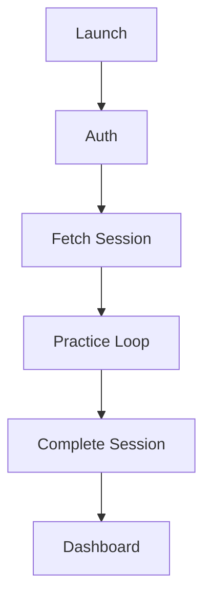
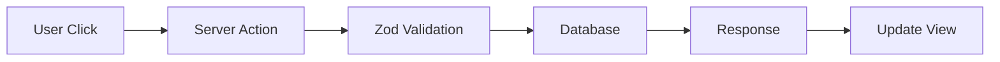
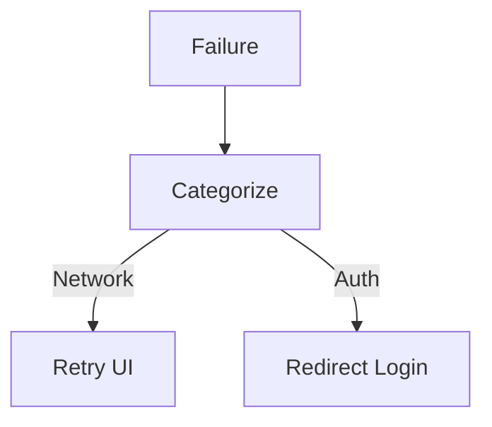

# 17 — State Management

## 1. Document Control

* **Document ID:** STATE-001
* **Document Name:** Tejaswini AI English Tutor - State Management Specification
* **Version:** 1.0.0
* **Status:** APPROVED FOR IMPLEMENTATION
* **Product:** Web-based AI English Learning Application
* **Primary User:** Tejaswini (Beginner)
* **Owner:** Principal Software Architect
* **Source of Truth:** Authoritative specification for application state representation, ownership, transitions, synchronization, and recovery.

## 2. Purpose

This document defines how the application's state is represented, owned, transitioned, and persisted. It ensures that the client remains a presentation layer, while the server and database act as the absolute, immutable source of truth for learning progress, evaluation, and mastery.

## 3. Scope

The scope encompasses all state domains: Auth, Student, Curriculum, Session, Exercise, Voice, Evaluation, Scoring, Progress, Adaptive Learning, and UI. It covers client/server synchronization, local recovery, caching, and race-condition prevention for the single-student MVP.

## 4. Source Documents and Authority

This specification synthesizes state requirements from `01_PRODUCT_REQUIREMENTS.md` through `16_VOICE_SPEECH_SPECIFICATION.md`. It translates those rules into strict state-machine boundaries.

## 5. State Management Principles

* **Single Source of Truth:** Every business state has exactly one authoritative owner (the Server/Database).
* **Client is Untrusted:** UI state is derived/ephemeral. The client never dictates mastery, scores, or evaluations.
* **Explicit Transitions:** State changes occur via strictly defined events (Server Actions), not arbitrary variable mutation.
* **Fail-Safe:** Technical state failures (e.g., Voice API crash) must not corrupt or penalize Learning state.

## 6. State Terminology

* **Authoritative State:** The definitive record, owned by the server/database.
* **Client State:** Ephemeral interaction data (e.g., text input before submission).
* **Server State:** Business logic state (e.g., XP calculations).
* **Persistent State:** Durably stored in Supabase.
* **Derived State:** Calculated dynamically from authoritative state (e.g., Accuracy %).
* **Cached State:** Temporary local copy (e.g., `localStorage` session recovery).

## 7. State Authority Model

Database / Server Domain State $\rightarrow$ API Canonical Response $\rightarrow$ Client Server-State Cache $\rightarrow$ Derived Client State $\rightarrow$ UI Representation.

## 8. State Domain Inventory

Auth, Student Profile, Curriculum, Daily Plan (Implicit Streak), Practice Session, Exercise, Voice, Attempt/Submission, Evaluation, Scoring, Progress, Mastery, Adaptive Learning, UI, Network.

## 9. State Classification

State is classified by persistence, location, and mutability to define its architectural boundaries.

## 10. State Ownership

Every state domain is owned by a specific layer. UI components only read from selectors and dispatch actions; they do not own business state.

## 11. State Ownership Matrix

| State Domain | Source of Truth | Owner | Client Representation | Persistence | Mutation Authority |
| --- | --- | --- | --- | --- | --- |
| Identity | Supabase Auth | Server | JWT Context | `auth.users` | Server |
| Curriculum | Database | Server | Read-Only Cache | `concepts` | System (Migrations) |
| Session | Database | Server | `PracticeSessionState` | `sessions` | Server Action |
| Attempt | Database | Server | `Attempt` | `attempts` | Server Action |
| Voice | Browser API | Client | `VoiceRecognitionState` | N/A | Client Hook |
| Evaluation | Database | Server | `Evaluation` | `evaluations` | AI Orchestrator |
| Mastery | Database | Server | `MasteryProfile` | `mastery` | Progress Service |

## 12. Client State

The browser owns ephemeral UX states: microphone active, text input drafts, modal visibility, and local session recovery caching.

## 13. Server State

The Next.js backend owns all business logic evaluation: XP calculation, AI orchestration status, and session sequence.

## 14. Database State

Supabase PostgreSQL permanently stores all authoritative records: student profiles, attempts, evaluations, and mastery.

## 15. Derived State

State computed on the fly. Example: `Session Accuracy %` is derived from evaluating the array of `attempts` within a `session`.

## 16. Cached State

Data temporarily stored to survive navigation/refreshes. Example: `LocalSessionState` in `localStorage`.

## 17. Ephemeral State

Data that vanishes on refresh. Example: The pulsing animation state of the microphone.

## 18. Request State

Tracks asynchronous API calls: `IDLE`, `PENDING`, `SUCCESS`, `ERROR`.

## 19. Asynchronous State

Every mutation via Server Actions uses React's `useTransition` or `useActionState` to track `isPending`.

## 20. State Lifecycle

Created $\rightarrow$ Active/Mutating $\rightarrow$ Resolved/Canonical $\rightarrow$ Persisted $\rightarrow$ Cleaned up / Garbage Collected.

## 21. State Transition Principles

Transitions must be valid for the current state. An `EVALUATING` state cannot transition to `RECORDING`.

## 22. State Machine Architecture

The application uses strict Discriminated Unions (TypeScript) to enforce state machines at compile time, preventing impossible UI states.

## 23. State Machine Conventions

* **State Naming:** UPPER_SNAKE_CASE (e.g., `EXERCISE_READY`).
* **Event Naming:** camelCase (e.g., `submitAnswer`).
* **Guard Naming:** `can[Action]` or `is[State]`.

## 24. Event Model

Events represent distinct user or system intents (e.g., `ATTEMPT_SUBMITTED`, `VOICE_RECORDING_STOPPED`).

## 25. Event Ownership

Events are dispatched by the UI but validated and processed by Application Services (Server Actions).

## 26. Event Idempotency

Repeated events (e.g., double-clicking "Submit") are neutralized by checking the `sessionExerciseId` state lock before hitting the database or AI.

## 27. Event Ordering

Strictly enforced. Evaluation events cannot fire before Submission events.

## 28. Stale Event Protection

Responses from older, delayed network requests are ignored if the state machine has already advanced.

## 29. Race Conditions

Prevented by UI locks (`isSubmitting = true`) and Server DB constraints (`UNIQUE(session_id, order_index)`).

## 30. Request Identity

`sessionExerciseId` acts as the definitive correlation and idempotency key for the core learning loop.

## 31. Correlation IDs

Next.js `x-vercel-id` correlates server logs.

## 32. Optimistic Updates

**Forbidden for Learning State.** The application MUST wait for Server/AI confirmation before showing a Correct/Incorrect grade or XP gain to ensure absolute accuracy.

## 33. Pessimistic Updates

Used for all core loop actions. The UI displays "Evaluating..." and waits for the canonical Server Response.

## 34. Rollback

If a pessimistic update fails (e.g., 500 Error), the UI drops the "Evaluating..." state and returns to "Ready", preserving the user's drafted text for retry.

## 35. Server Reconciliation

Client state completely syncs to the returned Server payload upon successful mutation.

## 36. Hydration

Initial load fetches authoritative session state from the server. The client reads `localStorage` to repopulate unsubmitted text drafts.

## 37. SSR/CSR Boundaries

* **SSR:** Dashboard, Progress stats, Session Initialization.
* **CSR:** Active practice chat loop, Voice capture, Media APIs.

## 38. URL State

`/practice` relies on server session cookies. No query parameters (e.g., `?exercise=5`) are used to prevent users from manipulating the sequence.

## 39. Local Storage

Used exclusively for `LocalSessionStateSchema` to recover from accidental tabs closing.

## 40. Browser Persistence

Never stores PII, Evaluations, or AI keys. Only `sessionId`, `currentExerciseIndex`, and `draftText`.

## 41. Refresh Recovery

Upon refresh, `/practice` queries the Server for the active session. The Client matches `sessionId` with `localStorage` to restore drafted text.

## 42. Session Recovery

If an `IN_PROGRESS` session exists in the DB, the server resumes it instead of creating a new one.

## 43. Exercise Recovery

The server returns the exact `sessionExercise` that is `PENDING`.

## 44. Voice Recovery

Voice state is strictly ephemeral. A refresh during `RECORDING` clears the audio. The student must re-record.

## 45. AI Request Recovery

If the browser refreshes *during* `EVALUATING`, the Server Action still completes in the background. On reload, the client fetches the now-completed evaluation.

## 46. Evaluation Recovery

Evaluations are strictly tied to `attempts`. If an attempt exists without an evaluation, the server permits a technical retry.

## 47. Scoring Recovery

XP is strictly additive based on DB rows. Recalculations are safe.

## 48. Progress Recovery

Mastery is a derived aggregation. If client state desyncs, it is completely rebuilt by querying the `evaluations` table.

## 49. Adaptive-Learning Recovery

Adaptive decisions are calculated server-side based on fresh DB queries, immune to client cache loss.

## 50. Transaction Boundaries

Attempt, Evaluation, and EvaluationErrors are inserted within a single PostgreSQL transaction.

## 51. State Mutation Boundaries

Mutations only occur within `src/features/*/actions/`.

## 52. State Read Boundaries

Reads occur via Server Components or authorized Supabase Client queries.

## 53. State Selectors

Zustand (or React Context) exposes atomic selectors (e.g., `useSession(state => state.status)`) to prevent unnecessary re-renders.

## 54. State Normalization

Relational DB data is transformed into nested DTOs (e.g., `Evaluation` containing `EvaluationError[]`) by the Server Action before returning to the UI.

## 55. Entity Identity

UUIDs are the stable identity for all entities.

## 56. Entity Lifecycle

`CREATED` $\rightarrow$ `ACTIVE` $\rightarrow$ `COMPLETED`.

## 57. Deletion Semantics

Hard delete (`CASCADE`) upon user account deletion. No soft deletes for attempts to keep MVP simple.

## 58. Cascade Behavior

Deleting a `Session` drops all its `Attempts` and `Evaluations`.

## 59. State Dependencies

Student $\rightarrow$ Session $\rightarrow$ Exercise $\rightarrow$ Attempt $\rightarrow$ Evaluation $\rightarrow$ Score $\rightarrow$ Progress $\rightarrow$ Mastery $\rightarrow$ Adaptive Decision.

## 60. Dependency Direction

Strictly unidirectional. UI cannot mutate Mastery directly.

## 61. Derived-State Dependencies

Must be completely re-calculable from authoritative inputs (e.g., Accuracy is strictly derived from Attempts).

## 62. Invalidation

When an Attempt is submitted, the cached "Current Exercise" state is invalidated.

## 63. Cache Invalidation

`revalidatePath('/dashboard')` is called by the Server Action upon Session Completion.

## 64. Stale-While-Revalidate

Used for Dashboard data to ensure fast loading while fetching updated XP.

## 65. Consistency Levels

Strongly consistent for Practice Session loop. Eventually consistent for Dashboard Analytics.

## 66. Learning-State Consistency

Mastery and Scores must exactly match the sum of historical evaluations.

## 67. UI Consistency

The UI must precisely reflect the active Discriminated Union state.

## 68. Loading-State Consistency

UI disables all inputs while `isPending` is true.

## 69. Error-State Consistency

Errors display a retry state but do not wipe out valid historical learning data.

## 70. Partial Failure

If AI evaluation fails after STT succeeds, the transcribed text is preserved in the UI.

## 71. Partial-Failure Recovery

The user clicks "Submit" again.

## 72. Retry Semantics

*Technical* retries use identical payloads. *Learning* retries create new attempts.

## 73. Retry Ownership

Server owns technical AI retries. User owns learning retries.

## 74. Retry Backoff

1 immediate technical retry on Gemini JSON failure. No infinite loops.

## 75. Retry Limits

Max 1 technical retry per submission.

## 76. Cancellation

Navigation away from the page unmounts the component, ignoring pending responses.

## 77. Stale Response Handling

Zustand state checks `currentExerciseId`. If a response arrives for an old ID, it is discarded.

## 78. Request Cancellation

Utilizes `AbortController` in the Gemini SDK.

## 79. Timeout State

Throws `ACTION_TIMEOUT`. Handled as a standard error.

## 80. Polling

Not used. Server Actions are synchronous HTTP requests.

## 81. Realtime State

Not used. Supabase Realtime is excluded from MVP.

## 82. Realtime Authority

N/A.

## 83. State Synchronization

Client sends Action $\rightarrow$ Server mutates DB $\rightarrow$ Server returns Canonical State $\rightarrow$ Client updates UI.

## 84. Synchronization Matrix

| State | Source of Truth | Sync Direction | Mechanism | Revalidation |
| --- | --- | --- | --- | --- |
| Session | Database | Server $\rightarrow$ Client | Server Action Response | On mutate |
| Draft Text | Client UI | Client $\rightarrow$ Local | `localStorage` sync | On keystroke |

## 85. Server-State Cache

Next.js App Router Cache handles standard RSC caching.

## 86. Client-State Store

Zustand or Context API manages the active chat array (previous questions in the current session).

## 87. Global vs Local State

| State | Global? | Local? | Reason |
| --- | --- | --- | --- |
| Auth User | Yes | No | Needed by layout and routes |
| Input Draft | No | Yes | Only relevant to current exercise |

## 88. Component State

Microphone pulsing animation, accordion toggles.

## 89. Form State

Textarea content, validation errors (empty string).

## 90. Form Persistence

Textarea persists to `localStorage` onChange.

## 91. Conversation State

Array of `{ prompt, attempt, evaluation }` objects representing the current session history.

## 92. Message Ordering

Strictly sequential. Evaluation always follows Attempt.

## 93. Duplicate AI Responses

Prevented by Server Action idempotency locks.

## 94. AI Streaming State

Not applicable (Structured JSON required).

## 95. AI Processing State

`EVALUATING` (UI shows "Checking your answer...").

## 96. Evaluation State Machine

### EVALUATION_MACHINE

**Initial State:** `IDLE`
**States:** `IDLE`, `EVALUATING`, `VALIDATING`, `SUCCESS`, `FAILED`
**Transitions:** `IDLE` $\rightarrow$ `EVALUATING` (on submit), `EVALUATING` $\rightarrow$ `VALIDATING` (on AI response), `VALIDATING` $\rightarrow$ `SUCCESS` (on Zod pass).

## 97. Scoring State Machine

Scoring is a synchronous functional transformation `f(grade) -> XP`, not a state machine.

## 98. Adaptive State Machine

`NOT_INTRODUCED` $\rightarrow$ `INTRODUCED` $\rightarrow$ `DEVELOPING` $\rightarrow$ `PROFICIENT` $\rightarrow$ `NEEDS_REVIEW`.

## 99. Voice State Machine

`IDLE` $\rightarrow$ `PERMISSION_REQ` $\rightarrow$ `RECORDING` $\rightarrow$ `PROCESSING` $\rightarrow$ `TRANSCRIBED` $\rightarrow$ `IDLE`.

## 100. Session State Machine

`NOT_STARTED` $\rightarrow$ `IN_PROGRESS` $\rightarrow$ `COMPLETED`.

## 101. Daily-Plan State Machine

Implicit based on "Streak" (0 sessions today $\rightarrow$ 1 session today).

## 102. Exercise State Machine

`PENDING` $\rightarrow$ `COMPLETED` (or `SKIPPED`).

## 103. Authentication State

`LOADING` $\rightarrow$ `AUTHENTICATED` | `UNAUTHENTICATED`.

## 104. Authorization State

Derived from Auth State + DB RLS.

## 105. Network State

Browser `navigator.onLine` used to warn users before submission.

## 106. Application Initialization

Auth Check $\rightarrow$ Fetch Profile $\rightarrow$ Fetch Active Session $\rightarrow$ Render UI.

## 107. Initialization Failure

Returns Error Boundary UI.

## 108. Partial Initialization

Not applicable.

## 109. Application Shutdown

Browser closure. `localStorage` preserves unsubmitted drafts.

## 110. Browser Navigation

Navigating away from `/practice` shows a standard `beforeunload` warning to prevent accidental session abandonment.

## 111. Route Protection

Next.js Middleware redirects unauthenticated users to `/login`.

## 112. Route-State Synchronization

Session ID in Server State matches the active route data context.

## 113. Modal and Dialog State

React `useState` (local).

## 114. Notification State

Zustand toast array. Clears after 3000ms.

## 115. Accessibility State

`aria-live` regions update based on canonical state transitions (e.g., announcing "Correct!").

## 116. State-Driven UI

UI is a pure function of the Discriminated Union state.

## 117. UI State Mapping

| Application State | UI State | Allowed Actions | Disabled Actions |
| --- | --- | --- | --- |
| `EXERCISE_READY` | Input Visible | Type, Speak | Next, Retry |
| `EVALUATING` | Spinner | None | Type, Speak, Submit |

## 118. Impossible UI States

"Submitting while Recording".

## 119. Impossible-State Prevention

Enforced by TypeScript discriminated unions. The `RECORDING` state simply does not contain a `submit` method.

## 120. Discriminated State Types

Defined extensively in `08_TYPES_AND_SCHEMAS.md`.

## 121. Nullable-State Policy

We do not use multiple boolean flags (`isLoading`, `isError`, `isSuccess`). We use explicit string status literal types.

## 122. State Invariants

* STATE-INV-001: Only the authoritative server layer can mutate authoritative learning state.
* STATE-INV-002: A stale response cannot overwrite newer state.
* STATE-INV-003: Technical failures cannot become learning failures.

## 123. State Anti-Patterns

* **Prohibited:** `const [score, setScore] = useState(0)` in the client determining DB writes.
* **Prohibited:** Optimistic updates for evaluations.

## 124. Mutation Architecture

UI $\rightarrow$ Action $\rightarrow$ Server Validation $\rightarrow$ Persistence $\rightarrow$ Canonical Response $\rightarrow$ Client Update.

## 125. Read Architecture

DB $\rightarrow$ Server Component $\rightarrow$ UI.

## 126. Event Architecture

User Event $\rightarrow$ Validation $\rightarrow$ State Transition $\rightarrow$ UI Update.

## 127. Layer State Boundaries

| Layer | Owns | Reads | Writes | Must Not Control |
| --- | --- | --- | --- | --- |
| Client | UI, Voice, Drafts | Server Responses | Local Storage | Business Logic |
| Server | Mastery, Evals | DB, Prompts | DB (Service Key) | Browser APIs |

## 128. Domain Boundaries

Evaluation Service never directly modifies Adaptive Learning state; it returns results that the Progress Service consumes.

## 129. Cross-Domain State Updates

Handled by the `/complete` Server Action orchestrating multiple services synchronously.

## 130. Event-Driven Integration

Not used in MVP. Synchronous RPC calls preferred for simplicity.

## 131. Domain Events

`ATTEMPT_SUBMITTED`, `SESSION_COMPLETED`. (Conceptual; implemented as direct function calls).

## 132. Event Payload Boundaries

PII is excluded from evaluation payloads.

## 133. Event Persistence

Events are persisted as standard relational rows (`attempts`, `evaluations`).

## 134. Event Replay

Mastery can be deterministically rebuilt by replaying `evaluations`.

## 135. State Reconstruction

Query all evaluations, apply scoring algorithm, derive total XP and Mastery.

## 136. Derived-State Rebuild

See 135.

## 137. Cache Rebuild

Local storage is overwritten by server state on mismatch.

## 138. State Migration

Handled via SQL scripts if DB schemas change.

## 139. Persisted Client-State Versioning

`LocalSessionSchema` includes a `version: 1` field.

## 140. Server-State Versioning

Implicit in DB schema.

## 141. Schema Versioning

Adheres to `08_TYPES_AND_SCHEMAS.md`.

## 142. State Snapshots

`sessions.summary_data` caches performance.

## 143. Auditability

Every XP gained is linked to a specific `evaluation_id`.

## 144. State Provenance

Authoritative state originates from Gemini JSON parsed securely on the Server.

## 145. State Timestamps

PostgreSQL `TIMESTAMPTZ` (`created_at`, `updated_at`).

## 146. Clock Authority

Server clock is the absolute authority. Client clocks are ignored for logic.

## 147. Temporal Ordering

Managed by Database sequence/timestamps.

## 148. State Freshness

Active practice session data is always perfectly fresh via synchronous updates.

## 149. Stale-Data Indicators

N/A.

## 150. Post-Mutation Synchronization

The Server Action returns the updated object. Client replaces local object.

## 151. Mutation Response Authority

The Server Response is definitive.

## 152. UI Update Strategy

React automatically reconciles the DOM with the new Canonical State object.

## 153. Error Normalization

All provider errors become `ActionError` with predefined string codes.

## 154. Error-State Taxonomy

`INVALID_INPUT`, `UNAUTHORIZED`, `PROVIDER_ERROR`, `NETWORK_ERROR`.

## 155. Error Ownership

Server generates errors; Client displays them.

## 156. Error Persistence

Only systemic validation errors are logged. User-facing transient errors are not persisted.

## 157. Error Recovery

User clicks "Retry" or alters input.

## 158. Error Clearing

Cleared automatically when a new mutation is initiated.

## 159. Error Precedence

Auth errors override Validation errors.

## 160. Loading Precedence

Loading state disables all interactive UI elements.

## 161. Retry UI

Displayed in the Evaluation Card for network or 500 errors.

## 162. User-Action Locking

`isPending` boolean flag from React transitions locks the Submit button.

## 163. Debounce and Throttle

Mic button is debounced by 500ms to prevent rapid toggle glitches.

## 164. Auto-Save

Draft text saves to `localStorage` on every keystroke.

## 165. Draft State

Owned by Client `<textarea>`.

## 166. Submission State

`modality`, `text`, `timestamp`.

## 167. Completed State

Terminal state for a Session.

## 168. Terminal States

Cannot be reversed (e.g., `Session.status = 'COMPLETED'`).

## 169. State Cleanup

`localStorage` is wiped when a session hits `COMPLETED`.

## 170. Memory Management

The UI only keeps the current session's history in memory (max 15 items), preventing DOM bloat.

## 171. Browser Memory Constraints

Web Speech API garbage collects audio buffers automatically.

## 172. Audio-Memory Lifecycle

Strictly ephemeral. Discarded immediately after transcription.

## 173. Subscription Cleanup

N/A (No WebSockets).

## 174. Timer Cleanup

React `useEffect` return functions clear recording safety timeouts.

## 175. Abort Cleanup

`AbortController.abort()` fired if component unmounts during Server Action.

## 176. Component Unmount Behavior

Cleans up timeouts and aborts pending fetch requests.

## 177. Navigation Cleanup

Same as 176.

## 178. Session Expiration

Supabase Auth handles JWT refresh. If expired, forces redirect to `/login`.

## 179. Authentication Invalidation

Wipes all client state.

## 180. Authorization Changes

Enforced server-side.

## 181. Account/Student Switching

Not applicable for MVP.

## 182. Student-State Isolation

Enforced by RLS and Server Action auth checks.

## 183. Cache-Key Scoping

Local storage keys are prefixed: `tejaswini_session_draft_v1`.

## 184. Session-Key Scoping

`session_id` UUID.

## 185. Voice-State Scoping

Scoped to the active exercise component.

## 186. Progress-State Scoping

Scoped to `student_id`.

## 187. Adaptive-State Scoping

Scoped to `student_id` + `concept_id`.

## 188. Security Boundary

Adheres strictly to `10_SUPABASE_SECURITY.md`.

## 189. Secret Handling

Secrets NEVER enter client state.

## 190. Server-Only State

API keys, DB admin clients.

## 191. Public Configuration State

`NEXT_PUBLIC_` variables.

## 192. Hydration Security

No sensitive user data is embedded in static HTML.

## 193. Serialization Boundaries

JSON stringification occurs at the Server Action boundary.

## 194. API Payload Boundaries

Validated by Zod.

## 195. Sensitive-State Redaction

Logs exclude PII.

## 196. State Observability

Vercel logs capture state transition failures.

## 197. State Transition Logging

Server logs `[INFO] Attempt created for exercise {id}`.

## 198. Correlation and Tracing

`x-vercel-id`.

## 199. State Metrics

Latency of state transitions (AI Evaluation step).

## 200. State Alerting

Alerts on high rates of `INVALID_STATE` errors.

## 201. State Debugging

React Developer Tools inspect the Zustand store.

## 202. Testing Architecture

Vitest for state machines, Playwright for E2E flow.

## 203. State-Machine Tests

Verify `EXERCISE_READY` cannot jump to `FEEDBACK_READY` without evaluation data.

## 204. Concurrency Tests

Simulate double-submit.

## 205. Stale-Response Tests

Simulate out-of-order API returns.

## 206. Refresh-Recovery Tests

Playwright: Reload page mid-exercise, assert draft text remains.

## 207. Network-Recovery Tests

Playwright: Drop network, assert error UI, restore network, assert recovery.

## 208. Provider-Failure Tests

Mock Gemini 503, assert fallback state.

## 209. Voice-State Tests

Test IDLE $\rightarrow$ REC $\rightarrow$ TRANS.

## 210. Evaluation-State Tests

Test A-F parsing.

## 211. Scoring-State Tests

Test XP mapping.

## 212. Progress-State Tests

Test Mastery aggregation.

## 213. Adaptive-State Tests

Test difficulty thresholds.

## 214. Cache Tests

Test `localStorage` hydration.

## 215. Hydration Tests

Test SSR to CSR handoff.

## 216. Authentication-State Tests

Test unauthorized access redirects.

## 217. Authorization-State Tests

Test RLS blocking.

## 218. Security Tests

Test mass-assignment prevention.

## 219. State-Invariant Tests

Assert Mastery cannot be negative.

## 220. Regression Dataset

Ensure UI states render correctly for all A-F grades.

## 221. Golden State-Transition Tests

End-to-end happy path flow.

## 222. State-Transition Matrix

*(See Section 96-102)*.

## 223. State Ownership Matrix

*(See Section 11)*.

## 224. State Classification Matrix

| State | Persistent | Server | Client | Ephemeral | Derived | Cached |
| --- | --- | --- | --- | --- | --- | --- |
| Attempts | Yes | Yes | No | No | No | No |
| Draft Text | No | No | Yes | No | No | Yes |

## 225. Synchronization Matrix

| State | Source of Truth | Sync Direction | Mechanism | Revalidation |
| --- | --- | --- | --- | --- |
| Mastery | DB | Server $\rightarrow$ Client | API Payload | End of Session |

## 226. UI State Matrix

| Application State | UI State | Allowed Actions | Disabled Actions |
| --- | --- | --- | --- |
| `EVALUATING` | Spinner | None | All Inputs |

## 227. Error Matrix

| Error | Source | State Impact | User Feedback | Recovery |
| --- | --- | --- | --- | --- |
| `AI_TIMEOUT` | Gemini | Stays in `READY` | "Connection issue" | Retry Submit |

## 228. Recovery Matrix

| Failure | Current State | Recovery Action | Resulting State | Data Integrity |
| --- | --- | --- | --- | --- |
| Browser Crash | `RECORDING` | Reload page | `READY` | Draft lost, no DB corruption |

## 229. Concurrency Matrix

| Race Condition | Risk | Detection | Prevention | Recovery |
| --- | --- | --- | --- | --- |
| Double Submit | Dup Eval | Server Action | Idempotency Key | Return `409 Conflict` |

## 230. Caching Matrix

| Data | Cacheable? | Cache Key | Lifetime | Invalidation | Authority |
| --- | --- | --- | --- | --- | --- |
| Draft Text | Yes | `session_draft` | 24h | Session Complete | Client |

## 231. Persistence Matrix

| State | Persisted? | Location | Write Authority | Retention |
| --- | --- | --- | --- | --- |
| Evaluations | Yes | DB `evaluations` | Server | Indefinite |

## 232. Security Matrix

| State/Data | Sensitivity | Client Accessible? | Server Only? | Protection |
| --- | --- | --- | --- | --- |
| Total XP | Low | Read-Only | Writes | RLS / API Validation |

## 233. Observability Matrix

| State Event | Metric/Log | Purpose | Sensitive Data Excluded |
| --- | --- | --- | --- |
| Stage Advance | Info Log | Tracking pacing | Yes |

## 234. Testing Matrix

| Test ID | State | Scenario | Expected Transition | Verification |
| --- | --- | --- | --- | --- |
| T-SM-01 | `EVALUATING` | Valid AI JSON | `FEEDBACK_READY` | Card displays |

## 235. Overall Application State Architecture

Client Form $\rightarrow$ Server Action $\rightarrow$ Server Validation $\rightarrow$ Database / AI $\rightarrow$ Updated State $\rightarrow$ Client Update.

## 236. Learning Session State Machine

### PRACTICE_SESSION_MACHINE

**Purpose:** Manage the active 15-question flow.
**States:** `LOADING`, `ACTIVE`, `COMPLETING`, `CLOSED`
**Transitions:** `ACTIVE` $\rightarrow$ `COMPLETING` (on 15th question).

## 237. Exercise State Machine

**States:** `PENDING`, `SUBMITTED`, `EVALUATED`.

## 238. Attempt and Submission State Machine

**States:** `DRAFTING`, `SUBMITTING`, `FAILED_RETRY`.

## 239. Evaluation State Machine

**States:** `AWAITING_AI`, `VALIDATING_SCHEMA`, `SUCCESS`, `FAIL`.

## 240. Voice State Machine

**States:** `IDLE`, `RECORDING`, `TRANSCRIBING`.

## 241. Scoring State Flow

Eval $\rightarrow$ Grade Switch $\rightarrow$ XP Assignment.

## 242. Progress State Flow

Session Complete $\rightarrow$ Aggregation $\rightarrow$ Mastery Update.

## 243. Adaptive Learning State Flow

Mastery Update $\rightarrow$ Needs Review Trigger $\rightarrow$ Next Session Queue.

## 244. Authentication State Machine

`INIT` $\rightarrow$ `CHECKING` $\rightarrow$ `LOGGED_IN` | `LOGGED_OUT`.

## 245. Error and Recovery State Machine

`OK` $\rightarrow$ `ERROR_BOUNDARY` $\rightarrow$ `RECOVERED`.

## 246. Application Initialization State Flow

Mount $\rightarrow$ Hydrate LocalStorage $\rightarrow$ Fetch Server Session $\rightarrow$ Ready.

## 247. Application Lifecycle Diagram

## 248. Mutation Lifecycle Diagram

## 249. Voice Lifecycle Diagram

See `16_VOICE_SPEECH_SPECIFICATION.md`.

## 250. Failure Lifecycle Diagram

## 251. State Authority Hierarchy

Server Database > Server Memory > Client Store > Client UI.

## 252. State Boundary Architecture

Strict delineation between Client Components (Presentation) and Server Actions (Mutation).

## 253. Domain Interaction Boundaries

Domains communicate via strict function parameters on the server, not global state.

## 254. State Transition Authority

Only the Server can transition a session to `COMPLETED`.

## 255. Application Service Authority

Business rules belong to the Service layer, not the API layer.

## 256. Domain Event Authority

Events are implicit in the service calls.

## 257. Derived-State Authority

Calculated on the server when requested, caching only when expensive.

## 258. Client Cache Authority

Zero authority. Purely for UX recovery.

## 259. Local-State Authority

Authoritative ONLY for local UX (e.g., input string before submission).

## 260. State Persistence Authority

Supabase PostgreSQL.

## 261. State Synchronization Authority

Server response forces client sync.

## 262. Conflict Resolution

Server always wins.

## 263. Optimistic Concurrency

N/A.

## 264. Version Checks

N/A.

## 265. Mutation Conflict Handling

Returns 409 Conflict for duplicate keys.

## 266. Conflict-State Consistency

UI resets to Server state on conflict.

## 267. State Repair

Reloading the page fetches a fresh, repaired Server state.

## 268. Reconciliation Process

React renders new props from Server Action.

## 269. State Rebuild

Calculated from `attempts` table.

## 270. Crash Recovery

Browser restores from `localStorage`.

## 271. Browser Refresh Recovery

Same as 270.

## 272. Network Interruption Recovery

Action fails gracefully; user can retry.

## 273. Provider-Outage Recovery

Graceful UI error.

## 274. Authentication-Expiration Recovery

Middleware redirects.

## 275. Stale-Session Recovery

Server marks old session abandoned if started > 24 hours ago.

## 276. Schema-Migration Recovery

Server handles DB mapping.

## 277. Deployment Compatibility

Vercel handles zero-downtime swaps.

## 278. API Backward Compatibility

N/A for tightly coupled Next.js app.

## 279. State Migration Strategy

SQL scripts.

## 280. Rollback Strategy

Git revert.

## 281. Feature Flags and State

N/A.

## 282. Experimental State

N/A.

## 283. Configuration State

`config/env.ts`.

## 284. Environment-Specific State

Dev vs Prod DB URLs.

## 285. Development/Test State

Mocked APIs.

## 286. Reset Behavior

Clears local cache.

## 287. Hard Reset vs Soft Reset

Hard: DB wipe. Soft: Clear local storage.

## 288. Session Restart

Creates new Session ID.

## 289. Exercise Retry

Advances state array, retaining previous attempt in history.

## 290. Answer Retry

Clears input box.

## 291. Voice Re-Record

Clears transcript state.

## 292. Evaluation Retry

Technical auto-retry 1x.

## 293. Scoring Retry

Idempotent function.

## 294. Progress Recalculation

Derived on demand.

## 295. Adaptive Recalculation

Derived on demand.

## 296. Debugging Snapshots

Console logs in dev mode.

## 297. Deterministic State Transitions

Enforced by TypeScript discriminated unions.

## 298. Nondeterministic Provider Boundaries

Gemini JSON output.

## 299. AI State Isolation

AI output must pass Zod schema before becoming Application State.

## 300. Provider State

Ignored by App State.

## 301. Provider Response Normalization

Zod handles mapping (e.g., stripping unknown keys).

## 302. AI Retry State

Internal to Server Action.

## 303. AI Response Deduplication

DB Unique constraints.

## 304. AI Stale-Response Protection

UI locks until response completes.

## 305. Voice Provider State

Browser managed.

## 306. Transcription State

Browser managed.

## 307. TTS State

Browser managed.

## 308. Playback State

Browser managed.

## 309. Student Interaction State

Zustand / React Context.

## 310. Learning Evidence State

Database `evaluations`.

## 311. Authoritative Learning State

Database `mastery`.

## 312. Derived Learning State

`Accuracy %`.

## 313. Final State-Management Architecture

A strict, server-authoritative, unidirectional data flow that treats the browser strictly as a "dumb terminal" with local caching capabilities, ensuring that all educational progress is immutable, secure, and accurate.

## 314. State-Management Responsibilities by Layer

| Layer | Responsibilities | State Owned | State Read | State Written | Forbidden Responsibilities |
| --- | --- | --- | --- | --- | --- |
| Server | Business Rules, Evaluation | Mastery, XP, Sessions | DB, Config | DB | UI Rendering |
| Client | Interaction, UX | UI State, Drafts | Server Responses | LocalStorage | Business Logic |

## 315. State-Management Non-Responsibilities

The State Management system does NOT implement the curriculum logic or the AI evaluation logic; it merely stores and coordinates the movement of data between those systems.

## 316. Final State-Management Invariants

* Only the Server mutates authoritative learning state.
* Client UI state cannot modify score or mastery.
* Technical failures cannot become learning failures.

## 317. Final State-Management Anti-Patterns

* Multiple sources of truth.
* Trusting the client for scores.
* Persisting AI outputs blindly.

## 318. State Acceptance Criteria

* STATE-AC-001: Disconnecting internet during submission does not wipe draft text.
* STATE-AC-002: Sending `{ xp: 100 }` from client via dev tools is rejected by Server Action.

## 319. Final Consistency Audit

This specification seamlessly enforces the security boundaries of `10_SUPABASE_SECURITY.md` and the type strictness of `08_TYPES_AND_SCHEMAS.md`, ensuring Google Antigravity has a flawless blueprint for data flow.

## 320. State Decisions

* **Decision:** Use Next.js Server Actions exclusively for mutations, abandoning generic REST API routes to guarantee end-to-end type safety and simplify state reconciliation.

## 321. Assumptions

* Serverless functions executing state mutations will not be interrupted prematurely by Vercel timeouts before DB commit finishes.

## 322. Open Questions

* None. State architecture is fully resolved.

## 323. Final State-Management Specification

Provides a robust, fail-safe environment for the learner, isolating all complexity behind a secure server wall.

## 324. State-Management Completion Checklist

* [x] Defined Server/Client boundaries.
* [x] Established Zod validation at all state entry points.
* [x] Defined local storage recovery logic.
* [x] Established strict state-machine structures for the core loop.