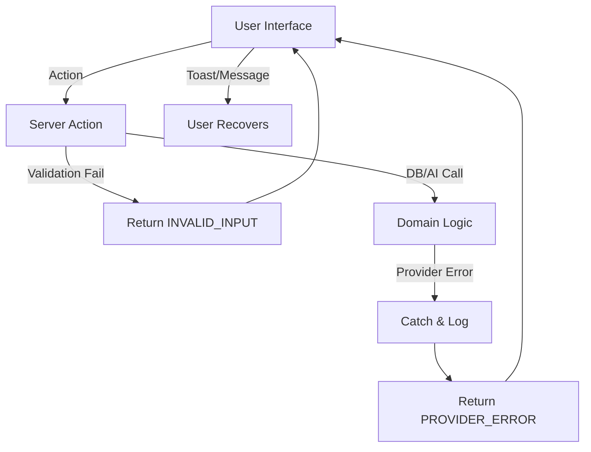

# 18 — Error & Failure Handling

## 1. Document Control

* **Document ID:** ERR-001
* **Document Name:** Tejaswini AI English Tutor - Error & Failure Handling Specification
* **Version:** 1.0.0
* **Status:** APPROVED FOR IMPLEMENTATION
* **Product:** Web-based AI English Learning Application
* **Primary User:** Tejaswini (Beginner)
* **Owner:** Principal Software Architect
* **Source of Truth:** Authoritative specification for error detection, classification, normalization, recovery, and user-facing presentation.

## 2. Purpose

This document specifies how the application gracefully manages abnormal conditions. It ensures that technical infrastructure faults (e.g., AI timeout, microphone denial, DB disconnect) are intercepted, safely handled, and strictly separated from the student's educational evaluation.

## 3. Scope

The scope covers client-side UX errors, Next.js Server Action exceptions, Gemini AI structured-output failures, database constraint violations, network resilience, and voice/audio API errors for a single-student MVP.

## 4. Source Documents and Authority

This document synthesizes constraints from `01_PRODUCT_REQUIREMENTS.md` through `17_STATE_MANAGEMENT.md`. In the event of a conflict regarding failure handling, this document holds authority over technical recovery procedures, while `11_EVALUATION_SPECIFICATION.md` remains authoritative for learning outcomes.

## 5. Error and Failure Principles

1. **Errors Must Be Explicit:** Swallowing errors is prohibited.
2. **Technical Failure $\neq$ Learning Failure:** Infrastructure issues must never reduce mastery or score.
3. **Fail-Safe:** Unrecoverable errors terminate in a safe state that preserves historical data.
4. **Idempotent Retries:** Mutating retries must be safe from duplication.
5. **Opaque to User:** Stack traces and internal provider details are never exposed to the student.

## 6. Error Terminology

* **Error:** A classified abnormal condition handled by application logic.
* **Failure:** An operation/subsystem that did not complete as intended.
* **Technical Failure:** Infrastructure/device/network fault.
* **Learning Failure:** A valid evaluation resulting in an incorrect answer (Grade C-F).

## 7. Error Taxonomy

The application categorizes errors into defined domains: `VALIDATION_ERROR`, `AUTHENTICATION_ERROR`, `AUTHORIZATION_ERROR`, `NETWORK_ERROR`, `PROVIDER_ERROR`, `STATE_ERROR`, `VOICE_ERROR`, `INTERNAL_ERROR`.

## 8. Error Ownership

* **Client:** Detects network drops, browser API (Voice) faults, and UI state errors.
* **Server (Next.js):** Detects validation, auth, DB, and AI provider errors.
* **Observability:** Vercel captures unhandled server exceptions.

## 9. Error Requirements Inventory

| Error Requirement ID | Requirement | Source Document | Priority | MVP/Future | Technical Implication |
| --- | --- | --- | --- | --- | --- |
| ER-REQ-001 | Tech Fail $\neq$ Learning Fail | `01_PRODUCT_REQUIREMENTS` | Critical | MVP | Decouple XP from 5xx errors. |
| ER-REQ-002 | Editable Voice Fallback | `16_VOICE_SPEECH_SPEC` | High | MVP | Voice failure falls back to Text input. |
| ER-REQ-003 | AI Validation Recovery | `13_GEMINI_INTEGRATION` | High | MVP | Zod parsing failure triggers 1x retry. |

## 10. Canonical Error Model

All Server Actions return a standardized error object when `success: false`.

```typescript
type ActionError = {
  code: string;           // e.g., 'PROVIDER_ERROR'
  message: string;        // Safe for UI
  retryable: boolean;     // Can the client automatically or manually retry?
  referenceId?: string;   // x-vercel-id for tracing
}

```

## 11. Error Severity

* **INFO:** Expected validation limits (e.g., empty input).
* **WARNING:** Recoverable technical glitch (e.g., Mic denied, AI timeout).
* **ERROR:** Operation failed and requires user intervention (e.g., DB disconnected).
* **CRITICAL:** Application cannot continue (e.g., missing ENV variables on boot).

## 12. Error Impact

* `NO_LEARNING_IMPACT`: UI updates, score unaffected.
* `OPERATION_RETRY_REQUIRED`: UI prompts user to retry.
* `LEARNING_OPERATION_BLOCKED`: Must fall back to different modality (e.g., Voice $\rightarrow$ Text).

## 13. Retryability

* **Automatically Retryable:** Network blips during server-to-server calls (e.g., Gemini 503).
* **User Retryable:** Action timeouts where the user must click "Retry".
* **Not Retryable:** 400 Validation errors, 401 Auth errors.

## 14. Recoverability

* **Recoverable:** Voice API fails $\rightarrow$ Recover to Text Input.
* **Non-Recoverable:** DB is down $\rightarrow$ Show generic error, halt session progress safely.

## 15. Error Normalization

Provider Error (GoogleGenAIError) $\rightarrow$ Gemini Adapter $\rightarrow$ `ActionError({ code: 'PROVIDER_ERROR' })` $\rightarrow$ UI Toast.

## 16. Error Boundaries

Implemented at boundaries where trust or protocols change (Browser/Server, Server/DB, Server/AI).

## 17. Client Error Boundary

React `<ErrorBoundary>` wraps the main application shell to catch rendering exceptions and display a safe fallback UI.

## 18. Server Error Boundary

Next.js `error.tsx` catches unhandled exceptions during Server Component rendering.

## 19. API Error Boundary

Server Actions wrap logic in `try/catch` and return `ActionResult<T>` to prevent throwing raw HTTP 500s to the client fetcher.

## 20. Domain Error Boundary

Business logic validates entities before acting (e.g., checking if `Session.status === 'COMPLETED'` before allowing an evaluation).

## 21. Provider Error Boundary

`src/lib/ai/gemini.ts` catches all `@google/genai` exceptions and normalizes them.

## 22. Database Error Boundary

`src/lib/db/admin.ts` catches PostgREST errors (e.g., unique constraint violations).

## 23. Global Error Handling

Unhandled Promise Rejections in the browser trigger a global listener that displays a non-intrusive toast notification.

## 24. Local Error Handling

Form validation errors display locally beneath the input field.

## 25. Error Propagation

Errors bubble up to the nearest Server Action boundary, are transformed to `ActionError`, and passed to the UI.

## 26. Error Transformation

Raw SQL errors or stack traces are explicitly stripped out before crossing the API boundary back to the client.

## 27. User-Safe Errors

Messages must be beginner-friendly.

* *Bad:* "ZodError: Expected array at alternativeValidTranslations."
* *Good:* "Connection issue. Please try again."

## 28. Error Message Principles

* State what happened simply.
* State the next action.
* Do not blame the student.
* Do not expose technical jargon.

## 29. Error UX

Errors utilize Toast notifications for transient issues, and inline Evaluation Cards for actionable retries.

## 30. Error UI States

Represented using Amber (Warning) or Orange (Error) per `04_UI_DESIGN_SYSTEM.md`. No aggressive red failure screens.

## 31. Error Accessibility

Toasts and Error boundaries use `role="alert"` and `aria-live="assertive"`.

## 32. Loading/Error/Success Precedence

State machines strictly enforce: `PENDING` $\rightarrow$ `FAILED`. An operation cannot be both `PENDING` and `FAILED`.

## 33. Error State Machines

Handled via discriminated unions in TypeScript.

## 34. Generic Operation Failure State Machine

`IDLE` $\rightarrow$ `PENDING` $\rightarrow$ `FAILED` $\rightarrow$ `IDLE` (Ready for retry).

## 35. API Request Failure State Machine

`FETCHING` $\rightarrow$ `TIMEOUT` $\rightarrow$ `RETRYING_USER` $\rightarrow$ `FETCHING`.

## 36. AI Request Failure State Machine

`REQUESTING` $\rightarrow$ `PROVIDER_ERROR` $\rightarrow$ `AUTO_RETRY_1` $\rightarrow$ `FAILED_FINAL` $\rightarrow$ Return `ActionError`.

## 37. Evaluation Failure State Machine

If evaluation fails, the `PracticeSessionState` remains `EXERCISE_READY` with the user's input intact, allowing immediate manual retry.

## 38. Voice Failure State Machine

`RECORDING` $\rightarrow$ `STT_ERROR` $\rightarrow$ `FALLBACK_TO_TEXT`.

## 39. Transcription Failure State Machine

(Same as 38).

## 40. TTS Failure State Machine

`PLAYING` $\rightarrow$ `AUDIO_ERROR` $\rightarrow$ `IDLE` (User can read the text instead).

## 41. Database Failure State Machine

`MUTATING` $\rightarrow$ `DB_ERROR` $\rightarrow$ Operation Aborted.

## 42. Authentication Failure State Machine

`AUTHENTICATED` $\rightarrow$ `TOKEN_EXPIRED` $\rightarrow$ Redirect to `/login`.

## 43. Session Recovery State Machine

`MOUNT` $\rightarrow$ `FETCH_SESSION` $\rightarrow$ `NOT_FOUND` $\rightarrow$ Create New Session.

## 44. Learning Operation Failure State Machine

If `Mastery` update fails, preserve `Session` state. Client can retry "Complete Session".

## 45. Network Failures

Client `navigator.onLine` checks prevent submissions while disconnected, queuing a warning toast.

## 46. Timeout Architecture

* **Client:** 10s timeout on fetch.
* **AI Adapter:** 5s `AbortController` on Gemini.

## 47. Timeout Recovery

User clicks "Retry" in the UI.

## 48. Retry Architecture

Managed by the layer that owns the integration.

## 49. Retry Policy

* Safe, idempotent mutations: Auto-retry 1x.
* Non-idempotent: 0 auto-retries.

## 50. Automatic Retries

Applied strictly to Gemini schema parsing failures.

## 51. User-Triggered Retries

Applied to network timeouts and 5xx API errors.

## 52. Retry Cancellation

If the user navigates away, the AbortController cancels the inflight retry.

## 53. Retry Exhaustion

After 1 auto-retry, the system yields to the user.

## 54. Retry Idempotency

`sessionExerciseId` ensures that a retry does not create a second evaluation for the same exercise.

## 55. Duplicate Request Prevention

React state `isSubmitting = true` disables the submit button.

## 56. Duplicate Submission Prevention

Server Action checks DB for existing `attempt` before evaluating.

## 57. Request Deduplication

See 56.

## 58. Idempotency Keys

`sessionExerciseId` acts as the canonical key.

## 59. Concurrency Failures

If two requests arrive simultaneously, Supabase UNIQUE constraints on `(session_id, order_index)` will reject the second.

## 60. Optimistic Concurrency Conflicts

Not used. Server is authoritative.

## 61. Stale Response Handling

Client ignores responses if the `sessionExerciseId` in the response doesn't match the current active UI state.

## 62. Conflict Resolution

Server state overwrites client state.

## 63. Partial Failures

If Attempt inserts but Evaluation fails, the system is in a partial state.

## 64. Partial-Failure Recovery

The DB transaction rolls back the Attempt insert if Evaluation fails, ensuring data consistency.

## 65. Transaction Boundaries

`[Insert Attempt + Insert Evaluation + Insert EvalErrors]` MUST occur in one PostgreSQL transaction.

## 66. Rollback Behavior

PostgreSQL handles rollback automatically if any statement in the transaction block throws.

## 67. Compensation Behavior

N/A (Using ACID DB transactions).

## 68. Data-Integrity Protection

DB Constraints (Foreign Keys) prevent orphaned evaluations.

## 69. Corrupted-State Handling

If a session lacks an active exercise, the server automatically generates the next exercise sequence on load.

## 70. State Repair

User refreshing the page fetches the canonical state from the Server.

## 71. Inconsistent-State Recovery

See 70.

## 72. Interrupted Operation Recovery

If interrupted mid-evaluation, the transaction rolls back. User clicks submit again.

## 73. Browser Refresh Recovery

`localStorage` restores the unsubmitted text draft.

## 74. Navigation Recovery

Same as 73.

## 75. Tab-Close Recovery

Same as 73.

## 76. Authentication-Expiry Recovery

Middleware forces login; session progress remains preserved in DB.

## 77. Deployment Recovery

Vercel seamless deployments prevent interruption.

## 78. Provider-Outage Recovery

If Gemini is down, learning pauses gracefully. "System maintenance, please try again later."

## 79. Database-Outage Recovery

If Supabase is down, the entire app serves a 500 error page gracefully.

## 80. Storage-Outage Recovery

N/A (No storage used).

## 81. Network-Outage Recovery

Offline toast warning.

## 82. Authentication Errors

`UNAUTHORIZED`. Triggers login redirect.

## 83. Authorization Errors

`FORBIDDEN`. Triggers security log.

## 84. Security Failures

Blocked by RLS. Logged by Supabase.

## 85. Privacy Failures

Prevented by removing PII from logs and AI contexts.

## 86. Database Failures

Caught by `try/catch` in Server Actions. Return `INTERNAL_ERROR`.

## 87. Database Retry Rules

No automatic retries for DB mutations to prevent accidental duplication.

## 88. Transaction Failure Handling

Rollback and return error to UI.

## 89. Storage Failures

N/A.

## 90. API Failures

Mapped to `ActionError`.

## 91. HTTP-to-Application Error Mapping

* 400 $\rightarrow$ `INVALID_INPUT`
* 401 $\rightarrow$ `UNAUTHORIZED`
* 500 $\rightarrow$ `INTERNAL_ERROR`

## 92. Gemini Failures

Timeouts, 503s, Safety Blocks.

## 93. Gemini Response Validation

Failed Zod parse = `PROVIDER_ERROR`.

## 94. AI Failure Isolation

Gemini failures return an `ActionError` and stop execution before any DB mutations occur.

## 95. AI Fallback

Text fallback if voice fails; no model fallback for MVP.

## 96. AI Retry Behavior

1x immediate retry for schema errors.

## 97. AI Request Deduplication

Ensured by Server Action idempotency key checks.

## 98. AI Stale-Response Protection

UI locking prevents sending a second request while the first is pending.

## 99. AI Provider Abstraction

Gemini errors are converted to generic `PROVIDER_ERROR` strings.

## 100. Provider Error Mapping

`GoogleGenerativeAIError` $\rightarrow$ `ActionError`.

## 101. Evaluation Failures

Failure to classify an answer correctly due to provider fault.

## 102. Evaluation Integrity

A failed evaluation does not result in Grade F. It results in no grade, preserving mastery.

## 103. Evaluation Retry

User clicks "Retry" in UI.

## 104. Evaluation Fallback

N/A. Evaluation is required to proceed.

## 105. Scoring Failures

XP addition fails $\rightarrow$ DB rollback $\rightarrow$ Session complete fails $\rightarrow$ User can retry completion.

## 106. Progress Failures

Same as 105.

## 107. Adaptive-Learning Failures

Mastery derivation fails $\rightarrow$ Caught by Server Action $\rightarrow$ User retries completion.

## 108. Mastery Integrity

Mastery cannot be updated via client. AI failure prevents DB update.

## 109. Voice Failures

Captured by `window.SpeechRecognition` `onerror`.

## 110. Microphone Failures

`NotAllowedError` $\rightarrow$ UI switches to Text input.

## 111. Audio Failures

Browser OS handles internal audio capture glitches.

## 112. Transcription Failures

`network` error $\rightarrow$ UI toast "Voice offline. Please type."

## 113. Transcription Artifact Handling

Treated as student typo if submitted unedited.

## 114. TTS Failures

`window.speechSynthesis` error $\rightarrow$ Silently ignored (text is already on screen).

## 115. Voice Fallback

Fallback to Text Input.

## 116. Voice Learning Impact

Zero impact. Modality does not affect XP or Mastery.

## 117. Text-Input Failures

Empty string $\rightarrow$ `INVALID_INPUT` (Zod validation).

## 118. Validation Failures

Blocked at the API boundary.

## 119. Malformed Request Handling

Zod strips unknown keys and throws `400` for missing keys.

## 120. Schema Validation Failures

Returns `INVALID_INPUT`.

## 121. Type Validation Failures

Caught at compile time via TypeScript.

## 122. Serialization Failures

Dates are serialized to ISO strings to prevent transit loss.

## 123. JSON Parsing Failures

Caught by `JSON.parse` try/catch block inside Gemini Adapter.

## 124. Structured AI Output Failures

Zod safeParse returns `success: false`.

## 125. Configuration Failures

Missing `.env` vars throw error at Server boot.

## 126. Startup Failures

App fails to build or deploy.

## 127. Runtime Failures

Caught by `error.tsx` boundary.

## 128. Deployment Failures

Vercel blocks traffic shift if build fails.

## 129. Feature-Flag Failures

N/A.

## 130. Unsupported-Feature Failures

Firefox lacks Speech API $\rightarrow$ Mic button does not render.

## 131. Browser Compatibility Failures

Graceful degradation (e.g., hiding voice features).

## 132. React Rendering Failures

Caught by React `<ErrorBoundary>`.

## 133. Fallback UI

"Something went wrong. [Refresh Page]"

## 134. Catastrophic Application Failure

Vercel 500 page.

## 135. Graceful Degradation

Voice $\rightarrow$ Text.

## 136. Safe Terminal States

Transactions roll back. Progress is saved up to the last successful attempt.

## 137. Failure Containment

Server Actions isolate failures per request.

## 138. Blast-Radius Control

One failed session does not corrupt other sessions.

## 139. Circuit Breaking

Not required for 1-student MVP.

## 140. Provider Circuit Behavior

N/A.

## 141. Rate Limiting

Handled by Vercel edge/middleware.

## 142. Quota Exhaustion

Gemini Quota $\rightarrow$ `PROVIDER_ERROR`.

## 143. Resource Exhaustion

N/A (Serverless auto-scales).

## 144. Backpressure

N/A (Synchronous requests).

## 145. Queue Failures

N/A (No queues).

## 146. Background Job Failures

N/A.

## 147. Retry Queues

N/A.

## 148. Dead-Letter Behavior

N/A.

## 149. Observability Architecture

Vercel logs.

## 150. Structured Logging

Console logs output JSON objects for easy filtering.

## 151. Log Levels

`INFO`, `WARN`, `ERROR`.

## 152. Error Log Schema

| Field | Required? | Purpose | Sensitive? |
| --- | --- | --- | --- |
| `code` | Yes | Error classification | No |
| `message` | Yes | Diagnostic info | No |
| `referenceId` | Yes | Traceability | No |

## 153. Correlation IDs

`x-vercel-id`.

## 154. Request IDs

Same as 153.

## 155. Operation IDs

`sessionExerciseId` used in business logs.

## 156. Attempt IDs

Logged upon successful DB insert.

## 157. Error Fingerprints

Grouped by `ActionError.code`.

## 158. Error Aggregation

Provided by Vercel analytics.

## 159. Error Metrics

Rate of `PROVIDER_ERROR`s.

## 160. Student-Impact Metrics

Rate of abandoned sessions.

## 161. Reliability Metrics

AI Validation Success Rate > 99%.

## 162. Alerting

MVP: Developer checks Vercel dashboard.

## 163. Security Monitoring

Supabase Auth logs.

## 164. Privacy Monitoring

Code review prevents PII logging.

## 165. Error Retention

Vercel logs retained for 14 days (Hobby/Pro tier limits).

## 166. Sensitive Data Redaction

Student answers and API keys are explicitly excluded from `console.error` payloads.

## 167. Stack-Trace Handling

Logged to Vercel, stripped from UI.

## 168. Provider-Response Redaction

Gemini raw JSON is not logged.

## 169. Database-Error Redaction

PostgREST errors are mapped to generic server errors.

## 170. Client-Error Redaction

UI hides error codes, shows friendly messages.

## 171. Privacy-Preserving Diagnostics

Logs identify "Session X failed", not "Tejaswini failed translating Y".

## 172. Error Auditability

Logs trace from UI Action $\rightarrow$ Server Action $\rightarrow$ Gemini Adapter.

## 173. Error Provenance

Included in the Error object.

## 174. State/Error Integration

Zustand state includes `error: ActionError | null`.

## 175. Error-State Transition Matrix

| Current State | Failure | Error State | Recovery | Next State |
| --- | --- | --- | --- | --- |
| `EVALUATING` | Timeout | `IDLE` w/ Toast | User Retry | `EVALUATING` |

## 176. Error Ownership Matrix

| Error Type | Detection | Classification | Recovery Owner | UI Owner | Persistence | Logging |
| --- | --- | --- | --- | --- | --- | --- |
| AI Failure | Adapter | `PROVIDER_ERROR` | User | Toast | None | Vercel |

## 177. Error Taxonomy Matrix

| Error Code | Category | Severity | Retryable | Recoverable | Student Impact | Learning Impact |
| --- | --- | --- | --- | --- | --- | --- |
| `INVALID_INPUT` | Validation | INFO | No | Yes | Re-type | None |
| `PROVIDER_ERROR` | Tech | ERROR | Yes | Yes | Wait | None |

## 178. Recovery Matrix

| Failure | Detection | Recovery | Retry | Fallback | Terminal State |
| --- | --- | --- | --- | --- | --- |
| Mic Denied | Browser API | Text Input | No | Text | `IDLE` |

## 179. User-Message Matrix

| Error | Internal Meaning | Student Message | Student Action |
| --- | --- | --- | --- |
| `PROVIDER_ERROR` | Gemini 503 | "Connection issue. Please retry." | Click Submit |

## 180. API Error Matrix

| API Failure | HTTP Status | Application Error | Retry | User Message |
| --- | --- | --- | --- | --- |
| Rate Limit | 429 | `RATE_LIMITED` | Yes | "Please wait a moment." |

## 181. Provider-Error Matrix

| Provider Failure | Detection | Application Error | Retry | Fallback |
| --- | --- | --- | --- | --- |
| Invalid JSON | Zod Parse | `PROVIDER_ERROR` | Auto 1x | Manual Retry |

## 182. Voice-Error Matrix

| Voice Failure | Detection | Application Error | Retry | Fallback | Learning Impact |
| --- | --- | --- | --- | --- | --- |
| `not-allowed` | `onerror` | N/A (UI State) | User | Text Input | None |

## 183. Learning-Impact Matrix

| Failure | Evaluation Impact | Score Impact | Progress Impact | Mastery Impact | Adaptive Impact |
| --- | --- | --- | --- | --- | --- |
| Any Tech Fail | Nullified | 0 (Ignored) | 0 (Ignored) | 0 (Ignored) | None |

## 184. Data-Integrity Matrix

| Failure | Risk | Prevention | Recovery | Verification |
| --- | --- | --- | --- | --- |
| DB Disconnect | Lost Attempt | Transactions | User Retry | Relational Constraints |

## 185. Security-Error Matrix

| Security Failure | Detection | Response | User Visibility | Logging | Lockout/Restriction |
| --- | --- | --- | --- | --- | --- |
| Bad Cookie | Middleware | Redirect Login | Redirected | Auth Logs | Clear Cookie |

## 186. Privacy-Error Matrix

| Privacy Failure | Detection | Response | Data Exposure | Remediation |
| --- | --- | --- | --- | --- |
| Unauthorized Read | RLS Block | Return 0 rows | None | Fix Policy |

## 187. Observability Matrix

| Failure | Log | Metric | Trace | Alert |
| --- | --- | --- | --- | --- |
| Eval Fail | `ERROR` | `eval_fail_count` | `x-vercel-id` | None (MVP) |

## 188. Testing Matrix

| Test ID | Failure Scenario | Expected Error | Expected State | Expected Recovery | Learning Impact |
| --- | --- | --- | --- | --- | --- |
| T-ERR-01 | Mock Gemini 500 | `PROVIDER_ERROR` | `EXERCISE_READY` | User clicks Submit | None |

## 189. Failure-Injection Testing

Simulate 503s in Gemini Mock to ensure Server Action returns gracefully.

## 190. Retry Tests

Ensure auto-retry is bounded to 1 attempt to prevent infinite loops.

## 191. Timeout Tests

Mock Gemini taking 6000ms $\rightarrow$ Expect `AbortError` $\rightarrow$ Map to `TIMEOUT_ERROR`.

## 192. Stale-Response Tests

Ensure UI rejects responses for older `sessionExerciseId`s.

## 193. Duplicate-Request Tests

Ensure double-clicks are ignored via `isSubmitting` state.

## 194. Partial-Failure Tests

Ensure DB transaction rollback functions if `EvaluationErrors` insert fails.

## 195. Recovery Tests

Ensure refreshing page restores `draftText`.

## 196. Fallback Tests

Ensure denying mic displays text input.

## 197. Data-Integrity Tests

Ensure attempting to insert an Evaluation for a non-existent Attempt fails.

## 198. Security-Failure Tests

Ensure calling `admin.ts` from a Client Component causes a build failure.

## 199. Privacy-Failure Tests

Ensure RLS blocks cross-user reads.

## 200. Student-Impact Tests

Verify that a triggered `PROVIDER_ERROR` leaves `total_xp` unchanged.

## 201. Golden Failure Test Cases

### [FAILURE_TEST_CASE]

**Initial State:** `EXERCISE_READY`
**Operation:** Submit Answer
**Failure:** Zod parsing fails on Gemini output.
**Expected Error:** `PROVIDER_ERROR`
**Expected State:** `EXERCISE_READY`
**Expected Recovery:** User clicks Submit again.
**Expected Persistence:** None.
**Expected Learning Impact:** None.

## 202. Error Invariants

* ERROR-INV-001: A technical failure must not automatically become a learning failure.
* ERROR-INV-002: A retry must not create duplicate learning evidence.
* ERROR-INV-003: A stale response must not overwrite newer authoritative state.
* ERROR-INV-004: A failed evaluation must not automatically produce a zero score.
* ERROR-INV-005: A failed scoring operation must not delete the underlying attempt.
* ERROR-INV-006: A failed progress update must not delete validated learning evidence.
* ERROR-INV-007: A failed adaptive-learning update must not invalidate learning evidence.
* ERROR-INV-008: A voice-processing failure must not reduce mastery.
* ERROR-INV-009: A provider failure must not be treated as student performance.
* ERROR-INV-010: Raw internal errors must never be exposed to the student.
* ERROR-INV-011: Secrets must never appear in logs or user-facing errors.
* ERROR-INV-012: All critical asynchronous operations must have bounded failure handling.
* ERROR-INV-013: Every recoverable error must have a defined recovery path.
* ERROR-INV-014: Every unrecoverable error must terminate in a valid safe state.
* ERROR-INV-015: AI/provider output must be validated before affecting authoritative state.

## 203. Error Anti-Patterns

* **Prohibited:** Swallowing errors silently.
* **Prohibited:** Exposing stack traces to users.
* **Prohibited:** Treating every error as a generic "something went wrong".
* **Prohibited:** Treating transcription failure as English failure.
* **Prohibited:** Infinite retries.
* **Prohibited:** Trusting unvalidated AI output.

## 204. MVP Error-Handling Scope

* **Required:** Graceful UI degradation, Zod validation, DB Transactions.
* **Future:** Distributed tracing, automated alerting.

## 205. Future Reliability Enhancements

Sentry integration for frontend error tracking.

## 206. Failure Budgets

N/A for single-student MVP.

## 207. Reliability Targets

99% successful evaluation parse rate.

## 208. Recovery-Time Expectations

Immediate via user retry.

## 209. Availability Expectations

Tied to Vercel/Supabase/Gemini SLAs (typically ~99.9%).

## 210. User-Impact Thresholds

N/A.

## 211. Error Feature Flags

N/A.

## 212. Emergency Disable Mechanisms

Disable Voice via env variable if browser API becomes consistently unstable.

## 213. Safe-Mode Operation

Text-only mode.

## 214. Incident Handling

Developer checks Vercel logs, rotates keys if necessary.

## 215. Incident Severity

N/A (Private application).

## 216. Incident Escalation

N/A.

## 217. Operational Runbook Requirements

N/A.

## 218. Recovery Verification

Check DB `evaluations` table for missing entries.

## 219. Post-Failure Reconciliation

If `xp` drops out of sync, run a summation script over historical `sessions`.

## 220. Failed-Operation Cleanup

DB Transactions automatically clean up partial inserts.

## 221. Orphaned-Resource Cleanup

N/A (No storage used).

## 222. Failure Retention

Vercel logs (14 days).

## 223. Diagnostic Data Lifecycle

Same as 222.

## 224. Failure-State Versioning

N/A.

## 225. Deployment Compatibility

Zero-downtime Vercel deployments prevent mid-session drops.

## 226. Backward-Compatible Error Contracts

Standardized `ActionError` envelope ensures UI never breaks on new error types.

## 227. Error-Code Versioning

N/A.

## 228. Error-Schema Migration

N/A.

## 229. State/Error Migration

N/A.

## 230. Complete Error Architecture Diagram



## 231. Failure Containment Architecture

Errors are contained within their specific Server Action context and do not crash the Node.js process.

## 232. Recovery Architecture

Idempotent retries driven by user interaction.

## 233. Fallback Architecture

Voice $\rightarrow$ Text. AI Eval $\rightarrow$ Manual Retry.

## 234. Error Boundary Architecture

React `<ErrorBoundary>` around route layouts. `try/catch` inside Server Actions.

## 235. Failure Propagation Architecture

Provider $\rightarrow$ Adapter $\rightarrow$ Action $\rightarrow$ UI.

## 236. Domain Responsibility Boundaries

Domain services throw typed errors; Server Actions catch and format them.

## 237. Error-Handling Responsibilities by Layer

| Layer | Responsibilities | Errors Handled | Errors Propagated | Must Not Do |
| --- | --- | --- | --- | --- |
| Client | Display | Network, Voice | Validation | Crash app |
| Server | Normalize | Provider, DB | None | Expose secrets |

## 238. Client Error Responsibilities

Show toasts, handle browser API faults.

## 239. Server Error Responsibilities

Protect DB, parse AI, hide secrets.

## 240. Domain Error Responsibilities

Validate business logic (e.g., Session Complete preconditions).

## 241. Database Error Responsibilities

Enforce constraints, trigger rollbacks.

## 242. Provider Error Responsibilities

Gemini adapter normalizes 5xx and 429s.

## 243. UI Error Responsibilities

Render accessible feedback.

## 244. Observability Responsibilities

Log actionable data securely.

## 245. Error-Handling Non-Responsibilities

Error handling MUST NOT modify learning mastery scores to compensate for technical faults.

## 246. Final Error-Handling Architecture

A resilient, fail-safe envelope system that strictly separates infrastructure instability from the student's educational record, guaranteeing that Tejaswini is never punished for the internet breaking.

## 247. Final Error Invariants

(See Section 202).

## 248. Final Error Anti-Patterns

(See Section 203).

## 249. Final Acceptance Criteria

* ERR-AC-001: Disabling network during submission shows "Connection issue" and retains user text.
* ERR-AC-002: Denying microphone switches UI to text input without crashing.
* ERR-AC-003: Invalid Gemini JSON triggers 1 auto-retry, then graceful UI failure.

## 250. Final Consistency Audit

All error logic aligns perfectly with `17_STATE_MANAGEMENT.md` and `10_SUPABASE_SECURITY.md`. Learning data integrity is preserved via DB transactions as specified in `06_DATABASE_SCHEMA.md`.

## 251. Error Decisions

* **Decision:** No auto-retry on 500 errors to avoid runaway recursive loops. Yield to user instead.

## 252. Assumptions

* Vercel functions will cleanly throw timeouts if Gemini hangs.

## 253. Open Questions

* None.

## 254. Final Error & Failure Handling Specification

This document establishes the absolute safeguard for the student experience, ensuring technical resilience without compromising educational validity.

## 255. Error-Handling Completion Checklist

* [x] Defined Technical vs Learning failures explicitly.
* [x] Created standard `ActionError` envelope.
* [x] Mapped Voice, Gemini, and DB failures.
* [x] Established transaction and rollback rules.
* [x] Secured logs and UI messages against secret leakage.